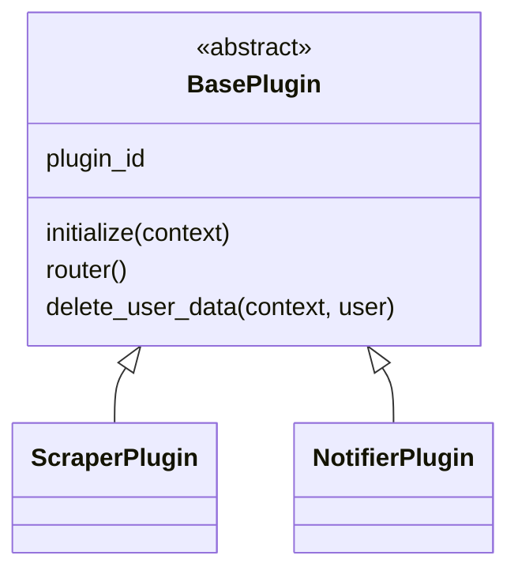
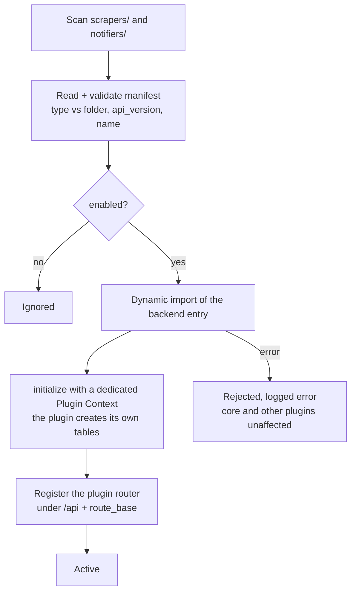
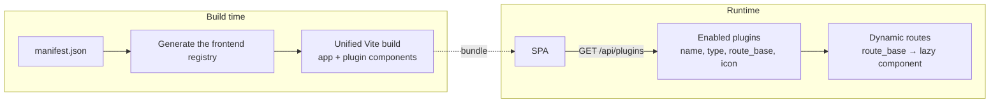

# Plugin architecture and dynamic integration

> **Layer 2 — Architecture** · Audience: SW architects, system engineers.
>
> English translation of the Italian reference [`docs-ita/2-architecture/plugin-architecture.md`](../../docs-ita/2-architecture/plugin-architecture.md), limited to what is implemented (DOC-12). Phase 2 ships the dynamic **backbone**: discovery, validation, isolated loading, a minimal context, and dynamic frontend mounting. The richer contracts (two-level configuration, the politeness HTTP client, `update_catalog`, notification rendering) arrive in later phases and are described in the Italian reference.

## The principle: plugin-first, full-stack

A plugin is an **indivisible full-stack unit**: Python backend and Svelte frontend co-located in one folder, described by a declarative **manifest** that is the plugin's single source of truth (identity, type, activation, entry points, icon, translations, contract version).

Two families derive from a common base:

In phase 2 the base contract is intentionally minimal — `initialize`, `router`, `delete_user_data` (all with safe defaults) — and the families are markers; the type-specific runtime methods (scrape, send, config schemas) land in later phases.

## Dynamic integration — backend

At startup every container that loads plugins (today: `web`) runs the same deterministic sequence. **No runtime plugin switching**: activation is static via the manifest, and a change needs a rebuild + restart.

Registry guarantees: manifest validation (type matches the folder, `api_version` compatible with the core, unique `name` equal to the class's `plugin_id`), and **failure isolation** — a broken plugin does not load, the rest does. See [plugin-registry](../4-capabilities/core/plugin-registry.md).

## Dynamic integration — frontend

The plugin frontends are part of the **same build** (one Vite process): a build step reads the manifests, filters the enabled plugins, and generates the component registry; at runtime the SPA asks the backend for the active plugins and mounts their routes dynamically.

Key properties:

- **Adding a plugin does not touch build or routing code**: a folder with a valid manifest and a conforming frontend entry is enough.
- Plugins import the core design system and shared helpers **via `$lib`** (single build, no cross-bundle issue) — never a bare dependency, which would not resolve from outside the SvelteKit root.
- Each plugin brings its own **translations** (a dedicated namespace) and an **icon**.
- Build and runtime stay coherent by construction (the same manifests feed both); this is why activation needs a rebuild (see [build system](../infrastructure/build-system.md)) and why a bundle/runtime skew is surfaced rather than crashing (see [plugin-discovery](../4-capabilities/frontend/plugin-discovery.md)).

## Isolation: the "soft sandbox"

Each plugin receives a **Plugin Context** with what it needs and, by convention, nothing else. In phase 2 that is: a DB session/engine for its **own** tables, a namespaced logger, and its (empty, for now) admin config. See [plugin-context](../4-capabilities/core/plugin-context.md).

**Declared trust model**: plugins run in-process and are **trusted first-party code**. The context is an architectural discipline (maintainability, clear boundaries), **not** a security boundary — Python cannot stop a malicious plugin from reaching whatever it wants. The real protections against *faulty* (not malicious) plugins are error isolation at load and namespaced tables; run timeouts and anti-overlap locks arrive with the worker. Consistent with the project's security posture.

## Plugin data rules

- Every plugin owns **one or more dedicated tables** (namespaced `plugin_<name>_*`) that it creates itself, idempotently, at initialization. No shared generic tables.
- The core never reads a plugin's tables; when it needs something it **asks the plugin** through a contract.
