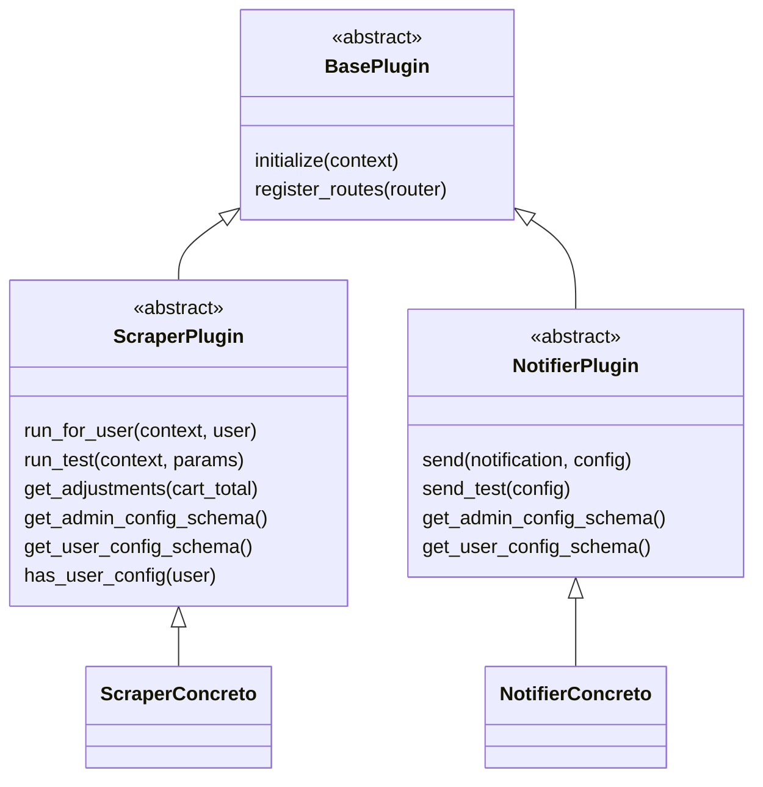
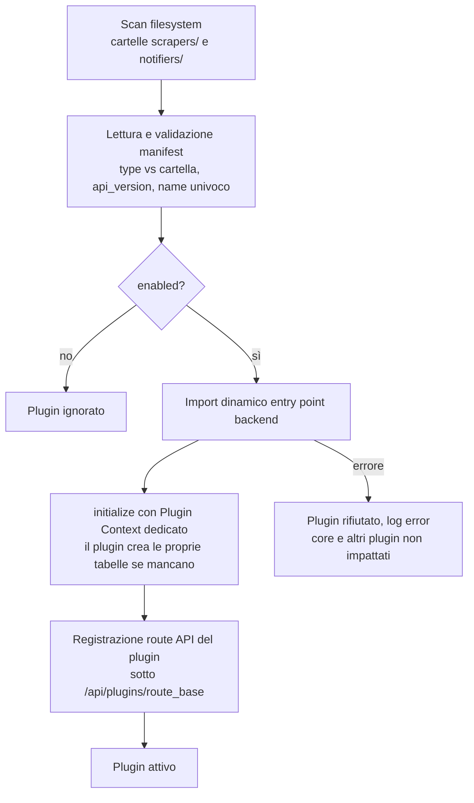
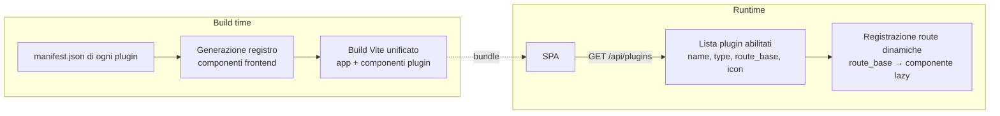
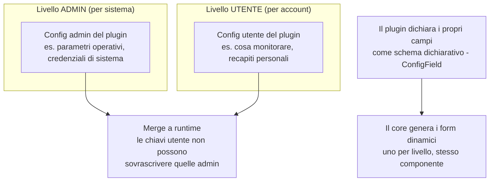

# Architettura dei plugin e integrazione dinamica

> **Layer 2 — Architettura** · Audience: architetti SW, system engineer · Testo + Mermaid, niente codice.

## Il principio: plugin-first full-stack

Un plugin è un'**unità indivisibile full-stack**: backend Python e frontend Svelte co-localizzati in un'unica cartella, descritti da un **manifest** dichiarativo che è l'unica source of truth del plugin (identità, tipo, attivazione, entry point, icona, traduzioni, versione di contratto).

Due famiglie, entrambe derivate da un contratto base comune:

I plugin concreti (un esempio di scraper reale e i notifier email/Discord) sono documentati a parte in [implemented-plugins/](../implemented-plugins/): **tutta la documentazione generica descrive solo i contratti astratti**, senza dipendere da alcun sito o canale reale.

## Integrazione dinamica — backend

All'avvio, ogni container che carica i plugin (web e worker) esegue la stessa sequenza deterministica. **Nessun plugin switching a runtime**: l'attivazione è statica via manifest, e una modifica richiede rebuild + restart.

Garanzie del registry: validazione del manifest (tipo coerente con la cartella, `api_version` compatibile col core, nome univoco e coincidente con l'identità del plugin), isolamento del fallimento (un plugin rotto non carica, il resto sì).

## Integrazione dinamica — frontend

Il frontend dei plugin è incluso nello **stesso build** dell'app (un solo processo Vite): uno step automatico legge i manifest, filtra i plugin abilitati e genera il registro dei componenti; a runtime la SPA chiede al backend la lista dei plugin attivi e monta dinamicamente le route.

Proprietà importanti:

- **Aggiungere un plugin non tocca il codice di build**: basta la cartella con manifest valido ed entry frontend conforme.
- I plugin **importano liberamente i componenti del design system** del core: build unico, nessun problema cross-bundle.
- Ogni plugin porta le **proprie traduzioni** in un namespace dedicato e una **icona** statica usata ovunque serva la provenienza (Product Picker, carrelli, notifiche).
- Build e runtime restano coerenti per costruzione: la stessa fonte (manifest) alimenta entrambi; per questo l'attivazione richiede rebuild (vedi [build system](../infrastructure/build-system.md)).

## Configurazione a due livelli (sempre, per ogni plugin)

Ogni plugin — scraper o notifier — è configurabile su due piani **separati e complementari**:

- Il plugin **dichiara** i campi (tipo, obbligatorietà, segretezza); il core **disegna** i form senza conoscere il plugin. I campi segreti sono mascherati e write-only.
- Per gli **scraper**: la config admin governa il comportamento (timeout, ritmo, regole del sito); la config utente è *cosa osservare* e vive nelle tabelle del plugin.
- Per i **notifier**: la config admin è l'infrastruttura del canale (es. server di posta); la config utente è il recapito personale, con un flag di **attivazione per-utente** e un'azione di **test**.

## Isolamento: la "sandbox soft"

Ogni plugin riceve un **Plugin Context** con tutto ciò che gli serve e nient'altro: sessione DB, logger, la propria sezione di config, un client HTTP con politeness integrata, e il callback per consegnare i prodotti al core.

**Trust model dichiarato**: i plugin girano in-process e sono **codice first-party fidato**. Il contesto è una disciplina architetturale (manutenibilità, confini chiari), **non** un confine di sicurezza — Python non può impedire a un plugin malevolo di accedere a ciò che vuole. Le protezioni reali contro i plugin *difettosi* (non malevoli) sono: timeout di run, lock anti-overlap, isolamento degli errori, tabelle namespaced. Coerente con la [postura di sicurezza](security-posture.md) del progetto.

## Regole sui dati dei plugin

- Ogni plugin possiede **una o più tabelle dedicate** (naming namespaced per plugin) che crea da sé, idempotentemente, all'inizializzazione. Niente tabelle generiche condivise.
- Lo scraper **non scrive mai** nelle tabelle del catalogo core: l'unica via d'ingresso dei prodotti è il callback `update_catalog`.
- Il core non legge mai le tabelle dei plugin: quando ha bisogno di sapere qualcosa (es. "questo utente ha configurato questo scraper?") lo **chiede al plugin** tramite contratto.

## Approfondimenti

- Dettaglio funzionale dei contratti: [Layer 3 — plugins](../3-features/plugins/)
- Contratti tecnici e pseudocodice: [Layer 4 — core](../4-capabilities/core/plugin-registry.md) e [contratti](../4-capabilities/contracts/)
- Guida per sviluppare un plugin: [plugin-development/](../plugin-development/README.md)
