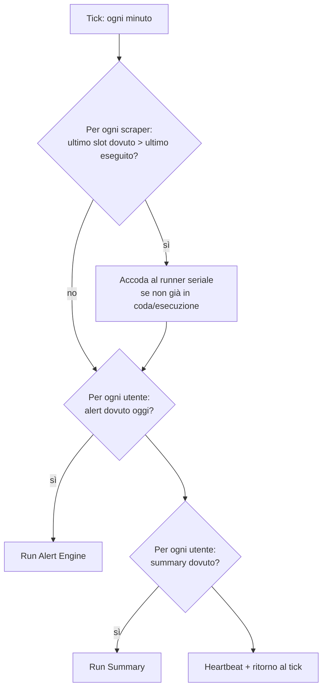
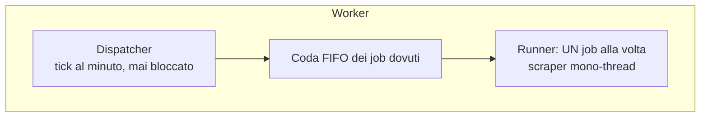
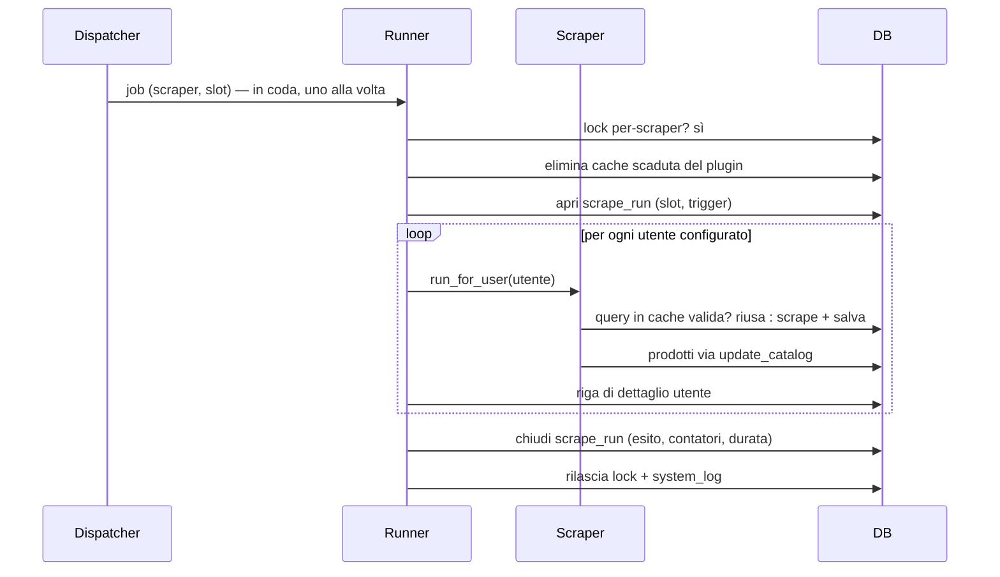

# Scheduling ed esecuzione degli scraper

> **Layer 2 — Architettura** · Audience: architetti SW, system engineer · Testo + Mermaid, niente codice.

## I tre flussi schedulati

Non esiste una cron table unica: i tre flussi hanno owner, granularità e logiche diverse, e sono **deliberatamente disaccoppiati** (lo scrape aggiorna i dati; la notifica arriva quando l'utente la vuole).

| Flusso | Owner | Granularità | Frequenza |
|---|---|---|---|
| **Scrape** | Admin | Per-scraper | **1..N slot al giorno** (lista di orari per scraper) |
| **Alert** | Utente | Per-account | Giorni della settimana scelti + un orario |
| **Summary** | Utente | Per-account | Settimanale (giorno scelto) o mensile (giorno 1), opt-in |

## Il dispatcher (Cron Worker)

Il worker si sveglia ogni minuto e confronta l'ora con gli schedule. Il principio del "dovuto": un job è dovuto quando esiste uno **slot programmato già passato** che non è ancora stato eseguito. Questo dà gratis il **recupero** (catch-up): se il worker era fermo, al riavvio esegue lo slot più recente perso — **uno solo**, mai il replay di tutti gli slot arretrati.

Limiti onesti del catch-up (dichiarati, scelta da hobby project):

- **Scraper**: il recupero attraversa la mezzanotte (si confrontano *slot*, non date) — uno scraper fermo dalle 23 recupera lo slot delle 23:50 anche all'1 di notte.
- **Alert e summary**: il recupero vale **entro il giorno dovuto**. Se il sistema resta fermo per l'intera giornata dovuta, quella notifica salta e gli eventi confluiranno nella successiva (il diff è cumulativo per natura: nulla va perso nei contenuti, solo nel momento della consegna).

## Il runner seriale

Gli scraper **non girano nel dispatcher**: vengono accodati a un runner che li esegue **uno alla volta**, in ordine di arrivo. Non esiste esecuzione concorrente tra scraper: ogni scraper ha il **proprio orario indipendente**, e l'admin distribuisce gli slot nella giornata con l'aiuto della [vista calendario](../3-features/admin/scraper-scheduling-and-limits.md) (read-only, un click porta alla configurazione dello scraper).

Regole architetturali (il razionale completo in [3-features/admin/scraper-scheduling-and-limits.md](../3-features/admin/scraper-scheduling-and-limits.md)):

1. **Ogni scraper è intrinsecamente mono-thread**: un solo flusso di lavoro che legge un sito con calma, una richiesta alla volta, con pause configurabili. È una proprietà del contratto, non un'opzione.
2. **Nessuna esecuzione concorrente tra scraper**: il runner ne esegue **uno alla volta**; due slot che cadono nello stesso minuto girano in sequenza (coda FIFO). Gli orari indipendenti per scraper, ben distribuiti, rendono la coda l'eccezione, non la regola.
3. **Mai due run dello stesso scraper insieme**: lock per-scraper a livello di database, valido anche tra container (worker e web, per gli scrape on-demand).
4. **Politeness obbligatoria**: il client HTTP fornito ai plugin impone un ritardo minimo tra richieste allo stesso sito (configurabile per scraper dall'admin). Il sistema **non deve mai** fare flooding o assomigliare a un DoS: poche richieste, lente, identificabili.
5. **Timeout di run**: una run che supera il tempo massimo (admin) viene terminata e marcata in errore — uno scraper appeso non blocca il sistema.

## La cache di scrape

Prima di ogni ricerca lo scraper — tramite il client HTTP del contesto, in modo per lui trasparente — controlla se esiste **in cache un risultato recente per la stessa query**: se l'**emivita** configurata non è scaduta, riusa i dati ed evita la chiamata al sito; altrimenti esegue lo scrape e salva il risultato. All'avvio di ogni run i record scaduti del plugin vengono eliminati. La cache vive in una **tabella dedicata** ([schema](../4-capabilities/database/schema.md), `scrape_cache`), l'emivita è configurabile dall'admin **per plugin**, e la pagina admin del plugin offre un pulsante di **svuotamento manuale**.

È un'ottimizzazione a doppio effetto: **tra utenti diversi nella stessa run** (due utenti che osservano la stessa categoria costano una sola visita al sito) e **tra run diverse** ravvicinate entro l'emivita. Dettagli del contratto: [plugin-context](../4-capabilities/core/plugin-context.md), CTX-R9.

## Osservabilità delle esecuzioni

Ogni run produce un **record di esecuzione** (durata reale, prodotti trovati/nuovi/variati/spariti, richieste HTTP effettuate, riusi dalla cache, esito) con il **dettaglio per utente**; gli eventi operativi (esecuzioni, recuperi, skip per overlap, errori, heartbeat) finiscono nel log di sistema consultabile dall'admin in near-real-time. È la base della [reportistica admin](../3-features/admin/scraper-monitoring.md).

## Assunzioni temporali (V1)

- Granularità al **minuto**; orari confrontati con l'ora del **server**.
- Server e utenti nello **stesso fuso orario** (multi-fuso: [future improvement](../future-improvements/README.md)).
- I cambi ora legale/solare possono spostare di un'ora la percezione di uno slot due volte l'anno: accettato e documentato, nessuna gestione speciale.
