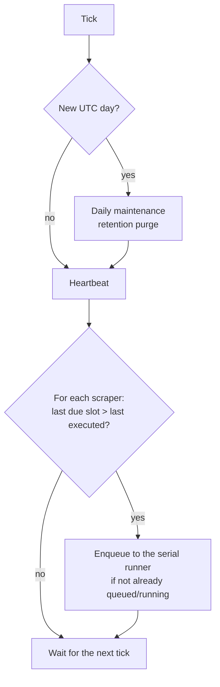
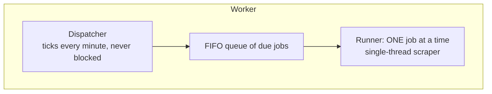
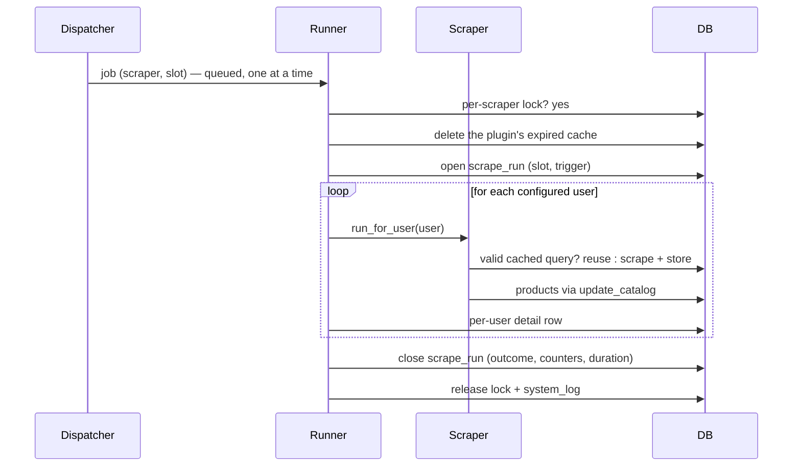

# Scraper scheduling and execution

> **Layer 2 — Architecture** · Audience: SW architects, system engineers · Text + Mermaid, no code.
>
> The worker dispatches the **scrape** flow and runs daily maintenance. **Alerts are event-driven** — the alert engine runs right after a scrape that changed a user's catalog (no schedule); details in the Italian [notification-architecture](../../docs-ita/2-architecture/notification-architecture.md). The **summary** scheduled flow (per-account cadence) arrives in the insights phase and is described in the Italian [scheduling-and-execution](../../docs-ita/2-architecture/scheduling-and-execution.md).

## The scheduled flows

There is no single cron table: the flows have different owners, granularities, and logics. The **scrape** is scheduled by slots; the **alert** is **event-driven** (it runs at the end of each scrape that changed the catalog — no time schedule); the **summary** is a per-account scheduled flow added later.

| Flow | Owner | Granularity | Frequency | Status |
|---|---|---|---|---|
| **Scrape** | Admin | Per-scraper | **1..N slots per day** (a list of times per scraper) | Implemented |
| **Alert** | User | Per-account | **Event-driven**: after each scrape that changed the catalog (no schedule) | Implemented |
| **Summary** | User | Per-account | Weekly (chosen day) or monthly (day 1), opt-in | Insights phase |

## The dispatcher (Cron Worker)

The worker wakes up every tick and compares the current time against the schedules. The "due" principle: a job is due when there is a **scheduled slot already in the past** that has not yet been executed. This gives **catch-up** for free: if the worker was down, on restart it runs the most recent missed slot — **only one**, never a replay of all the backlogged slots.

Honest limits of catch-up (declared, a hobby-project choice):

- **Scraper**: catch-up crosses midnight (*slots* are compared, not dates) — a scraper down since 23:00 recovers the 23:50:00 slot even at 1 a.m.
- **Alerts** need no catch-up: being event-driven, they run whenever a scrape produces changes. The summary flow follows the "most recent missed slot within the day" principle once it ships; see the Italian reference.

## The serial runner

Scrapers **do not run inside the dispatcher**: they are enqueued to a runner that executes them **one at a time**, in order of arrival. There is no concurrent execution between scrapers: each scraper has its **own independent schedule**, and the admin distributes the slots across the day with the help of the [calendar view](../3-features/admin/scraper-scheduling-and-limits.md) (read-only, one click takes you to the scraper's configuration).

Architectural rules (the full rationale in [3-features/admin/scraper-scheduling-and-limits.md](../3-features/admin/scraper-scheduling-and-limits.md)):

1. **Every scraper is intrinsically single-thread**: a single workflow that reads a site calmly, one request at a time, with configurable pauses. It is a property of the contract, not an option.
2. **No concurrent execution between scrapers**: the runner executes **one at a time**; two slots that fall in the same minute run in sequence (FIFO queue). Per-scraper independent schedules, well distributed, make the queue the exception, not the rule.
3. **Never two runs of the same scraper together**: a per-scraper lock at the database level, valid even across containers (worker and web, for on-demand scrapes).
4. **Mandatory politeness**: the HTTP client provided to plugins enforces a minimum delay between requests to the same site (configurable per scraper by the admin). The system **must never** flood or resemble a DoS: few requests, slow, identifiable.
5. **Run timeout**: a run that exceeds the maximum time (admin) is terminated and marked as error — a hung scraper does not block the system.

## The scrape cache

Before each search the scraper — through the context's HTTP client, transparently to it — checks whether there is **a recent cached result for the same query**: if the configured **half-life** has not expired, it reuses the data and avoids the call to the site; otherwise it performs the scrape and stores the result. At the start of each run the plugin's expired records are deleted. The cache lives in a **dedicated table** ([schema](../4-capabilities/database/schema.md), `scrape_cache`), the half-life is configurable by the admin **per plugin**, and the plugin's admin page offers a **manual purge** button.

It is an optimization with a double effect: **across different users in the same run** (two users watching the same category cost a single visit to the site) and **across different runs** close together within the half-life. Contract details: [plugin-context](../4-capabilities/core/plugin-context.md), CTX-R9.

## Observability of executions

Every run produces an **execution record** (actual duration, products found/new/changed/disappeared, HTTP requests made, cache reuses, outcome) with the **per-user detail**; operational events (executions, catch-ups, skips due to overlap, errors, heartbeats) end up in the system log, viewable by the admin in near-real-time. It is the basis of the [admin reporting](../../docs-ita/3-features/admin/scraper-monitoring.md).

## Temporal assumptions (V1)

- Granularity at the **minute**; the times entered are interpreted in the **installation's configured timezone** (`TZ`, default `Europe/Rome` — [configuration](../infrastructure/configuration.md)), the persisted timestamps remain in UTC.
- **A single timezone** for the whole installation, configurable but not per-user (per-user multi-timezone: [future improvement](../future-improvements/README.md)).
- Daylight saving time transitions may shift the perception of a slot by one hour twice a year: accepted and documented, with no special handling.
