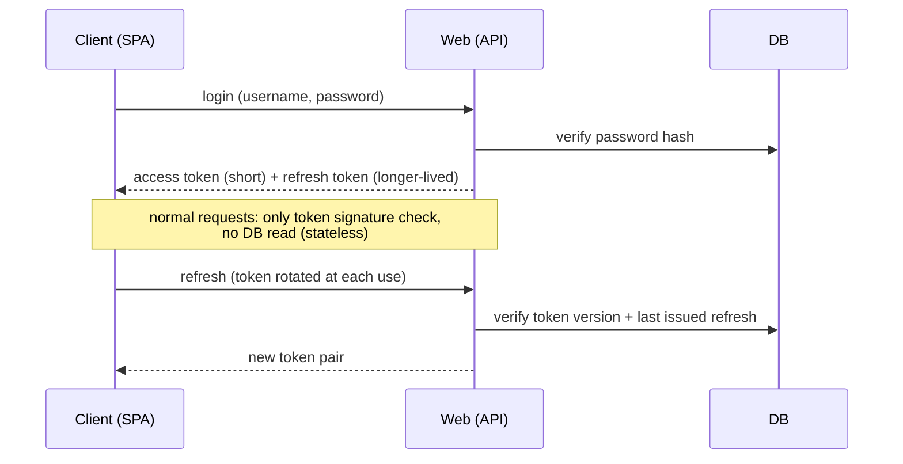

# Security posture

> **Layer 2 — Architecture** · Audience: SW architects, system engineers · Text + Mermaid, no code.
>
> Faithful to what is implemented (phases 0–5).

## Premise: context is everything

Watch 'Em All is a **self-hosted personal project**: a single private installation, typically on a home LAN, with a handful of users who know each other (≤5 concurrent). Security is designed **for this context**: modern patterns are adopted where they cost little, and simplifications that would be unacceptable in a production-ready product are explicitly accepted. Every simplification is **declared**, never implicit.

## Threat model (proportionate)

| Threat | Relevance | Response |
|---|---|---|
| Unauthorised access to the exposed app | Medium | JWT authentication, rate limit on login, no self-registration |
| A user accessing another's data | Medium | Strict multi-tenancy: every query is filtered by user |
| A user altering the system config | Medium | Role separation; admin keys are not overridable by user config |
| Token theft via XSS | Low (trusted users, no third-party content) | SPA without external user-generated content; short-lived access token |
| Traffic interception | Low on LAN | HTTP accepted; TLS via a reverse proxy **only if exposed** to the Internet |
| Malicious plugin | Out of scope | Plugins are trusted first-party code (declared trust model) |
| DoS, state actors, supply chain | Out of scope | Not proportionate to the context |

## Authentication: modern but lightweight

Choices (technical detail in [4-capabilities/core/auth.md](../4-capabilities/core/auth.md)):

- **Signed JWTs**, short-lived access verified without the DB; refresh **rotated** at each use, with the last issued one tracked on the user profile (the old one becomes unusable, reuse signals a theft — the reuse bumps the token version, forcing a global re-login).
- Access and refresh are **distinguishable by type** (`typ`): a refresh cannot be spent as an access.
- **Global invalidation** through a version counter on the profile: logout, password change and disabling cut out all issued tokens.
- **Lightness accepted and declared**: after logout/disabling, an already-issued access token stays technically valid until it expires. At this scale it is a risk accepted in exchange for stateless simplicity.
- Passwords hashed with **bcrypt**, minimum length; rate limit on login (HTTP 429 with backoff). No OAuth/SSO, no MFA: not proportionate.

The access and refresh token TTLs are bootstrap configuration (see [infrastructure/configuration.md](../infrastructure/configuration.md)); a short access (e.g. ~15 min) with a longer-lived refresh (e.g. ~7 days) is the intended shape.

## Authorization

- Two roles: `admin` (system governance, **no access to users' operational data**) and `user` (only their own data).
- Multi-tenancy is enforced **at the data-access level**: every operational read/write is bound to the token's user. It is the system's most important barrier and the only non-negotiable one.

## Transport and exposure

- **Plaintext HTTP is accepted** for LAN/localhost use: it is the most visible simplification of the hobby posture.
- If the installation is exposed to the Internet, TLS is the responsibility of a **reverse proxy** in front of the app (Caddy/Traefik: two lines of config). The [deployment](../infrastructure/deployment.md) documentation points to it as the only requirement for exposure.
- The DB inspection tool exists **only in the development profile**, never in production.

## Secrets

- Bootstrap secrets (DB credentials, signing key, initial admin password) live in environment variables, never in the repo (an example file committed without values).
- Operational configuration lives **in the DB**, set from the admin UI: a declared trade-off (configuration convenience without touching the environment) acceptable because the DB is not exposed and the installation is private. Channel credentials for the notifiers (e.g. SMTP) follow the same model and arrive with the notifier configuration; secret fields are masked in the UI and never sent back to the client.

## What we do NOT do (and that's fine)

No audit log, no at-rest encryption, no elaborate CSP, no WAF, no secret rotation, no penetration testing. These are all right in a real product and disproportionate here. If the project changed nature, this document is the first to rewrite — the starting point is the list of [future improvements](../future-improvements/README.md).
