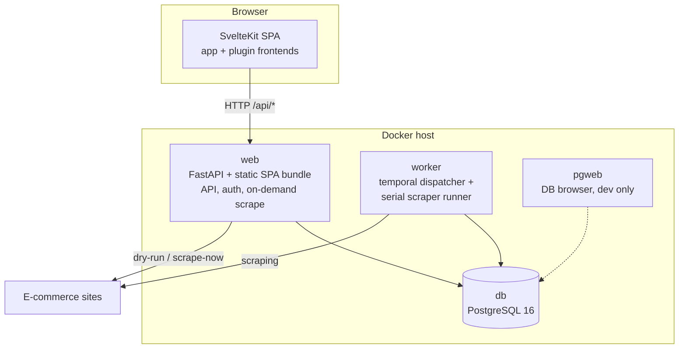
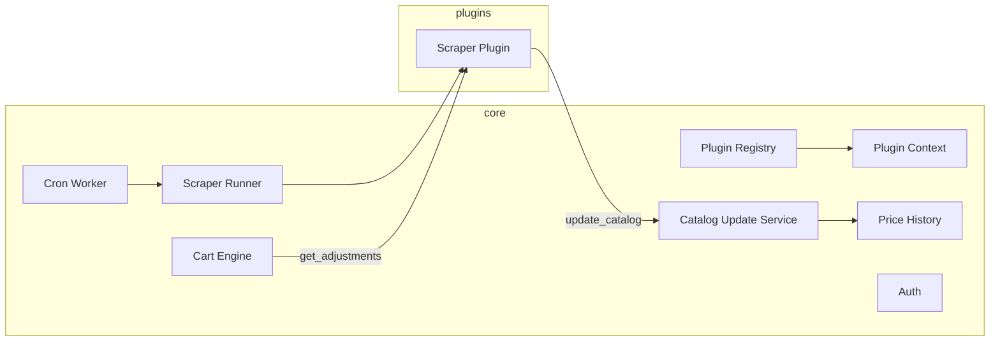
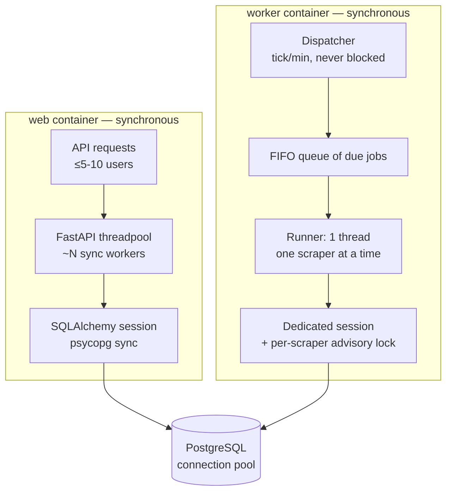
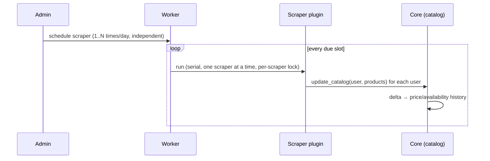

# System overview

> **Layer 2 — Architecture** · Audience: SW architects, system engineers · Text + Mermaid, no code.
>
> Mirror of the implemented system (phases 0–5). The alert/summary/notification components (Alert Engine, Summary Report, Notification Dispatch, notifier delivery) arrive with the in-app alerts phase and are described in the Italian [notification-architecture](../../docs-ita/2-architecture/notification-architecture.md).

## Container view

The system is made of three application processes plus the database, orchestrated with Docker Compose. `web` and `worker` never talk to each other directly: **they share only the database**.

| Container | Responsibility | Notes |
|---|---|---|
| `web` | HTTP API, authentication, serves the built SPA, runs the **on-demand scrapes** (dry-run, scrape-now) as background tasks | Loads the plugins to expose their routes and their config schemas |
| `worker` | Temporal dispatcher (tick every minute) + **serial scraper runner** (one at a time, each on its own schedule); daily maintenance (retention purge of logs and run records); heartbeat | Loads the plugins to execute them |
| `db` | PostgreSQL: the system's single shared state | MVCC handles the concurrent writes of web and worker |
| `pgweb` | DB inspection from the browser | Development stack only (`compose-dev.yml`), absent from the release |

**Why PostgreSQL and not SQLite**: two processes write concurrently (web and worker); SQLite with a file lock shared across containers is fragile, Postgres with MVCC is not.

**Why both containers load the plugins**: the worker runs the scheduled runs; the web exposes the plugin routes (UI, dry-run, config schemas) and runs the on-demand scrapes requested from the UI. The executions coordinate through a **per-scraper lock on the DB** (never two runs of the same scraper in parallel, whichever container starts them).

## Core component view

| Component | Responsibility | Detail |
|---|---|---|
| Plugin Registry | Discovery, manifest validation, loading, route registration | [L4](../4-capabilities/core/plugin-registry.md) |
| Plugin Context | Soft sandbox: everything a plugin may use | [L4](../4-capabilities/core/plugin-context.md) |
| Cron Worker | Temporal dispatcher of the scrape flow + daily maintenance | [L4](../4-capabilities/core/cron-worker.md) |
| Scraper Runner | Serial execution of the scrapers (one at a time, lock, timeout, cache) | [L4](../4-capabilities/core/scraper-pool.md) |
| Catalog Update Service | Receives the products from the scrapers, computes the deltas, writes the history | [L4](../4-capabilities/core/catalog-update-service.md) |
| Cart Engine | Totals, adjustments, cart thresholds | [L4](../4-capabilities/core/cart-engine.md) |
| Price History | Append-only history of prices and availability + series for the charts | [L4](../4-capabilities/core/price-history.md) |
| Auth | JWT (short access + rotated refresh), roles | [L4](../4-capabilities/core/auth.md) |

The Alert Engine, Summary Report and Notification Dispatch components close the loop (diff vs. baseline → aggregated notification, periodic snapshot, delivery to the enabled channels); they arrive with the alerts phase and are described in the Italian [notification-architecture](../../docs-ita/2-architecture/notification-architecture.md).

## Execution model (concurrency)

The backend is **synchronous** (a declared choice, [BE-21](../developer-rules/backend/rules.md); rationale in the decision table at the bottom): no asyncio in the core nor in the plugins. Concurrency exists in only two places, both properties of the system and not of the features — the **threadpool** with which FastAPI serves the synchronous endpoints in the `web` container, and the **single-thread runner** of the `worker` (one scraper at a time, SCHED-R6). The plugins stay simple sequential code.

The scalability knobs at equal architecture are two and configuration-only: the size of the web's **threadpool** and of the **connection pool** to Postgres. Beyond the current posture (tens→hundreds of concurrent requests, parallelism between scrapers), the evolution towards async and/or an execution pool is a [future improvement](../../docs-ita/future-improvements/platform.md).

## Core ↔ plugin boundaries

The core communicates with the plugins **only** through declarative contracts:

- it receives data as typed models: `Product`, `Adjustment` ([contracts, L4](../4-capabilities/contracts/));
- it invokes the abstract methods of the contracts (`run_for_user`, `run_test`, `get_adjustments`, the identity seed);
- it does not know: the scraping strategy, the concept of **category** (internal to the scrapers), the message format, delivery retries.

The dependency graph is acyclic: the plugins depend on the core, never the reverse. See [plugin-architecture.md](plugin-architecture.md).

## End-to-end flow (the full loop)

Once alerts ship, the loop continues at the user's alert time: the Alert Engine diffs each cart against its baseline and hands an aggregated digest to the enabled notifier channels, always writing the internal alert history first. See the Italian [notification-architecture](../../docs-ita/2-architecture/notification-architecture.md).

## Key architectural decisions

| Decision | Choice | Rationale |
|---|---|---|
| Catalog | **Per-user** | Total isolation; the cost (duplicated scraping across users) is acceptable at ≤5 users |
| Plugin state | **Dedicated tables per plugin** | No shared generic tables; the core does not know them |
| Frontend | **Client-side SPA** (no SSR) | App behind a login, no SEO; the dynamic mounting of the plugins is natural client-side |
| Backend execution model | **Synchronous** (endpoints in the threadpool, psycopg sync, sync plugins) | At ≤5-10 users async gives no throughput; the runner is already threaded and the plugins stay simple; it scales with threadpool/DB-pool tuning, async is a future evolution — see [Execution model](#execution-model-concurrency) |
| Scraper concurrency | **Serial execution (a single scraper at a time); scrapers internally single-thread** | Predictable load, no parallelism parameters to tune; the independent per-scraper schedules distribute the work; see [scheduling-and-execution.md](scheduling-and-execution.md) |
| Scrape data reuse | **Per-query cache with a per-plugin half-life** | The same search, across users or close-together runs, costs a single visit to the site; see [scheduling-and-execution.md](scheduling-and-execution.md) |
