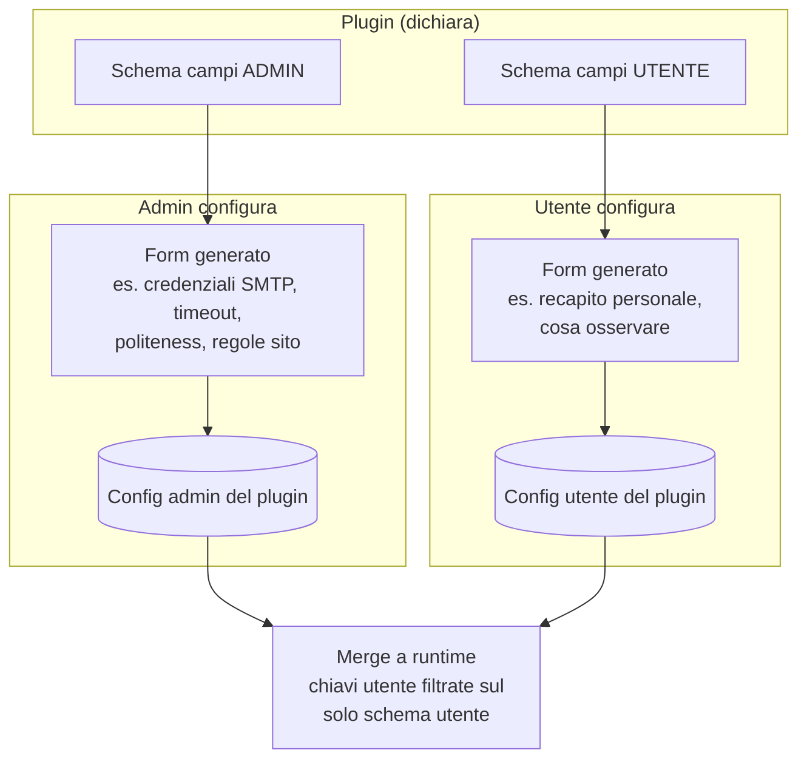

# Configurazione dei plugin (admin)

> **Layer 3 — Feature admin** · Audience: architetti, developer · Testo + Mermaid, niente codice. Architettura: [plugin-architecture](../../2-architecture/plugin-architecture.md).

## Scopo

Ogni plugin — scraper o notifier — ha una parte di configurazione **di sistema**, responsabilità dell'admin, distinta dalla parte personale degli utenti. L'admin la gestisce da form **generati dinamicamente** dagli schemi che i plugin dichiarano: il core non contiene una riga di UI specifica per plugin.

## Requisiti

- **PCFG-R1** — Ogni plugin dichiara i propri campi di configurazione admin come **schema dichiarativo** (lista di campi con tipo, obbligatorietà, segretezza, default — contratto [ConfigField](../../4-capabilities/contracts/config-field.md)); il core genera il form dal solo schema.
- **PCFG-R2** — La configurazione admin è salvata nel DB (config DB-first) ed è modificabile senza riavvio.
- **PCFG-R3** — I campi **segreti** (es. credenziali del server di posta) sono mascherati, write-only, mai rispediti al client; un valore già presente è indicato senza rivelarlo.
- **PCFG-R4** — La validazione autoritativa degli input è del **backend del plugin**; la UI valida solo per usabilità.
- **PCFG-R5** — Per gli **scraper**, la pagina admin del plugin offre anche: i parametri operativi (timeout, identificazione client, ritmo di politeness, regole del sito come le soglie di sconto) e il **Test Scraper** (dry-run on-demand che mostra i prodotti trovati in tabella, **senza scrivere nulla**). La pagina admin del plugin è **distinta** dalla pagina utente: configura il comportamento, non sceglie cosa osservare.
- **PCFG-R6** — Per i **notifier**, la configurazione admin è il prerequisito del canale: finché manca, il canale risulta "non disponibile" per tutti gli utenti (lo stato è visibile sia all'admin sia agli utenti). Anche l'admin ha un bottone di **test** del canale.
- **PCFG-R7** — L'**attivazione** di un plugin non è configurazione runtime: è dichiarata nel manifest e richiede rebuild + restart ([build system](../../infrastructure/build-system.md)). La **sospensione** di uno scraper (stop temporaneo delle esecuzioni) è invece runtime, dallo scheduler.
- **PCFG-R8** — Speculare per i **notifier**: l'admin può **disabilitare/riabilitare un canale per tutti gli utenti** a runtime. Un canale disabilitato risulta "non disponibile" per tutti (stesso stato della config di sistema mancante, PCFG-R6) e non consegna nulla — nemmeno i [messaggi admin](admin-notifications.md); le configurazioni personali degli utenti **non vengono toccate** e tornano operative alla riattivazione.

## I due livelli, fianco a fianco

La regola di sicurezza del merge: le chiavi inviate dall'utente sono **filtrate sullo schema utente** prima del merge — un utente non può mai sovrascrivere un parametro admin (es. il server di posta). Vedi [security posture](../../2-architecture/security-posture.md).

## Esempi tipici (generici)

| Plugin | Config admin (sistema) | Config utente (personale) |
|---|---|---|
| Scraper | timeout richieste, user-agent, ritardo di politeness, regole di sconto del sito | prodotti/categorie da osservare (vive nelle tabelle del plugin) |
| Notifier email | host/porta/credenziali del server in uscita, mittente | indirizzo destinatario, flag attivo |
| Notifier a webhook | eventuali default di sistema | URL del webhook personale, flag attivo |

I casi reali sono documentati in [implemented-plugins/](../../implemented-plugins/).
