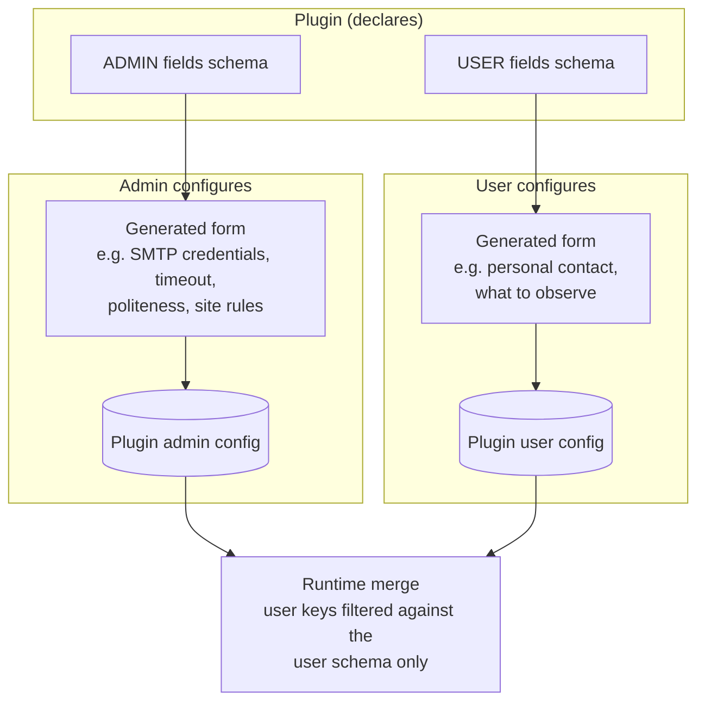

# Plugin configuration (admin)

> **Layer 3 — Admin feature** · Audience: architects, developers · Text + Mermaid, no code. Architecture: [plugin-architecture](../../2-architecture/plugin-architecture.md).

## Purpose

Every plugin — scraper or notifier — has a **system** configuration part, the admin's responsibility, distinct from the users' personal part. The admin manages it through forms that are **dynamically generated** from the schemas the plugins declare: the core does not contain a single line of plugin-specific UI.

## Requirements

- **PCFG-R1** — Every plugin declares its own admin configuration fields as a **declarative schema** (a list of fields with type, requiredness, secrecy, default — the [ConfigField](../../../docs-ita/4-capabilities/contracts/config-field.md) contract); the core generates the form from the schema alone.
- **PCFG-R2** — The admin configuration is stored in the DB (DB-first config) and is editable without a restart, in **dedicated core tables per type**: `scraper_admin_config` and `notifier_admin_config` ([schema](../../4-capabilities/database/schema.md)). They are **core** tables (not plugin tables) because they also host the **reserved parameters** that the core reads on its own behalf: for scrapers `politeness_delay_ms`, `http_timeout_s`, `cache_ttl_min`, `scrape_now_min_interval_s` and `http_retries` (10.B22), which live in the same row but are invisible to the plugin (CTX). A plugin-declared key **may not shadow a reserved one** and the declaration is refused if it does: the core reads those on the plugin's behalf, so redefining one would change behaviour the plugin does not own. The fields **declared** by the plugin stay in its `config_json`; anything that does not fit a key-value form lives in the plugin's own tables (`plugin_<name>_*`).
- **PCFG-R3** — **Secret** fields (e.g. mail server credentials) are masked, write-only, never sent back to the client; an already-present value is indicated without revealing it.
- **PCFG-R4** — The authoritative validation of inputs belongs to the **plugin's backend**; the UI validates only for usability.
- **PCFG-R5** — For **scrapers**, the plugin's admin page also offers: the operational parameters (timeout, client identification, politeness pace, **scrape cache half-life** — CTX-R9, site rules such as discount thresholds) and the **Clear cache** button (deletes the plugin's cached results). *(A "Test Scraper" dry-run was specified here and withdrawn in 0.9.0 together with SCR-R11/R12: asking a site for a page twice — once to preview, once for real — is not something to offer against a site that publishes a `Crawl-delay`.)* The plugin's admin page is **distinct** from the user page: it configures the behavior, it does not choose what to observe.
- **PCFG-R6** — For **notifiers**, the admin configuration is the prerequisite for the channel: until it is missing, the channel is "unavailable" for all users (the state is visible both to the admin and to the users). The admin also has a channel **test** button.
- **PCFG-R8b** (10.B22) — A **scraper** declares its own admin settings the same way a notifier does, through `get_admin_config_schema() -> list[ConfigField]`, and the admin page renders one dynamic form from that declaration alone — the frontend never learns a field name. There is **no per-user level** for a scraper: these are settings about how the installation treats a site, and a site does not care who is watching it. Values land in the same `scraper_admin_config.config_json` beside the reserved keys and neither side overwrites the other. After a save the core calls `on_config_changed()` on the plugin, which is what makes "takes effect without a restart" true for anything the plugin derived and cached from those numbers. First consumer: Dragon Store's discount bands and shipping, hard-wired since phase 5.
- **PCFG-R8c** (10.B22) — The politeness delay is configurable **upwards only**: if the site declares a `Crawl-delay` in its `robots.txt`, that value is the **hard minimum** and a smaller configured value is raised to it. Enforced by the HTTP client, and — this is the part that matters for a form — **stated in the field's own help text**, because a value silently raised is indistinguishable from a setting that does not work.
- **PCFG-R7** — The **activation** of a plugin is not runtime configuration: it is declared in the manifest and requires a rebuild + restart ([build system](../../infrastructure/build-system.md)). The **suspension** of a scraper (temporary stop of executions) is instead runtime, from the scheduler.
- **PCFG-R8** — Mirror image for **notifiers**: the admin can **disable/re-enable a channel for all users** at runtime. A disabled channel is "unavailable" for everyone (the same state as a missing system config, PCFG-R6) and delivers nothing — not even [admin messages](../../../docs-ita/3-features/admin/admin-notifications.md); the users' personal configurations **are not touched** and become operational again upon reactivation.

## The two levels, side by side

The merge security rule: the keys submitted by the user are **filtered against the user schema** before the merge — a user can never overwrite an admin parameter (e.g. the mail server). See [security posture](../../2-architecture/security-posture.md).

## Typical examples (generic)

| Plugin | Admin config (system) | User config (personal) |
|---|---|---|
| Scraper | request timeout, user-agent, politeness delay, cache half-life, site discount rules | products/categories to observe (lives in the plugin's tables) |
| Email notifier | outgoing server host/port/credentials, sender | recipient address, active flag |
| Webhook notifier | optional system defaults | personal webhook URL, active flag |

The real cases are documented in [implemented-plugins/](../../implemented-plugins/).
