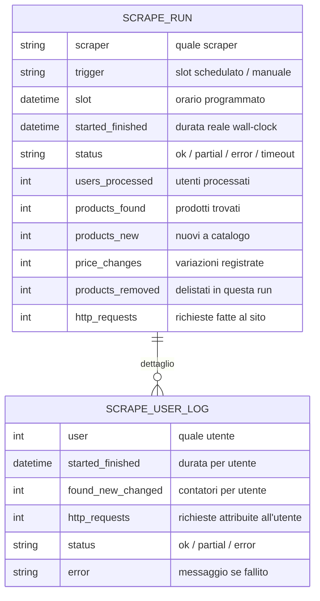
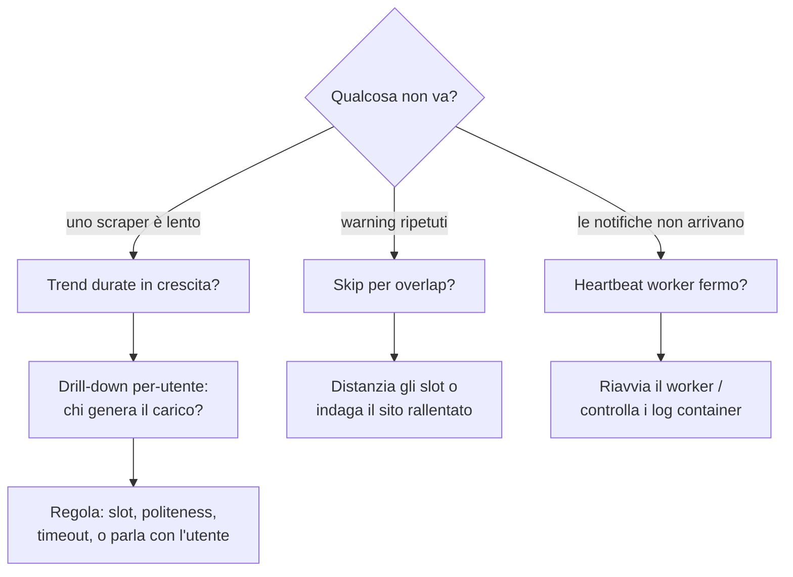

# Monitoraggio e statistiche degli scraper (admin)

> **Layer 3 — Feature admin** · Audience: architetti, developer · Testo + Mermaid, niente codice. Capability: [scraper-pool](../../4-capabilities/core/scraper-pool.md), [database](../../4-capabilities/database/schema.md).

## Scopo

Dare all'admin **visibilità completa sul lavoro degli scraper**: quanto girano, quanto durano, quanto producono, quante richieste fanno ai siti, dove falliscono. È il contrappeso necessario al potere di schedulare 1..N run al giorno: più potere di esecuzione richiede più controllo.

## Il modello dei dati di esecuzione

Ogni esecuzione produce un **record di run** con il **dettaglio per utente**:

- La **durata della run è wall-clock** (inizio→fine reale), non la somma dei tempi per utente.
- `http_requests` è contato dal client HTTP del core (il plugin non deve fare nulla): è la misura diretta del carico imposto al sito, quella che l'admin guarda per regolare politeness e numero di slot. È contato anche **per utente** (la run processa un utente alla volta): è la base del ranking di carico nella [dashboard di sistema](admin-dashboard.md).
- Semantica degli stati: `ok` = tutti gli utenti processati; `partial` = almeno un utente ok e almeno uno fallito; `error` = nessun utente completato; `timeout` = terminata dal sistema oltre il tempo massimo.

## Pagina di monitoraggio

### Vista d'insieme (per scraper)

| Elemento | Contenuto |
|---|---|
| Stato corrente | inattivo / in coda / **in esecuzione** (da quanto) / sospeso |
| Ultima run | esito, durata, prodotti trovati/nuovi/variati/delistati, richieste HTTP |
| Trend (grafici) | durata delle run nel tempo · richieste HTTP per run · variazioni di prezzo rilevate per run |
| Contatori di periodo | run riuscite/fallite negli ultimi 7/30 giorni; run al giorno |

### Drill-down

- **Elenco run** (paginato): ogni riga = una run con slot, trigger, esito, durata, contatori.
- **Dettaglio run**: le righe per-utente — chi ha generato quanto carico, chi è fallito e perché. È lo strumento per individuare l'utente con la configurazione patologica (es. una categoria enorme).

### Log di sistema

Registro near-real-time degli eventi operativi, con filtri per livello (`info`/`warning`/`error`) e origine (`worker`/`scraper`/`alert`/`summary`):

- esecuzioni e completamenti;
- **recuperi** (slot eseguito in ritardo oltre soglia → warning);
- **skip per overlap** (run precedente ancora in corso → warning; ripetuti = scraper troppo lento per i suoi slot, segnale di regolare schedule o timeout);
- errori e timeout;
- **heartbeat del worker**: la pagina mostra l'età dell'ultimo battito e segnala il worker come fermo oltre i 3 minuti.

La pagina si aggiorna in polling incrementale (cursore sull'ultima riga vista), con auto-scroll pausabile. Niente WebSocket in V1: semplicità prima di tutto.

## Flusso di lettura tipico dell'admin

## Requisiti

- **MON-R1** — Ogni run (schedulata o manuale) produce un record con i contatori sopra; il dettaglio per-utente è sempre disponibile.
- **MON-R2** — Le statistiche e i trend sono consultabili per scraper; i dati di run seguono la retention configurata (default 90 giorni), i log di sistema idem.
- **MON-R3** — Il conteggio delle richieste HTTP è automatico (instrumentazione del client del core), non dichiarato dal plugin.
- **MON-R4** — Il worker emette un heartbeat periodico visibile in pagina; l'assenza oltre soglia è evidenziata come anomalia.
- **MON-R5** — Run manuali (scrape-now degli utenti, dry-run esclusi perché non scrivono) compaiono nel monitoraggio con trigger `manual`.
