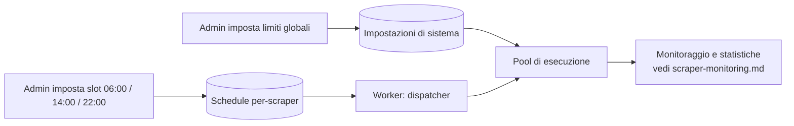

# Scheduling degli scraper e limiti di esecuzione (admin)

> **Layer 3 — Feature admin** · Audience: architetti, developer · Testo + Mermaid, niente codice. Architettura: [scheduling-and-execution](../../2-architecture/scheduling-and-execution.md) · Capability: [cron-worker](../../4-capabilities/core/cron-worker.md), [scraper-pool](../../4-capabilities/core/scraper-pool.md).

## Scopo

L'admin governa **quando** e **quanto** lavorano gli scraper: orari di esecuzione (da 1 a N volte al giorno per scraper), parallelismo massimo del sistema e ritmo verso i siti osservati. Obiettivo dichiarato e non negoziabile: **mai martellare un sito** — il sistema deve essere un osservatore discreto, non un flood di richieste.

## Requisiti

### Schedule per-scraper
- **SCHED-R1** — Per ogni scraper l'admin imposta una **lista di orari** (slot), da **1 a N al giorno** (es. `06:00`, `14:00`, `22:00`). Lo schedule vale per tutti gli utenti che hanno configurato quello scraper.
- **SCHED-R2** — Ogni scraper ha un flag **enabled/sospeso** a livello di schedule: sospenderlo ferma le esecuzioni senza disinstallare il plugin né perdere lo schedule.
- **SCHED-R3** — Uno slot è **dovuto** quando il suo orario è passato e non è ancora stato eseguito; se il sistema era fermo, al riavvio si recupera **solo lo slot più recente** perso (mai il replay di tutti). Il recupero attraversa la mezzanotte.
- **SCHED-R4** — **Mai due run dello stesso scraper in parallelo** (lock per-scraper, valido anche per le esecuzioni on-demand partite dal web). Se uno slot scatta mentre la run precedente è in corso, lo slot è saltato e l'evento registrato come warning.
- **SCHED-R5** — In caso di **errore** della run, lo slot è comunque consumato (niente retry automatico al minuto successivo: il prossimo slot farà il suo lavoro). L'errore è registrato e visibile.

### Limiti di sistema (globali, admin)
- **SCHED-R6** — **`max_concurrent_scrapers`**: numero massimo di scraper in esecuzione contemporanea (default prudente: 2). Gli altri job dovuti attendono in coda. Modificabile dalla UI senza riavvio.
- **SCHED-R7** — **`scraper_run_timeout`**: durata massima di una run (default 30 minuti); oltre, la run è terminata e marcata in errore. Uno scraper appeso non deve mai bloccare il sistema.
- **SCHED-R8** — **Politeness per-scraper**: ritardo minimo tra richieste HTTP consecutive dello stesso scraper (default 1–2 s, configurabile per scraper nella sua pagina admin). È imposto dal client HTTP fornito dal core, non lasciato alla buona volontà del plugin.
- **SCHED-R9** — Ogni scraper è **internamente mono-thread** (vincolo di contratto): una richiesta alla volta verso il sito. Il parallelismo esiste solo **tra scraper diversi**, cioè verso siti diversi.

## Il modello di concorrenza, visivamente

```mermaid
gantt
    dateFormat HH:mm
    axisFormat %H:%M
    title Pool con max_concurrent_scrapers = 2
    section Slot 06:00
    Scraper A (sito A)     :a, 06:00, 25m
    Scraper B (sito B)     :b, 06:00, 40m
    Scraper C (sito C) - in coda, parte quando A finisce :c, 06:25, 20m
```

Tre scraper dovuti alle 06:00, pool da 2: C attende il primo slot libero. Dentro ogni barra, le richieste al sito sono **sequenziali e cadenzate** dal ritardo di politeness.

## Pagina admin "Scheduler scrapers"

| Elemento | Contenuto |
|---|---|
| Riga per scraper | nome+icona, stato (attivo/sospeso/in esecuzione), slot configurati, esito e durata dell'ultima run, prossimo slot |
| Azioni per riga | modifica slot (aggiungi/rimuovi orari), sospendi/riattiva, vai al monitoraggio |
| Impostazioni globali | `max_concurrent_scrapers`, `scraper_run_timeout`, soglia di ritardo per i recuperi, retention dei log |

## Razionale delle scelte

- **Slot espliciti, non intervalli** ("ogni 4 ore"): l'admin ragiona per momenti della giornata utili ai dati (i prezzi cambiano la mattina; le offerte lampo richiedono uno slot in più), e gli slot rendono banale il calcolo del "dovuto" e del recupero.
- **Limiti centralizzati**: la politeness non è delegata ai plugin (un plugin scritto male non può violarla, il client HTTP la impone) e il parallelismo è una proprietà del sistema, non dei singoli scraper.
- **Errore = slot consumato**: il retry immediato trasformerebbe un sito in manutenzione in un bombardamento di tentativi al minuto; la cadenza naturale degli slot è il retry giusto.
