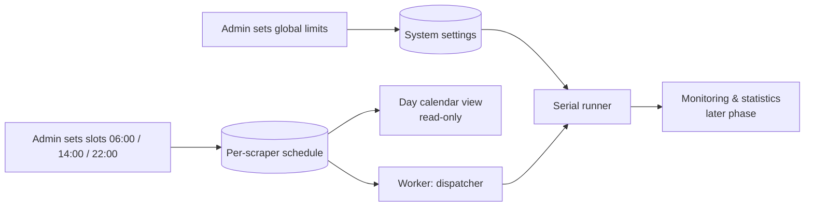

# Scraper scheduling and execution limits (admin)

> **Layer 3 — Admin feature** · Audience: architects, developers · Text + Mermaid, no code. Architecture: [scheduling-and-execution](../../2-architecture/scheduling-and-execution.md) · Capabilities: [cron-worker](../../4-capabilities/core/cron-worker.md), [scraper-pool](../../4-capabilities/core/scraper-pool.md).

## Purpose

The admin governs **when** and **how much** the scrapers work: execution times (from 1 to N per day per scraper, each independent of the others) and the pace toward the watched sites. Scrapers run **one at a time**: there is no concurrent execution across scrapers. The stated, non-negotiable goal: **never hammer a site** — the system must be a discreet observer, not a flood of requests.

## Requirements

### Per-scraper schedule
- **SCHED-R1** — For each scraper the admin sets a **list of times** (slots), from **1 to N per day** (e.g. `06:00`, `14:00`, `22:00`), **independent of the schedules of the other scrapers**. The schedule applies to all users who have configured that scraper.
- **SCHED-R2** — Each scraper has an **enabled/suspended** flag at the schedule level: suspending it stops executions without uninstalling the plugin or losing the schedule.
- **SCHED-R3** — A slot is **due** when its time has passed and it has not yet been executed; if the system was down, on restart it recovers **only the most recent** missed slot (never a replay of all of them). Recovery crosses midnight.
- **SCHED-R4** — **Never two runs of the same scraper in parallel** (per-scraper lock, valid also for on-demand executions started from the web). If a slot fires while the previous run is still in progress, the slot is skipped and the event logged as a warning.
- **SCHED-R5** — In case of a run **error**, the slot is consumed anyway (no automatic retry at the next minute: the next slot will do its job). The error is logged and visible.

### Serial execution and system limits
- **SCHED-R6** — **Strictly serial execution**: the runner runs **only one scraper at a time**; jobs due at the same moment wait in a **FIFO queue**. There is no parallelism parameter: load distribution is governed by **spacing out the scrapers' times** (with the help of the calendar view, SCHED-R10).
- **SCHED-R7** — **`scraper_run_timeout`**: maximum duration of a run (default 30 minutes); beyond that, the run is terminated and marked as an error. A hung scraper must never block the system (with serial execution it would also block the queue).
- **SCHED-R8** — **Per-scraper politeness**: minimum delay between consecutive HTTP requests of the same scraper — reserved key **`politeness_delay_ms`** (milliseconds, default 1000–2000 ms), configurable per scraper on its admin page (4.B10). It is enforced by the HTTP client provided by the core, not left to the plugin's goodwill.
- **SCHED-R9** — Each scraper is **internally single-threaded** (contract constraint): one request at a time toward the site. With serial execution across scrapers, at any instant the system has **at most one HTTP request in flight** toward the watched sites.

### Calendar view
- **SCHED-R10** — A page with a **day calendar view** shows all the scheduled runs of **all scrapers** (one block per slot, sized on the average duration of recent runs). It is **read-only**: slots are edited from the configuration; a **click on a scraper** takes you to its configuration page. It is the tool the admin uses to distribute the times while avoiding queue overlaps.

## The execution model, visually

```mermaid
gantt
    dateFormat HH:mm
    axisFormat %H:%M
    title Serial runner - only one scraper at a time
    section Morning
    Scraper A (site A) - slot 06:00     :a, 06:00, 25m
    Scraper B (site B) - slot 06:00, starts when A finishes :b, 06:25, 40m
    Scraper C (site C) - slot 08:00     :c, 08:00, 20m
```

A and B are due at 06:00: B waits in the queue for A to finish. C has its own independent time at 08:00 and runs alone. Inside each bar, the requests to the site are **sequential and paced** by the politeness delay.

## "Scraper scheduler" admin page

| Element | Content |
|---|---|
| Per-scraper row | name+icon, the configured slots as **`HH:MM:SS` chips** with **×** (asks for confirmation), a **`HH:MM:SS` time-picker + Add** to add more, and an **Active/Suspended toggle** (= `enabled` flag). Scrapers that cannot be scheduled appear as "Not schedulable" |
| Slot editor | dedicated page **`/admin/scrapers/schedule`** (4.F1, a child of *Scrapers* in the sidebar): add/remove times (with confirmation) and suspend/reactivate persist immediately via `PUT /api/admin/scrapers/{id}`. **UI-only rule**: two runs of *any* scraper cannot be less than 1 minute apart (circular distance at midnight). |
| 24-hour view | below the table, a timeline of **6 bands of 4h** from midnight: each run is a **marker = the plugin's icon**, clickable (removes it, with confirmation), with a legend, an `N runs/day` counter and a **now-marker** that reads the server time from `/api/health` once and then advances locally every second (hover → highlights the next run). A suspended scraper has its marker/chip/legend **greyed out**. |
| Global settings | `scraper_run_timeout`, the lateness threshold for recoveries, log retention |



## Rationale of the choices

- **Explicit slots, not intervals** ("every 4 hours"): the admin reasons in terms of moments of the day that are useful for the data (prices change in the morning; flash deals call for an extra slot), and slots make computing the "due" state and the recovery trivial.
- **Serial, not parallel**: at a few dozen runs per day parallelism buys nothing and complicates everything (limits to tune, load spikes, contention). One scraper at a time makes the load predictable and the calendar view a faithful snapshot of the day. (Reintroducing parallelism is a [future improvement](../../../docs-ita/future-improvements/platform.md) should the slots ever saturate the day.)
- **Centralized limits**: politeness is not delegated to the plugins (a badly written plugin cannot violate it, the HTTP client enforces it) and seriality is a property of the system, not of the individual scrapers.
- **Error = slot consumed**: an immediate retry would turn a site under maintenance into a barrage of attempts every minute; the natural cadence of the slots is the right retry.
