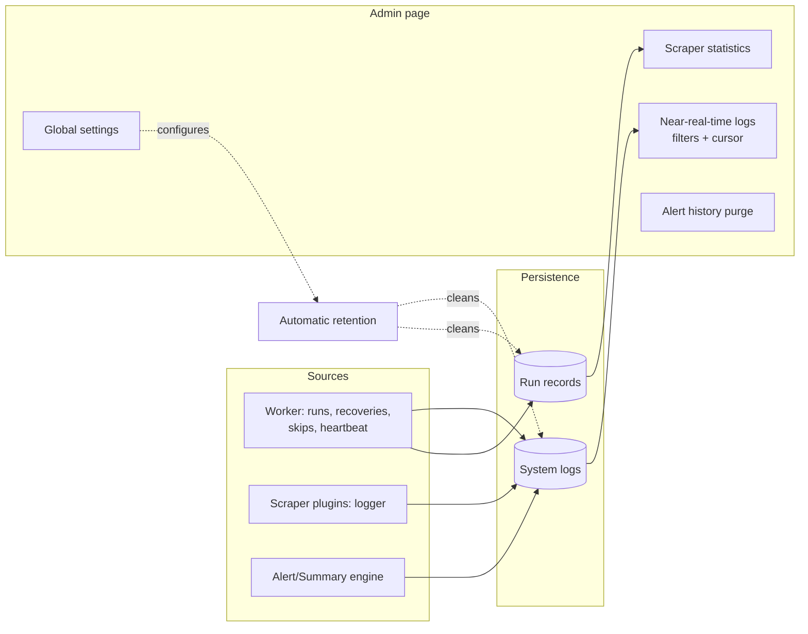

# System logs and maintenance (admin)

> **Layer 3 — Admin feature** · Audience: architects, developers · Text + Mermaid, no code.

## System logs

The record of the system's operational events, viewable in near-real-time from the admin page (incremental polling with a cursor, pausable auto-scroll, filters by level and source).

- **LOG-R1** — Sources: `worker` (dispatcher: runs, recoveries, skips due to overlap, heartbeat, daily maintenance — purge of expired users and related errors), `scraper` (events emitted by scraper plugins via the context logger), `alert`, `summary`. Levels: `info`, `warning`, `error`.
- **LOG-R2** — Notable events that are always recorded: run executed (with its delay relative to the slot; beyond the threshold → "recovery" warning), slot skipped due to overlap (warning), run error/timeout (error), heartbeat (info, recurring line).
- **LOG-R3** — Polling uses a cursor (id of the last row seen): the server returns only the rows that follow it.
- **LOG-R4** — Messages never contain users' operational content (product titles, notification content): only identifiers and metrics — consistent with the principle that the admin does not read users' data.

## Maintenance and global settings

- **MNT-R1** — **Alert history purge**: a global rule by date ("delete all users' notifications older than X / older than N days"), applied without accessing the content.
- **MNT-R2** — **Automatic retention of operational logs**: system logs and run records are cleaned automatically beyond the configured window (default 90 days). The **price history has no retention**: it is the system's value and is kept forever.
- **MNT-R3** — **System settings** editable from the UI without a restart: `scraper_run_timeout`, the delay threshold for recoveries, retention days, the grace period for user deletion (`user_deletion_retention_days`). Persisted in the DB (DB-first config), with safe defaults on first startup.
- **MNT-R4** — **Health**: the app exposes a liveness check (application + DB reachability) used by container monitoring; the worker is supervised via heartbeat ([scraper-monitoring](scraper-monitoring.md)).
- **MNT-R5** — **Backup**: backup/export/restore scripts versioned in the repo (`ops/`), shipped with the `ops` image and run by hand as an ephemeral container; the archive includes a full dump (data + DB-first configurations) and local bootstrap files ([backup-and-restore](../../infrastructure/backup-and-restore.md)). The price history cannot be reconstructed: the host decides the cadence.

## Overview

