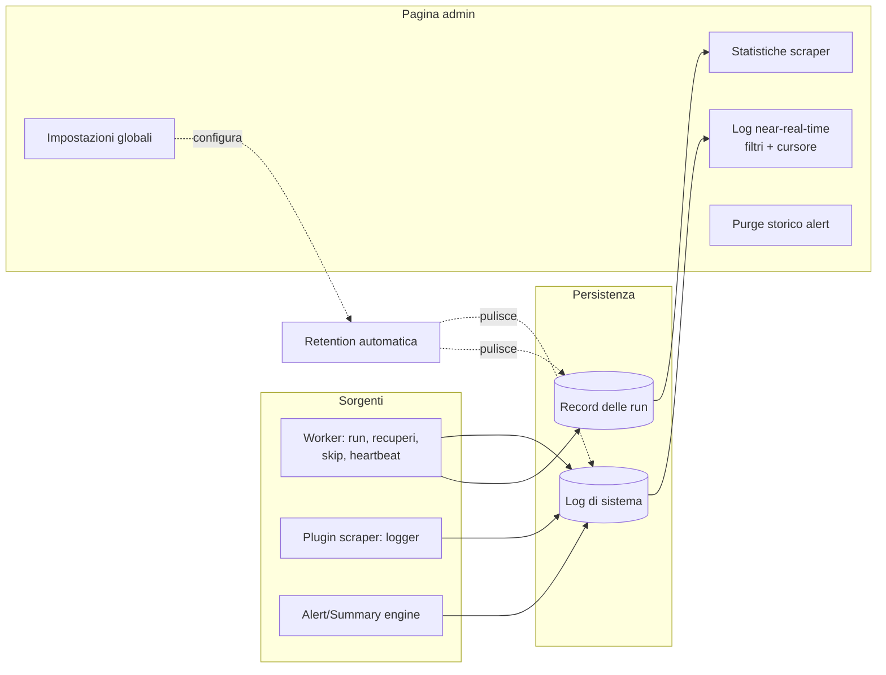

# Log di sistema e manutenzione (admin)

> **Layer 3 — Feature admin** · Audience: architetti, developer · Testo + Mermaid, niente codice.

## Log di sistema

Il registro degli eventi operativi del sistema, consultabile in near-real-time dalla pagina admin (polling incrementale con cursore, auto-scroll pausabile, filtri per livello e origine).

- **LOG-R1** — Origini: `worker` (dispatcher: esecuzioni, recuperi, skip per overlap, heartbeat), `scraper` (eventi emessi dai plugin scraper via logger del contesto), `alert`, `summary`. Livelli: `info`, `warning`, `error`.
- **LOG-R2** — Eventi notevoli sempre registrati: run eseguita (con ritardo rispetto allo slot; oltre soglia → warning "recupero"), slot saltato per overlap (warning), errore/timeout di run (error), heartbeat (info, riga ricorrente).
- **LOG-R3** — Il polling usa un cursore (id dell'ultima riga vista): il server restituisce solo le righe successive.
- **LOG-R4** — I messaggi non contengono mai contenuti operativi degli utenti (titoli dei prodotti, contenuto delle notifiche): solo identificativi e metriche — coerente con il principio che l'admin non legge i dati degli utenti.

## Manutenzione e impostazioni globali

- **MNT-R1** — **Purge dello storico alert**: regola globale per data ("elimina le notifiche di tutti gli utenti precedenti a X / più vecchie di N giorni"), applicata senza accesso ai contenuti.
- **MNT-R2** — **Retention automatica dei log operativi**: log di sistema e record delle run sono puliti automaticamente oltre la finestra configurata (default 90 giorni). Lo **storico prezzi non ha retention**: è il valore del sistema e si conserva per sempre.
- **MNT-R3** — **Impostazioni di sistema** modificabili da UI senza riavvio: `max_concurrent_scrapers`, `scraper_run_timeout`, soglia di ritardo per i recuperi, giorni di retention. Persistite nel DB (config DB-first), con default sicuri al primo avvio.
- **MNT-R4** — **Salute**: l'app espone un controllo di vita (applicazione + raggiungibilità del DB) usato dal monitoraggio dei container; il worker è sorvegliato tramite heartbeat ([scraper-monitoring](scraper-monitoring.md)).
- **MNT-R5** — **Backup**: responsabilità dell'host (dump del DB o snapshot del volume); la [documentazione di deployment](../../infrastructure/deployment.md) fornisce il comando consigliato e ricorda che lo storico prezzi non è ricostruibile.

## Vista d'insieme

