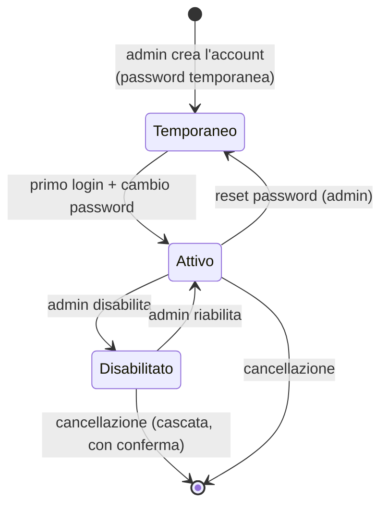

# Gestione utenti (admin)

> **Layer 3 — Feature admin** · Audience: architetti, developer · Testo + Mermaid, niente codice. Capability: [auth](../../4-capabilities/core/auth.md).

## Requisiti

- **USR-R1** — **Nessuna auto-registrazione**: gli account sono creati esclusivamente dall'admin (username, ruolo, password temporanea).
- **USR-R2** — Alla creazione l'admin imposta una **password temporanea** da comunicare all'utente; il sistema **forza il cambio al primo login** (flag sul profilo).
- **USR-R3** — L'admin può **reimpostare la password** di un utente (nuova temporanea + cambio forzato): è il flusso di recupero per password dimenticata — non esiste reset self-service via email, scelta coerente con la postura hobby.
- **USR-R4** — L'admin può **disabilitare/riabilitare** un account. La disabilitazione invalida le sessioni (con la tolleranza dichiarata di pochi minuti dell'access token, vedi [security posture](../../2-architecture/security-posture.md)).
- **USR-R5** — Ruoli: `admin` e `user`, uno per account. L'admin non accede ai dati operativi degli utenti; chi amministra e vuole anche monitorare usa due account.
- **USR-R6** — Al **primo avvio** del sistema, se non esistono utenti, viene creato l'admin iniziale con password temporanea da variabile d'ambiente e cambio forzato al primo login.
- **USR-R7** — La cancellazione di un account elimina **a cascata** tutti i suoi dati operativi (catalogo, carrelli, storici, config). Conferma con riepilogo esplicito di cosa verrà perso.

## Flusso di vita di un account

## Pagina admin

| Elemento | Contenuto |
|---|---|
| Tabella account | username, ruolo, stato (attivo/disabilitato/cambio password pendente), lingua, data creazione |
| Azioni per riga | reset password, disabilita/riabilita, elimina |
| Creazione | form: username, ruolo, password temporanea (o generata) |

L'admin **non vede**: cataloghi, carrelli, notifiche, configurazioni personali dei canali.
