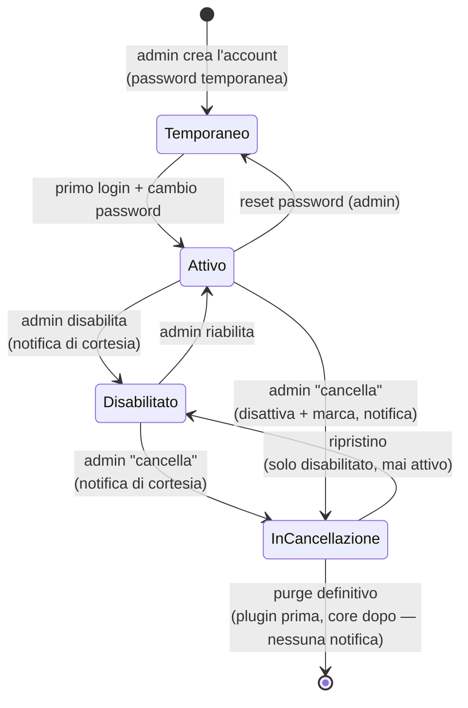

# Gestione utenti (admin)

> **Layer 3 — Feature admin** · Audience: architetti, developer · Testo + Mermaid, niente codice. Capability: [auth](../../4-capabilities/core/auth.md).

## Requisiti

- **USR-R1** — **Nessuna auto-registrazione**: gli account sono creati esclusivamente dall'admin (username, ruolo, password temporanea).
- **USR-R2** — Alla creazione l'admin imposta una **password temporanea** da comunicare all'utente; il sistema **forza il cambio al primo login** (flag sul profilo).
- **USR-R3** — L'admin può **reimpostare la password** di un utente (nuova temporanea + cambio forzato): è il flusso di recupero per password dimenticata — non esiste reset self-service via email, scelta coerente con la postura hobby.
- **USR-R4** — L'admin può **disabilitare/riabilitare** un account. La disabilitazione invalida le sessioni (con la tolleranza dichiarata di pochi minuti dell'access token, vedi [security posture](../../2-architecture/security-posture.md)).
- **USR-R5** — Ruoli: `admin` e `user`, uno per account. L'admin non accede ai dati operativi degli utenti; chi amministra e vuole anche monitorare usa due account.
- **USR-R6** — Al **primo avvio** del sistema, se non esistono utenti, viene creato l'admin iniziale con password temporanea da variabile d'ambiente e cambio forzato al primo login.
### Cancellazione in due fasi
- **USR-R7** — **"Cancella" è soft**: l'azione disattiva l'account e lo marca **"in cancellazione"** (`deletion_marked_at` = ora). Nessun dato viene eliminato in questa fase. Conferma con riepilogo di cosa verrà perso al purge.
- **USR-R8** — Un account in cancellazione resta **ricercabile e ripristinabile**: il ripristino lo riporta a **solo disabilitato** (la marcatura decade), e da lì la riabilitazione standard (USR-R4) lo riporta attivo. **Due passi, mai direttamente attivo.**
- **USR-R9** — Il **purge** (cancellazione definitiva, irreversibile) è un'azione dedicata: sul singolo account in cancellazione, oppure **bulk** su tutti quelli marcati con scelta tra **tutti** e **solo marcati da più di 30 giorni**. Doppia conferma esplicita. Il purge non genera notifiche.
- **USR-R10** — **Ordine del purge**, per ogni utente: prima ogni plugin riceve `delete_user_data(user_id)` (hook **idempotente**: elimina le righe dell'utente dalle tabelle del plugin, es. gli input degli scraper), in sequenza; **solo se tutti completano** il core elimina i dati centralizzati con la cascata (DB-R2: catalogo, storici, carrelli, config notifier con recapiti personali, notifiche). Se un plugin fallisce: l'utente **resta in cancellazione**, errore in `system_log`, purge ritentabile. Mai dati orfani dei plugin.
- **USR-R11** — **Notifiche di cortesia** (kind `system_message`, [admin-notifications](admin-notifications.md)): alla **disabilitazione** e alla **marcatura per cancellazione** l'utente riceve un avviso sui suoi canali attivi. Senza canali configurati non riceve nulla all'esterno; la riga in-app viene comunque scritta (la troverà se ripristinato). Il purge definitivo non notifica.
- **USR-R12** — **Login negato con messaggio**: un utente disabilitato o in cancellazione che tenta il login **con credenziali corrette** riceve un messaggio dedicato ("l'accesso non è più possibile, contatta l'amministratore"). Con credenziali errate: errore generico, identico a un account inesistente (nessuna enumerazione dello stato).

## Flusso di vita di un account

## Pagina admin

| Elemento | Contenuto |
|---|---|
| Tabella account | username, ruolo, stato (attivo/disabilitato/**in cancellazione**/cambio password pendente), lingua, data creazione, data marcatura |
| Azioni per riga (icone) | reset password · **abilita/disabilita** · **cancella** (= marca) |
| Vista "in cancellazione" | un toggle converte la tabella nei soli account marcati; azioni: **ripristina** (→ disabilitato), **elimina definitivamente**, **bulk delete** (tutti / marcati da >30 giorni) — irreversibili, con doppia conferma |
| Creazione | form: username, ruolo, password temporanea (o generata) |

L'admin **non vede**: cataloghi, carrelli, notifiche, configurazioni personali dei canali.
