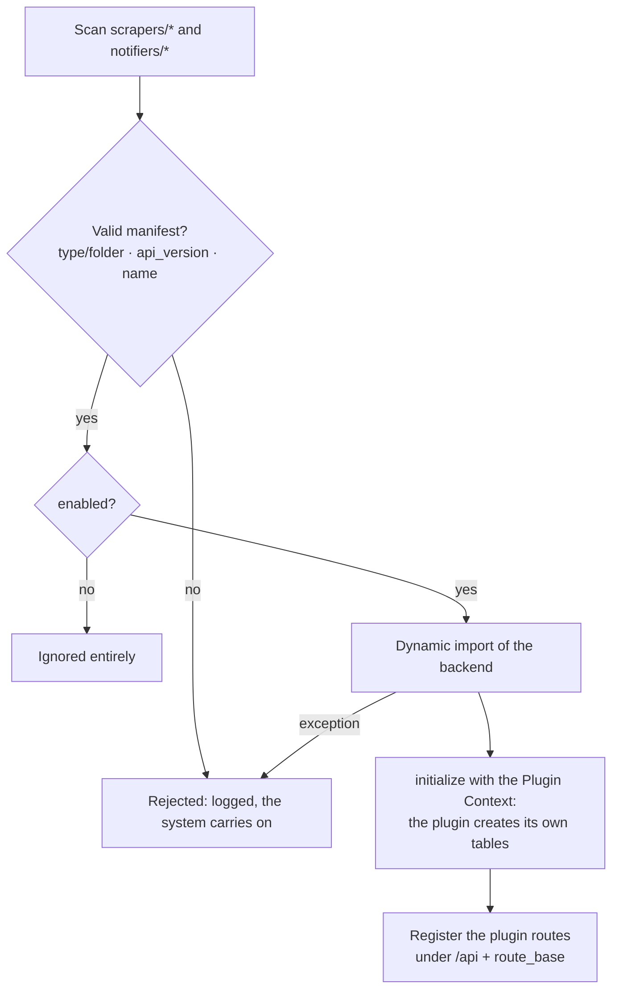

# Dynamic plugin integration (feature view)

> **Layer 3 — Plugin feature** · Audience: architects, plugin developers.
>
> English translation of the Italian reference [`docs-ita/3-features/plugins/dynamic-integration.md`](../../../docs-ita/3-features/plugins/dynamic-integration.md), limited to what is implemented (DOC-12). Architecture view: [plugin-architecture](../../2-architecture/plugin-architecture.md) · technical detail: [plugin-registry](../../4-capabilities/core/plugin-registry.md).

## The manifest: the plugin's ID card

Each plugin declares in its `manifest.json` everything the system must know **without running it**: `name` (the system-wide `plugin_id`), `type` (`scraper`/`notifier`, must match its folder), `version`, `api_version`, `enabled` (the single source of activation), `icon`, `display_name`, the backend entry, and — for plugins with a UI — the frontend entry, `route_base` and i18n folder. Full table in the [manifest reference](../../plugin-development/manifest-reference.md).

## Backend discovery

Central guarantee: **one plugin's failure never affects the core or the other plugins**.

## Frontend discovery (build + runtime)

Two phases fed by the **same source** (the manifests), hence coherent by construction: a build step generates the component registry (`route_base → lazy import`); at runtime the SPA fetches `GET /api/plugins` and mounts the routes by resolving each plugin in the generated registry. The discovery response exposes no internal filesystem paths. Because the registry is baked into the bundle, **enabling/disabling a plugin needs a rebuild + restart** (see [build system](../../infrastructure/build-system.md)).

## Where a plugin shows up in the UI (phase 2)

| Surface | Scraper | Notifier |
|---|---|---|
| Sidebar | **SCRAPERS** group at the bottom (collapsible, icon + name → route) | Never in the sidebar |
| Plugin page | its own page mounted under `route_base` | — (no own page) |

The fuller surfaces (admin config pages, profile notifier settings, provenance icon on products) arrive with the configuration and catalog features in later phases.

## Plugin lifecycle (operational)

```mermaid
stateDiagram-v2
    [*] --> Installed: folder in the repo, enabled=false
    Installed --> Active: enabled=true → rebuild + restart
    Active --> Disabled: enabled=false → rebuild + restart
    Disabled --> [*]: remove the folder (its tables remain; manual cleanup)
```

