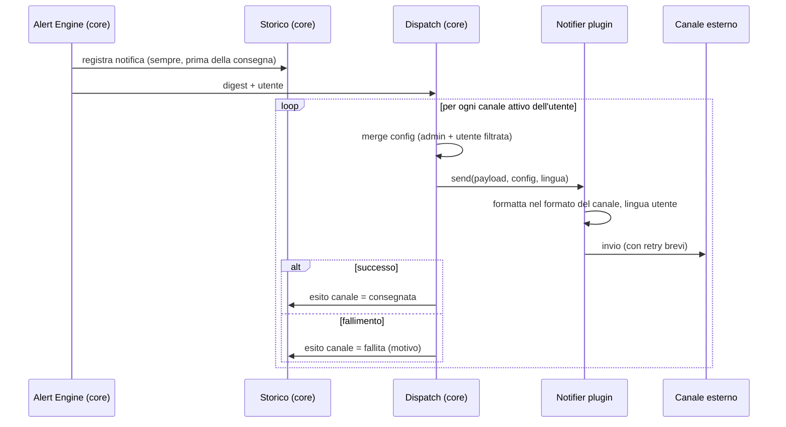

# Notifier Plugin (contratto generico)

> **Layer 3 — Feature plugin** · Audience: architetti, plugin developer · Testo + Mermaid, niente codice. Contratto tecnico: [4-capabilities/contracts/alert-event.md](../../4-capabilities/contracts/alert-event.md) · Guida pratica: [plugin-development/notifier-development-guide.md](../../plugin-development/notifier-development-guide.md).

Questo documento descrive **il notifier astratto**. I canali concreti (es. email, Discord) sono solo menzionati come esempi e documentati a parte in [implemented-plugins/](../../implemented-plugins/).

## Cos'è un notifier

Il traduttore tra il contenuto delle notifiche (deciso dal core) e un canale di consegna (es. un messaggio di posta, un messaggio su una piattaforma di chat, una chiamata a un webhook). Il core decide **quando** e **cosa**; il notifier decide **come formattare** e **dove inviare**.

## Responsabilità: core vs plugin

| Responsabilità | Core | Plugin |
|---|---|---|
| Decidere quando inviare (cadenza utente) | ✅ | — |
| Costruire il contenuto (digest/summary) | ✅ | — |
| Scrivere lo storico interno (sempre) | ✅ | — |
| Iterare i canali abilitati dell'utente | ✅ | — |
| Merge config admin+utente (con filtro chiavi) | ✅ | — |
| Passare la lingua dell'utente | ✅ | — |
| Registrare l'esito per canale | ✅ | — |
| Formattare il messaggio per il canale | — | ✅ |
| Tradurre i testi nella lingua richiesta | — | ✅ |
| Inviare sul canale | — | ✅ |
| Retry brevi sugli errori transitori | — | ✅ |

## Requisiti del contratto

- **NOT-R1** — Il notifier riceve due tipi di payload, distinti da un campo tipo: il **digest di alert** (diff) e il **summary** (snapshot); formatta ciascuno in modo appropriato al canale.
- **NOT-R2** — Configurazione a due livelli: **admin** (infrastruttura del canale, es. server e credenziali di invio) e **utente** (recapito personale + flag attivo). Entrambe da schema dichiarativo. Senza la parte admin il canale è "non disponibile" per tutti.
- **NOT-R3** — Il core consegna a **tutti i canali attivi** dell'utente, senza routing per tipo di evento. Il plugin non filtra contenuti.
- **NOT-R4** — Il plugin riceve la **lingua dell'utente** e genera i testi in quella lingua con le **proprie traduzioni di backend** (file di lingua del plugin, lato server — distinti dalle traduzioni frontend della sua UI). La valuta è resa come simbolo (default €).
- **NOT-R5** — **Errori**: il plugin esegue pochi tentativi con attesa crescente per gli errori transitori; se fallisce, solleva un errore descrittivo. Il core registra l'esito finale per canale (consegnata/fallita/saltata); un canale fallito non blocca gli altri né la registrazione nello storico.
- **NOT-R6** — **Test**: ogni notifier implementa l'invio di una **notifica di prova** con la config corrente (merge admin+utente), invocabile dall'utente (suo recapito) e dall'admin (verifica del canale). Nessuna persistenza.
- **NOT-R7** — Il contenuto formattato deve preservare le informazioni decisionali del payload: tag degli eventi, prezzi prima/dopo, **provenienza** dei prodotti, link, totali e soglia dei carrelli. Il rendering (testo, HTML, embed, markdown del canale) è libero.

## Flusso di consegna

## Stato di un canale per un utente (riepilogo)

Un canale consegna solo se **tutte** le condizioni valgono — ogni livello ha il suo owner:

| Condizione | Owner | Dove si vede |
|---|---|---|
| Plugin abilitato nel sistema | manifest (deploy) | esiste nella lista canali |
| Config di sistema completa | admin | stato "disponibile" |
| Config personale valida | utente | form compilato |
| Canale attivato | utente | flag on |
