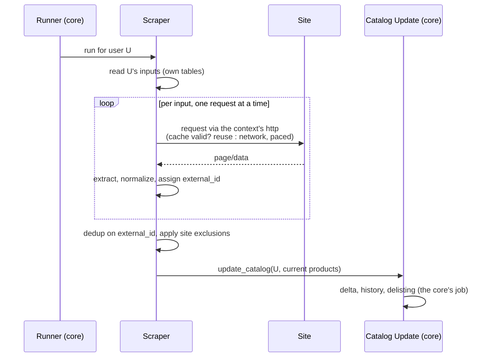

# Scraper plugin (contract)

> **Layer 3 — Feature (plugin contract)** · Audience: developer.
>
> Limited to what is implemented (DOC-12). Defines the abstract scraper: a stateless, single-threaded producer of products that runs per user, delivers a flat deduplicated list (unavailable items included) to the core, and owns product identity, tags and category breadcrumb — with a per-scraper manual scrape-now cooldown.

This document describes the **abstract scraper**: everything every scraper is and must do, independently of the site. No reference to real sites — concrete plugins are documented under [implemented-plugins/](../../../docs-ita/implemented-plugins/).

## What a scraper is

A **stateless** and **internally single-threaded** producer of products: it reads its own inputs (what to watch, for which user), visits the site calmly — one request at a time, paced — and delivers to the core the current list of products it found. Everything about the site (structure, navigation, categories, pagination, special product states) is **internal to the plugin**: the core knows nothing of it.

## Responsibilities: scraper vs core

| Responsibility | Scraper | Core |
|---|---|---|
| Knowing what to watch for each user (its own inputs) | ✅ | — |
| Scraping strategy (DOM, internal calls, browser) | ✅ | — |
| Concept of category, pagination, site filters | ✅ | — |
| Product identity: **seed** (`identity_seed`) | ✅ (provides it) | uses |
| Product identity: **hashing/normalization** into `external_id` | — | ✅ (imposed, uniform) |
| Deciding availability (`is_available`) | ✅ | — |
| Product tags (`tags`) | ✅ (populates) | persists (does not interpret) |
| Brand (`brand`: text + link) | ✅ (extracts) | persists |
| Category (`category`: breadcrumb) | ✅ (builds) | persists |
| Site-specific exclusions (special product states) | ✅ | — |
| Cart adjustment computation (site rules) | ✅ | applies |
| History, deltas, delisting | — | ✅ |
| Writing to the catalog | — | ✅ (single path: callback) |
| When to run, seriality across scrapers, politeness, timeout | — | ✅ |
| Response cache (reuse across users and close-together runs) | — | ✅ (transparent, in the HTTP client) |

## Contract requirements

### Input and configuration
- **SCR-R1** — The scraper owns its **own inputs** in dedicated tables (namespaced per plugin), per user, which it creates by itself if they do not exist. Each user configuration (from the plugin's page) creates one or more entries.
- **SCR-R2** — Two-level configuration like every plugin: **admin** (operational parameters: timeout, identification, politeness, site rules) and **user** (what to watch). Both described by declarative schemas for the dynamic forms. *(The admin/user configuration schemas arrive in a later phase.)*
- **SCR-R3** — The scraper can tell the core **which users have configured it** (needed by the **scheduled runner**, which iterates over the users without the core reading the plugin's tables). Manual scrape-now does not go through here: it is per-scraper, starts from its page, and the scraper already knows the requesting user (SCR-R15). *(The scheduled runner side arrives in a later phase.)*

### Execution
- **SCR-R4** — The unit of execution is **per user**: the core invokes the scraper for each configured user. The **scheduled run** iterates over all users; **scrape-now** (manual, from the scraper's page) runs for the **requesting user only**. The scraper never decides *when* to run. *(The scheduled-run scheduling arrives in a later phase; per-user execution and manual scrape-now are implemented.)*
- **SCR-R5** — The scraper is **stateless**: it produces only the current state, knows neither history nor deltas (the core's job).
- **SCR-R6** — The scraper is **internally single-threaded**: no internal parallelism toward the site. It uses **exclusively the HTTP client provided by the context**, which imposes the pace (politeness), counts requests for monitoring, and can serve a response from the **scrape cache** transparently (same query within the half-life → no call to the site, [plugin-context](../../4-capabilities/core/plugin-context.md) CTX-R9). *(The scrape-cache half-life reuse arrives in a later phase; the single-threaded `context.http` client is implemented.)*
- **SCR-R7** — It returns **the unavailable products too** (marked); it never filters them out. Site-specific exclusions (e.g. products in special states the user does not want) happen inside the plugin, and the excluded products are counted for monitoring.
- **SCR-R8** — The delivered list is **flat and deduplicated** on identity: if the same product surfaces from multiple inputs (e.g. a single input + a category containing it), it appears only once.

### Tags and category
- **SCR-R16** — The scraper base provides the **mechanism** to attach a list of **tags** to a product (`tags`, [product](../../4-capabilities/contracts/product.md) PROD-R5): two methods `add_tag(value)` (adds a string, already **trimmed** and **deduplicated**) and `get_tags()` (returns the list). They operate on the **product under construction**, not as state of the plugin instance (which is a **shared singleton**): one product/user's tags must never spill over onto another. **What** to put in the tags is the plugin's choice (a label cleaned up from the title, a particular availability state, …); a scraper that does not need them calls nothing and the list stays empty. The core does not interpret the tags: it persists them and the UI shows them (long-term vision: graphical tags). The *site-specific* rules (which labels exist, how to recognize them) stay in the concrete plugin, never in the base.
- **SCR-R17** — Same philosophy for the **category** (`category`, PROD-R7): the base provides a **breadcrumb** builder — `add_child(name, url)` (called root → leaf as the scraper discovers the path) and `get_path()` (returns the ordered list of `CategoryRef`). Per-product (never on the singleton instance). Where and how the breadcrumb is discovered is site-specific (DOM, JSON-LD `BreadcrumbList`, …); a scraper without a category calls nothing and the list stays empty. The core persists it and the UI shows it (`text / text / …`, the last one without `/`).

### Product identity (the trickiest point)
- **SCR-R9** — Every product carries an `external_id` that is **stable across runs and unique** in the plugin's space. It is the anchor of everything: recognition, history, availability, delisting. If it changes, the core sees a new product and the history is broken.
- **SCR-R10** — The derivation is a **template method** ([product](../../4-capabilities/contracts/product.md)): the plugin **must** implement only the **seed** (`identity_seed`, abstract method — native SKU/ID if one exists, otherwise `None` for the fallback to the URL; never titles or descriptions); the **hashing and normalization** are imposed by the base (`final`, non-overridable) and identical for all scrapers. The plugin never fills `external_id` by hand and never reimplements the hashing — that is what guarantees stability and uniformity without relying on the plugin's good will. A scraper that does not provide the seed does not load (the abstract fails at load).

### Dry-run / Test — withdrawn in 0.9.0
- **SCR-R11**, **SCR-R12** — **withdrawn**, and the numbers are retired rather than reused (they appear in earlier phase records). A scraper no longer implements a no-write test scrape, and there is no preview step. Adding an input already scrapes the page and stores the product, so a dry-run meant asking the site for the same page twice for one intention — costly against a site that publishes a `Crawl-delay`, and confusing, because a preview that writes nothing looked identical to an add that does.

### Adjustments
- **SCR-R13** — The scraper exposes the computation of the **adjustments** for the carts bound to it: given the total, it returns the corrective entries according to the site rules (threshold discounts, shipping). The core applies them without knowing their logic. Contract: [adjustment](../../4-capabilities/contracts/adjustment.md).

### User data deletion
- **SCR-R14** — The scraper implements `delete_user_data(context, user_id)`: it deletes **all** of that user's rows from its own tables (inputs, personal parameters), **idempotently** (callable multiple times without error). It is invoked by the core during an account purge, **before** the cascade on the central data ([user-management](../admin/user-management.md), USR-R10).

### Manual scrape (scrape-now)
- **SCR-R15** — Every scraper exposes, on its **own user page**, a **scrape-now** command for the **requesting user only**, which re-reads every input and populates the catalog. It is subject to a **per-scraper minimum interval** (*cooldown*): a **reserved admin parameter** (SCR-R2, imposed by the core and uniform, not left to the individual plugin — same philosophy as politeness), with a **1-hour default**. *(The interval is a CONSTANT for now; making it an admin parameter arrives in a later phase.)* The block is **server-side**: a request within the interval is **rejected** declaring the **time remaining** (HTTP 429), never just hidden in the UI. The UI **disables** the button until the cooldown has elapsed, showing a **countdown** fed by the state read from the server; a **confirmation popup** on press reminds how often the scrape is available. Scrape-now shares the **per-scraper lock** with the scheduled runs ([SCHED-R4](../admin/scraper-scheduling-and-limits.md)). The cooldown relies on a **"last scrape" anchor per *(scraper, user)***, with a precise asymmetry: the anchor is **written at the start of *every* scrape — manual or scheduled — but read (and therefore binding) only by the manual scrape**. Intended consequences: after a **scheduled** run you cannot immediately force a manual one (the run wrote the anchor), while a **manual** one never blocks the next scheduled run (which does not read the anchor); writing the anchor **at the start** (not at the end) makes the cooldown count from the beginning and closes off the close-together double-press. The mechanics (cooldown, anchor, dispatch to the run) are **provided by the base** shared across scrapers, not reimplemented by the plugins.

## Flow of a run (contractual view)

## The plugin's user page

How the user chooses *what to watch* is a free choice of the plugin (browsing by categories, entering URLs, search…), with two constraints:

1. it uses the core's **design system**;
2. the confirmed selection creates the entries in the plugin's inputs — and scrapes them once, there and then, so the products are in the catalog immediately.

The page also hosts the per-scraper **Scrape now** command (SCR-R15), with its button subject to the cooldown (disabled + countdown when unavailable).

It is **distinct** from the core's Product Picker (which works on the already-extracted catalog). The plugin's **admin** page is in turn distinct: operational parameters (including the Scrape now interval), never content selection.

## Practical guide

The practical, site-by-site how-to lives in the scraper development guide: [scraper-development-guide](../../../docs-ita/plugin-development/scraper-development-guide.md). Architecture view: [plugin-architecture](../../2-architecture/plugin-architecture.md) · manifest fields: [manifest reference](../../plugin-development/manifest-reference.md).
