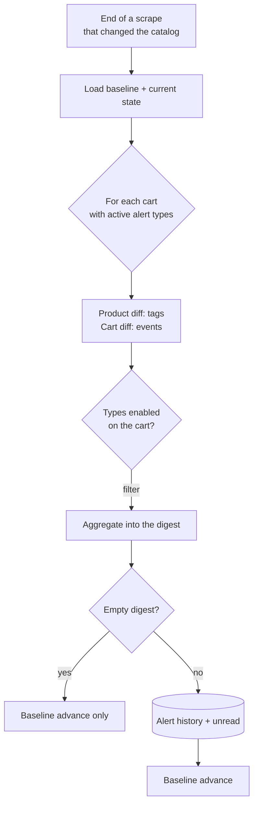

# Alerts and notifications (user side)

> **Layer 3 — User feature** · Audience: architects, developers.
>
> English mirror of the Italian reference [`docs-ita/3-features/user/alerts-and-notifications.md`](../../../docs-ita/3-features/user/alerts-and-notifications.md), limited to what is implemented (DOC-12). Phase 6 ships the event-driven trigger, the per-cart alert types, the diff-vs-baseline detection, the single aggregated digest and the in-app history. **Delivery to notifier channels** (per-channel outcome), the **history category filter (system/admin)**, the **all-time-low** tag and the **periodic summary** are spec-ahead (phases 7/10/11) and stay in the Italian reference. Architecture: [notification-architecture](../../2-architecture/notification-architecture.md) · Capability: [alert-engine](../../4-capabilities/core/alert-engine.md).

## Requirements

### Cadence (when)
- **ALERT-R1** — Alerts run **at the end of every scrape** that changed the user's catalog (scheduled scrape in the worker, manual scrape-now, the TP's "simulate scrape"). No configuration of time or days: scrape and notification are **coupled** (event-driven).
- **ALERT-R2** — Each scrape run produces **one aggregated digest per user** (`alert_digest`), gathering all the carts with events in that run.
- **ALERT-R3** — The baseline is seeded when the **first** alert type is enabled on a cart and deleted when **all** types on that cart are disabled (no backlog: on re-enabling it restarts from "now"). The UI warns of this effect.

### Diff and content (what)
- **ALERT-R4** — Detection is a **diff vs the last run**: only what changed is notified, whatever the number of intermediate scrapes. No repetition policy (an already-notified event does not repeat).
- **ALERT-R5** — For each cart, **only the types enabled on that cart** are evaluated.
- **ALERT-R6** — A run produces **at most one** notification: zero if the diff is empty (the baseline advances anyway), otherwise the single aggregated digest of ALERT-R2.
- **ALERT-R7** — Each product in the events carries: the **tags** (it may have more than one), **previous and current price**, discount %, **provenance** (scraper icon/name) and link. Each cart: current totals and threshold state. The digest must be enough to decide without opening the app.
- **ALERT-R8** — The first run after enabling does not notify (freshly seeded baseline); elements with no baseline (a product just added to an active cart) are seeded silently.

### Alert types
- **ALERT-R9** — **Product** tags (meaningful only inside the cart): entered a sale / left a sale / became unavailable / became available again.
- **ALERT-R10** — **Cart** events: all on sale / threshold reached / threshold reached partial (with products excluded because inactive).
- **ALERT-R11** — Formal semantics of "on sale": discount > 0 against the list price. The state transition (out of sale → on sale) generates the tag; a **further drop** while already on sale generates the "on sale" tag again (the price changed in the buyer's favour: information the user wants). Price back above the list price or back to full → "left the sale".
- **ALERT-R12** — Delisted products are **ignored** by the alerts (no tag); if they were in the baseline and get delisted, the visible event is their exclusion from the totals (a possible "partial threshold").

### History
- **ALERT-R13** — Every notification is **always** recorded in the internal history, before anything else; it has a **read/unread** state (opening a notification marks it read — an unread badge on the dashboard, kept live by polling).
- **ALERT-R15** — The history is browsable and paginated; a notification's detail shows the full digest, and entries can be removed with **multi-select delete**.

## Flow of a run

## Digest example

Cart "Cthulhu Starter" (5 products): one was unavailable, came back **and** is on sale; the final estimate dropped under the threshold.

> **Watch 'Em All — 2 carts with news**
>
> **Cthulhu Starter** — Threshold reached 🎯 (estimate €78.00, threshold €80.00)
> - *Necronomicon* 🏷 available again · 🏷 on sale — €25.00 → **€19.90** (−20%) · from *Site A* · [open]
>
> **Camera** (cross)
> - *Camera X100* 🏷 on sale — €1,099 → **€949** (−14%) · from *Site B* · [open]

Tags are rendered as graphic badges; the same product can accumulate several tags in the same notification.

## UI interactions

- **Cart**: selection of the alert types (default: none). Enabling/disabling shows the effect on the baseline ("monitoring restarts from now").
- **Alert history**: paginated list with an unread badge, detail showing the full digest (per-product tags, prev/current price, provenance and link; per-cart totals and threshold state), and **multi-select delete** of entries.
