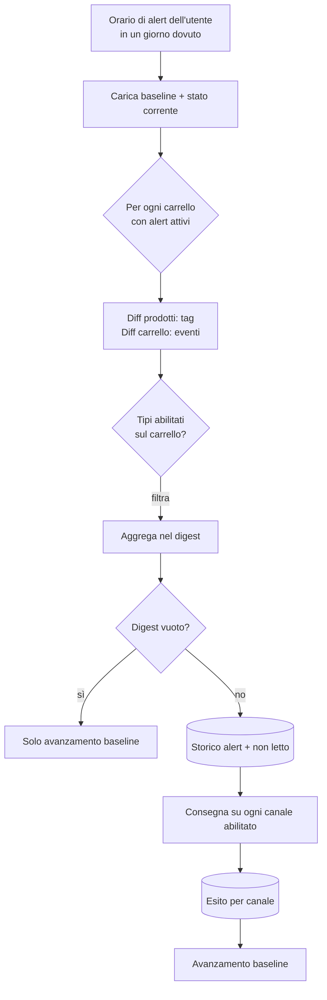

# Alert e notifiche (lato utente)

> **Layer 3 — Feature utente** · Audience: architetti, developer · Testo + Mermaid, niente codice. Architettura: [notification-architecture](../../2-architecture/notification-architecture.md) · Capability: [alert-engine](../../4-capabilities/core/alert-engine.md).

## Requisiti

### Cadenza (quando)
- **ALERT-R1** — L'utente imposta a livello account un **orario** e i **giorni della settimana** (tutti = giornaliera; nessuno = off), validi per tutti i suoi carrelli.
- **ALERT-R2** — La run avviene solo nei giorni dovuti, all'orario scelto. Gli alert **non** partono mai subito dopo uno scrape: scrape e notifica sono disaccoppiati.
- **ALERT-R3** — Mettere la cadenza a off elimina le baseline dell'utente; riattivarla le risemina dallo stato corrente (nessun arretrato). La UI avverte di questo effetto.

### Diff e contenuti (cosa)
- **ALERT-R4** — Il rilevamento è un **diff vs ultima run**: si notifica solo ciò che è cambiato, qualunque sia il numero di scrape intermedi. Nessuna policy di ripetizione (un evento già notificato non si ripete).
- **ALERT-R5** — Per ogni carrello si valutano **solo i tipi abilitati su quel carrello**.
- **ALERT-R6** — Una run produce **al più una notifica** (`alert_digest`) che aggrega tutti i carrelli con eventi.
- **ALERT-R7** — Ogni prodotto negli eventi porta: i **tag** (può averne più d'uno), **prezzo precedente e attuale**, % sconto, **provenienza** (icona/nome scraper) e link. Ogni carrello: totali correnti e stato soglia. Il digest deve bastare per decidere senza aprire l'app.
- **ALERT-R8** — La prima run dopo l'abilitazione non notifica (baseline appena seminata); gli elementi senza baseline (prodotto appena aggiunto a un carrello attivo) sono seminati in silenzio.

### Tipi di alert
- **ALERT-R9** — Tag di **prodotto** (validi solo dentro il carrello): entrato in offerta / uscito di offerta / diventato indisponibile / tornato disponibile / **minimo storico** (un ribasso ha portato il prezzo al minimo mai registrato — vedi [price-analytics](price-analytics.md)).
- **ALERT-R10** — Eventi di **carrello**: tutto in offerta / soglia raggiunta / soglia raggiunta parziale (con prodotti esclusi perché non attivi).
- **ALERT-R11** — Semantica formale di "in offerta": sconto > 0 rispetto al listino. Il passaggio di stato (fuori offerta → in offerta) genera il tag; un **ulteriore ribasso** mentre già in offerta genera di nuovo il tag "in offerta" (il prezzo è cambiato a favore: è un'informazione che l'utente vuole). Prezzo risalito sopra il listino o tornato pieno → "uscito di offerta".
- **ALERT-R12** — I prodotti delistati sono **ignorati** dagli alert (nessun tag); se erano presenti nella baseline e vengono delistati, l'evento visibile è la loro esclusione dai totali (eventuale "soglia parziale").

### Storico e consegna
- **ALERT-R13** — Ogni notifica è **sempre** registrata nello storico interno, anche senza canali configurati; ha uno stato **letto/non letto** (badge in dashboard).
- **ALERT-R14** — La consegna avviene su **tutti i canali abilitati** dall'utente; l'esito è registrato **per canale** (consegnata / fallita con motivo / nessun canale). Un fallimento di consegna non blocca né nasconde nulla.
- **ALERT-R15** — Lo storico è consultabile e paginato; il dettaglio di una notifica mostra il digest completo e gli esiti di consegna.
- **ALERT-R16** — Lo storico distingue **due categorie**: notifiche di **sistema** (digest, summary) e notifiche **admin** (messaggi inviati dall'amministratore — [admin-notifications](../admin/admin-notifications.md)). Le notifiche admin hanno **icona e colore dedicati** e lo storico è filtrabile per categoria. Anche per le notifiche admin valgono ALERT-R13/R14: sempre in storico, consegna sui canali abilitati.

## Flusso di una run

## Esempio di digest

Carrello "Cthulhu Starter" (5 prodotti): uno era indisponibile, è tornato **e** è in sconto; la stima finale è scesa sotto soglia.

> **Watch 'Em All — 2 carrelli con novità**
>
> **Cthulhu Starter** — Soglia raggiunta 🎯 (stima €78.00, soglia €80.00)
> - *Necronomicon* 🏷 di nuovo disponibile · 🏷 in offerta — €25.00 → **€19.90** (−20%) · da *Sito A* · [apri]
>
> **Fotocamera** (cross)
> - *Fotocamera X100* 🏷 in offerta — €1.099 → **€949** (−14%) · da *Sito B* · [apri]

I tag sono resi come badge grafici; lo stesso prodotto può cumulare più tag nella stessa notifica.

## Interazioni UI

- **Profilo → Notifiche**: picker dei giorni (L–D) + orario; configurazione canali con flag on/off e bottone **Test** per ciascuno ([profile-and-notifiers.md](profile-and-notifiers.md)).
- **Carrello**: selezione dei tipi di alert (default: nessuno). L'abilitazione/disabilitazione mostra l'effetto sulla baseline ("il monitoraggio riparte da ora").
- **Storico alert**: elenco con badge non letto, filtro per categoria (sistema/admin) e per tipo (digest/summary), notifiche admin evidenziate con icona e colore dedicati, dettaglio con esiti di consegna.
