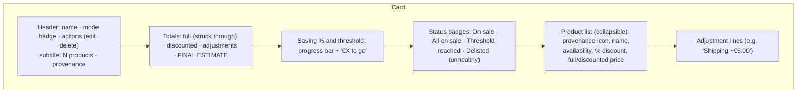
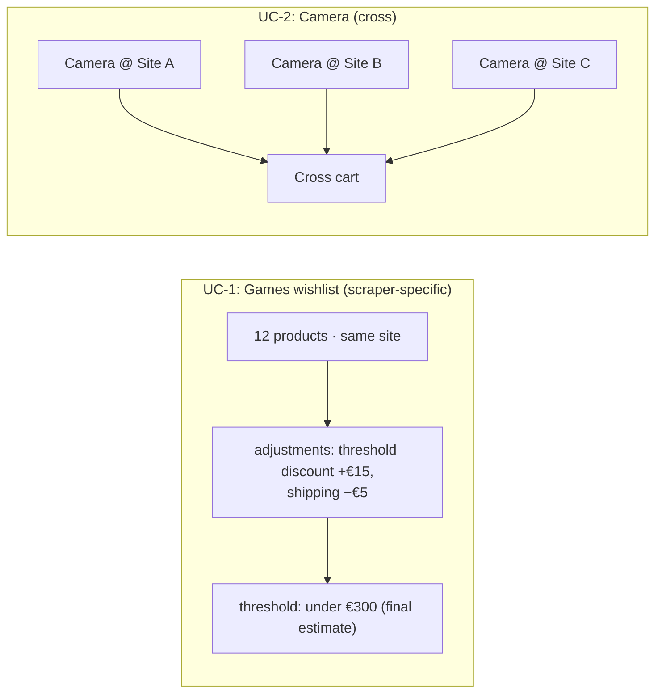

# Carts

> **Layer 3 — User feature** · Audience: architects, developers.
>
> English translation of the Italian reference [`docs-ita/3-features/user/carts.md`](../../../docs-ita/3-features/user/carts.md), limited to what is implemented (DOC-12). Phase 5 ships the two cart modes, membership, the computed state (totals, adjustments, final estimate, health flag) and the € savings threshold. The per-cart **alert types** and their **baseline**, and the cart **price history**, arrive in later phases and are not documented here. Capability: [cart-engine](../../4-capabilities/core/cart-engine.md).

## Purpose

A cart is the unit of monitoring: a group of catalog products with computed totals, a savings threshold and (in a later phase) the chosen alert types. It serves the two founding use cases: the **bulk purchase at the best possible saving** (UC-1) and the **multi-site monitoring of the same product** (UC-2).

## Requirements

### Structure
- **CART-R1** — A cart references only products already in the user's catalog; a product may belong to several carts.
- **CART-R2** — At creation you choose a **name** and a **mode**; the mode is **immutable** (changing it would invalidate the adjustments and the baseline: recreate the cart instead).
- **CART-R3** — Deleting a cart removes only the cart (never the catalog products), with confirmation.

### Modes
- **CART-R4** — **Scraper-specific**: products from a single scraper; the plugin's **adjustments** (threshold discounts, shipping) are applied to the total — the total is "what you would really pay on that site".
- **CART-R5** — **Cross**: products from any scraper; no adjustment (no discount logic is common to different sites). The "same" product may appear **several times, once per site** (they are distinct catalog rows): this is the intended way to do multi-site monitoring.
- **CART-R6** — In cross carts the **provenance is always explicit** on every row (scraper icon + name), in the card, in the detail and in the notifications.

### Computation
- **CART-R7** — The Cart Engine computes: the full total (sum of list prices), the discounted total (sum of current prices), the list of adjustments (scraper-specific only), and the **final estimate** = discounted total − sum of adjustments.
- **CART-R8** — **Unavailable** or **delisted** products stay in the cart but are **excluded from all totals** until they become active again.

### Threshold
- **CART-R9** — The threshold is set and stored as an **absolute value in €** (`threshold_amount`); `null` = no threshold, value `> 0`. *(Decision 2026-06-29 — this inverts the earlier "stored as %" version.)* The **percentage is only an input aid in the UI**: the **€ and %** fields **mirror each other** (editing one updates the other against the current full total of the active products, with `threshold€ = full · (1 − %/100)`); **only the € value is sent to the backend**.
- **CART-R10** — The € threshold is **fixed**: once set it is not recomputed as the cart's contents change (it is the number the user chose). The backend does not know the percentage; it reasons only about the amount.
- **CART-R11** — The threshold is compared against the **final estimate** (adjustments included, when present): this is the real price the user would pay — consistent with UC-1.
- **CART-R12** — No threshold event when the cart has **no active product** (a comparison against a total of 0 would always be true and meaningless).

## The cart card

## The two use cases

## Threshold and excluded products (normative example)

The threshold is a **fixed** € amount; the comparison is on the **final estimate** of the active products only (CART-R11). When a product becomes unavailable or delisted it drops out of the totals (CART-R8): the final estimate changes and the threshold can be reached with a reduced set. If it is reached **with excluded products**, the threshold state is marked **`partial`** (and the notification, in phase 6, states it with the list of the excluded).

| Scenario | Active final estimate | € threshold | Reached? |
|---|---|---|---|
| 5 products available | €90 | €80 | no |
| One (of €20) becomes unavailable | €72 | €80 | yes (`partial`, 1 excluded) |

## Membership rules (implemented)

Adding products to a cart is validated as a batch — the whole request succeeds or is rejected:

- Only products **in your own catalog** (a foreign or unknown id → `422 product_not_found`).
- **Delisted** products cannot be added (`422 product_delisted`); **out-of-stock** ones can (they simply do not count toward the totals, CART-R8).
- A **scraper-specific** cart accepts only that scraper's products (`422 product_scraper_mismatch`).
- A cart holds a **single currency**: an add that would mix currencies is rejected (`422 currency_mismatch`). V1 neither converts nor aggregates currencies.
- Adds are **idempotent** (a product already in the cart is not duplicated); UNIQUE `(cart_id, product_id)` enforces it. Removing a product that is not a member is a no-op.

A cart that holds at least one delisted member exposes a **`has_delisted`** flag and is shown as **"unhealthy"**, prompting the user to clean it up.

## Filling a cart from the catalog

Carts are populated from the **Catalog** (Product Picker): select rows, choose a target cart and add. See [catalog-and-product-picker](catalog-and-product-picker.md) (5.F4). Clicking a cart opens its **detail page** — the full product table with preview images, per-row provenance and per-row removal — built from the same shared presentation widgets as the catalog table.
