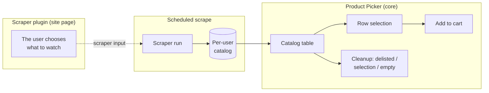
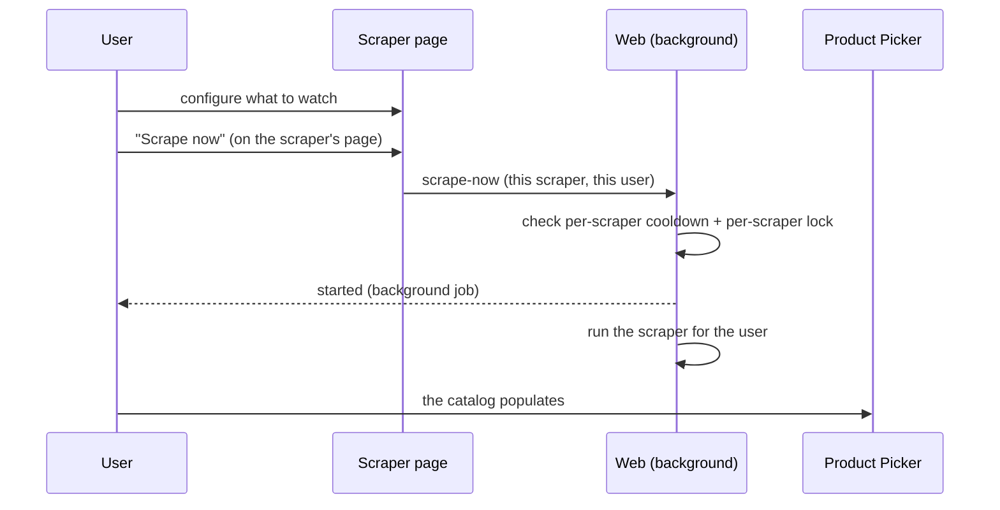

# Catalog & Product Picker

> **Layer 3 — User feature** · Audience: architects, developers.
>
> Limited to what is implemented (DOC-12). Phase 3 ships the read-only catalog view (the per-user, searchable, sortable, paginated table); phase 5 adds the selection role — picking rows and **adding them to an existing cart** (5.F4); phase 9 adds the **cleanups** (remove delisted, delete mode, empty).

## Purpose

The catalog is the set of products extracted by the user's scrapers. The **Product Picker** is the table the user consults it through — and, in a later phase, will use to clean it up and select the products to put into carts. It runs no scraping: it is pure selection over data already in the DB (the live previews live on the individual plugin pages).

## Requirements

- **CAT-R1** — The catalog is per-user: it holds the sum of the products extracted by the scrapers the user has configured.
- **CAT-R2** — Every product always shows its **source** (scraper icon + name), with the name **clickable**, linking to the scraper's page. Essential for cross carts ([use case 2](../../../docs-ita/1-business/use-cases.md)).
- **CAT-R3** — **Unavailable** products stay in the catalog (visual indicator); they are never excluded automatically.
- **CAT-R4** — **Delisted** products (`removed`, absent from the last scrape) stay in the table greyed out, excluded from carts and alerts, until the user cleans them up. If they reappear in a scrape, they become active again.
- **CAT-R5** — The table is **paginated server-side**, sortable (source, title, current price, list price, availability, last update), and **searchable by title** (the API also filters by availability and delisting). On open it populates itself (even right after a scrape, which writes asynchronously): no need to launch the search by hand.
- **CAT-R6** — Cleanup actions: remove delisted, selective removal (delete mode), empty the catalog. All with confirmation; the confirmation **states the consequences** (removal from carts and loss of the price history of the affected products), and each action reports **how many rows went** — "nothing was delisted" and "twelve products went" are different answers to the same click. Emptying the catalog says the other half too: the **watches are not touched**, so the next scheduled run brings back whatever is still watched.
- **CAT-R7** — **Catalog empty-state**: when the catalog is empty the Product Picker offers no scraping actions, but **points to the scraper pages** to configure what to watch and start the first population. **Scrape now** is **per-scraper** and lives on the scraper's page, not here ([scraper-plugin](../plugins/scraper-plugin.md), SCR-R15).
- **CAT-R8** — Deleting a product from the catalog removes it **in cascade** from every cart holding it, and the confirmation has to declare that. It does **not** delete its price history: that chain belongs to the product and is shared with everyone else watching it (CATSVC-R4), so the confirmation says the opposite — the history stays, and is still there if the product is added back.
- **CAT-R10** — A confirmation states **how many carts are about to lose something**, counted rather than described: `{count} of them are in one of your carts and will be taken out of it`. The membership cascade is silent and invisible in the catalog table, and a delisted product only ever gets into a cart while it was still on sale — so it is a choice the user made that disappears without a word otherwise. Said only when the count is non-zero: a dialog does not grow a line to announce a zero.
- **CAT-R9** — The confirmation for a single product says **whether it will come back, and from where**: the catalog carries the inputs that deliver it (PROD-R9), so the dialog names them ("it still comes from *Il Richiamo di Cthulhu*") instead of hedging, and says plainly that nothing will bring it back when the list is empty. 9.B7 accepted this consequence; until C14 only the empty-catalog confirmation mentioned it.

## The table

| Column | Content |
|---|---|
| Source | Scraper icon + name; **link to the scraper's page** |
| Photo | Remote image (thumbnail with border); **on hover** (after a short delay, so it doesn't pop up while scrolling) it enlarges (whole, not cropped, with size limits) |
| Title | Product name, **link** to the product page (new tab); below it: **brand** (optional link) and **category** (breadcrumb `text / text / …`, each entry clickable) |
| Tags | The product's **tags** (`tags`), in a **dedicated column** (one chip per tag, e.g. _Limited Edition_, _Pre Order_) |
| List price | List price (or last known), **struck through only when there is a discount** |
| Price | Current price; below the figure, a **`-NN%` badge** when the product is discounted (there is no separate "% discount" column) |
| Availability | Indicator (available / out of stock / delisted) |

> The photo and the title act as links to the product: there is no dedicated "Open" column.

## Flows

Distinction to keep firm (a frequent source of confusion):

| | Plugin page | Product Picker (core) |
|---|---|---|
| Purpose | Decide **what to watch on the site** | Choose products **already in the catalog** for the carts |
| Data | Read live from the site | DB |
| Writes | Scraper input (plugin tables) + the product itself, scraped on the spot | Cart members |

## "Empty catalog → first population" cycle

When the catalog is empty the Product Picker invites the user to configure a scraper and start its first scrape **from its own page**: "Scrape now" is **per-scraper** and lives there ([scraper-plugin](../plugins/scraper-plugin.md), SCR-R15). It exists so the first population doesn't take hours to wait for, but it stays available at any time within the individual scraper's cooldown. Otherwise the catalog refreshes at the normal scheduled scrapes.

## Adding selected products to a cart (5.F4)

The Product Picker's selection role is now live: tick one or more rows, pick a **target cart** from the picker's add bar and add the selection to it (or add a single row from its own control). The membership rules of the target cart apply on the server ([carts](carts.md)): the batch is rejected if it would add a **delisted** product, mix **currencies**, or — for a **scraper-specific** cart — include a product from another scraper. **Delisted** rows are not offered for adding (their per-row control is disabled).

The catalog does **not** yet steer the selection by cart compatibility: it does not grey out or pre-filter the products that a given cart cannot accept. That **multi-scraper compatibility UX** — surfacing, before the request, which carts a selection fits — is deferred to **phase 6 (6.F0)**; for now the **server constraint** is what holds, and an incompatible add comes back as a clear `422`.
