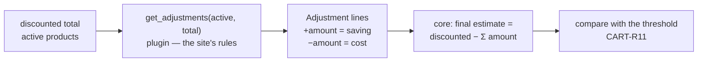

# Contract — `Adjustment`

> **Layer 4 — Contract** · Audience: developer, plugin developer · Pseudocode allowed.
>
> Limited to what is implemented (DOC-12). The implemented model carries an i18n `id` and `params` (localized on the frontend) in addition to `description` and `amount`. Feature: [carts](../../3-features/user/carts.md).

## Purpose

A correction on the total of a **scraper-specific** cart, computed by the plugin according to its own site rules (threshold discounts, shipping, …) without the core knowing that logic.



## Model

```python
from pydantic import BaseModel, Field
from decimal import Decimal

class Adjustment(BaseModel):
    id: str                                        # full i18n key the FRONTEND localizes
    description: str                               # human-readable, DEBUG only (never shown)
    amount: Decimal                                # POSITIVE = saving · NEGATIVE = extra cost
    params: dict[str, str] = Field(default_factory=dict)  # interpolation values for the i18n string
```

- `id` — the full i18n key the **frontend** renders into a localized label (e.g. `"dragon_store.adjustments.threshold_discount"`). So that keys always resolve for a core route, every mounted plugin's dictionary is registered eagerly at startup, not only when its page is first opened.
- `params` — values for that string's interpolation (e.g. `{"pct": "10"}`).
- `description` — human-readable, **debug only** (never shown to users).
- `amount` — **signed**: POSITIVE = a saving (lowers the final estimate), NEGATIVE = an extra cost (raises it).

## Rules

- **ADJ-R1** — The plugin returns zero or more lines from `get_adjustments(products, cart_total)`, where `cart_total` is the **current discounted total** of the active products.
- **ADJ-R2** — The core applies the lines without interpreting them: `final_estimate = discounted_total − Σ amount`.
- **ADJ-R3** — **Scraper-specific** carts only: in cross carts no discount logic is common to different sites, so no adjustment.
- **ADJ-R4** — The cart's **threshold** is compared against the **final estimate** (adjustments included): see CART-R11.

## Example

```python
def get_adjustments(self, products: list[CatalogProduct], cart_total: Decimal) -> list[Adjustment]:
    # a generic example: threshold discount + shipping
    out = []
    if cart_total >= 100:
        out.append(Adjustment(id="my_store.adjustments.threshold_discount",
                              description="Threshold discount 15%",
                              amount=cart_total * Decimal("0.15"),
                              params={"pct": "15"}))
    out.append(Adjustment(id="my_store.adjustments.shipping",
                          description="Shipping",
                          amount=Decimal("-5.00"),
                          params={"cost": "5.00"}))
    return out
```

Discounted total 120 → final estimate = 120 − (18 − 5) = 107. The lines appear at the bottom of the cart card and in the notification payloads (phase 6). See the [Dragon Store](../../implemented-plugins/dragon-store/overview.md) implementation (DRG-R5): a non-cumulative threshold discount (5% ≥ €100, 10% ≥ €200, 15% ≥ €300) plus shipping (−€5, free ≥ €100).
