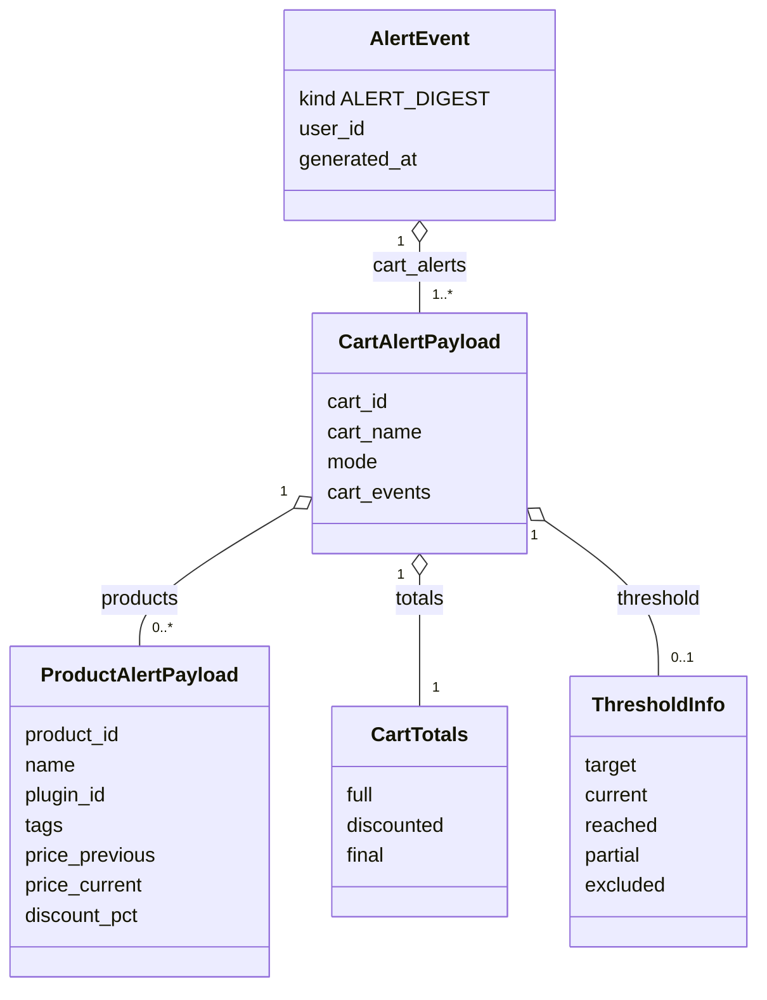

# Contract — `AlertEvent`

> **Layer 4 — Contract** · Audience: developer, plugin developer · Pseudocode allowed.
>
> Limited to what is implemented (DOC-12). Phase 6 ships the `alert_digest` payload: the aggregated `AlertEvent` written to the history. The handoff to the notifiers is phase 7; the summary payload, the admin/system text messages and the all-time-low tag are later phases and stay in the [Italian spec](../../../docs-ita/4-capabilities/contracts/alert-event.md). Feature: [alerts-and-notifications](../../3-features/user/alerts-and-notifications.md) · Architecture: [notification-architecture](../../2-architecture/notification-architecture.md).

## Purpose

The payload the core builds when a run has events, records in the history, and (from phase 7) hands to the notifiers. It is the boundary between evaluation (core) and formatting/sending (plugin): in phase 6 it only lands in `alert_log`.



One structured digest payload identified by its `kind` (`ALERT_DIGEST`): `AlertEvent` carries `CART_*` tags on each cart's `cart_events` and `PRODUCT_*` tags on each product's `tags`. The other payload families that share the same channel — the summary snapshot and the flat text message — are later phases and live in the [Italian spec](../../../docs-ita/4-capabilities/contracts/alert-event.md).

## Enum

```python
from enum import StrEnum

class AlertType(StrEnum):
    # Product tags (valid inside a product's tags)
    PRODUCT_ON_SALE         = "PRODUCT_ON_SALE"          # entered a discount, or dropped further
    PRODUCT_OFF_SALE        = "PRODUCT_OFF_SALE"
    PRODUCT_UNAVAILABLE     = "PRODUCT_UNAVAILABLE"
    PRODUCT_AVAILABLE_AGAIN = "PRODUCT_AVAILABLE_AGAIN"
    PRODUCT_DELISTED        = "PRODUCT_DELISTED"         # left the site's delivery (once)
    # Cart events (valid inside a cart's cart_events)
    CART_ALL_ON_SALE               = "CART_ALL_ON_SALE"
    CART_THRESHOLD_REACHED         = "CART_THRESHOLD_REACHED"
    CART_THRESHOLD_REACHED_PARTIAL = "CART_THRESHOLD_REACHED_PARTIAL"

class NotificationKind(StrEnum):
    ALERT_DIGEST = "alert_digest"    # diff vs baseline (category: system) — phase 6
    # SUMMARY / SYSTEM_MESSAGE / ADMIN_MESSAGE are reserved for later phases (10/11);
    # their semantics and payloads live in the Italian spec until implemented.
```

`PRODUCT_ALL_TIME_LOW` is intentionally **absent** in phase 6: it depends on the price-analytics capability (phase 11). A single enum covers all types — the distinction product/cart is given by the **position** in the model (a product's `tags` vs a cart's `cart_events`), enforced by validators.

## Digest model

```python
class ThresholdInfo(BaseModel):
    target: Decimal       # the € threshold — fixed stored amount (CART-R9: the % is only a UI input)
    current: Decimal      # current final estimate
    reached: bool         # final estimate ≤ target
    partial: bool         # reached while some members are excluded (not active)
    excluded: list[str] = []   # names of the excluded products (the PARTIAL case)

class CartTotals(BaseModel):
    full: Decimal         # Σ price_original of the active members
    discounted: Decimal   # Σ price_current of the active members
    final: Decimal        # discounted − Σ adjustments

class ProductAlertPayload(BaseModel):
    product_id: int
    name: str
    url: str
    plugin_id: str                    # PROVENANCE: always present (cross carts!)
    tags: list[AlertType]             # PRODUCT_* only, one or more
    price_previous: Decimal | None    # from the comparison against the baseline
    price_current: Decimal
    discount_pct: Decimal
    currency: str = "EUR"
    difference: str | None            # the Difference column, ALREADY RENDERED — see AEV-R7

class CartAlertPayload(BaseModel):
    cart_id: int
    cart_name: str
    mode: str                         # "cross" | "scraper_specific"
    cart_events: list[AlertType] = [] # CART_* only
    products: list[ProductAlertPayload] = []
    totals: CartTotals                # full, discounted, final estimate
    threshold: ThresholdInfo | None = None

class AlertEvent(BaseModel):
    kind: NotificationKind = NotificationKind.ALERT_DIGEST
    user_id: int
    generated_at: datetime
    cart_alerts: list[CartAlertPayload]   # only carts with at least one event
```

## Rules

- **AEV-R1** — A run produces **at most one** `AlertEvent` per user (aggregation of all the carts with events).
- **AEV-R2** — The payload is **self-sufficient to decide**: tags, before/after prices, provenance, links, totals and threshold (see ALERT-R7). The notifier queries nothing.
- **AEV-R3** — The tags are rendered graphically by the channel (badge/emoji), never as strings with underscores.
- **AEV-R4** — `Decimal` is serialized as a **string** in the JSON (history and API), `datetime` as ISO-8601 UTC. The whole `AlertEvent` is emitted via `model_dump(mode="json")`.
- **AEV-R7** — `difference` is the **Difference** column already rendered (`"+25%"`, `"-20.2%"`, `"0%"`), computed once by the core so every channel shows the same number. It was a rule implemented twice — Python for the email, TypeScript for the in-app history — which is a drift waiting to happen, and 9.F8 declared that debt rather than paying it because this payload is *stored* and digests already written would not carry the field. `None` means **there is nothing to report**, which every renderer shows as an em dash, and it covers two cases: no previous price, and a **delisted** product — whose two prices are equal by construction, so a percentage would print `0%` on a row nobody can buy, reading as "the price held" instead of "this is gone". A notifier renders this; it never recomputes it.

## Example

```python
CartAlertPayload(cart_name="Cthulhu Starter", mode="scraper_specific",
    cart_events=[CART_THRESHOLD_REACHED],
    products=[ProductAlertPayload(name="Necronomicon", plugin_id="store_a",
                           tags=[PRODUCT_AVAILABLE_AGAIN, PRODUCT_ON_SALE],
                           price_previous=Decimal("25.00"),
                           price_current=Decimal("19.90"), discount_pct=Decimal("20"))],
    totals=CartTotals(full="100.00", discounted="85.00", final="78.00"),
    threshold=ThresholdInfo(target=Decimal("80.00"), current=Decimal("78.00"),
                            reached=True, partial=False))
```
