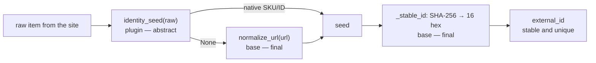

# Product (contract)

> **Layer 4 — Capability (contract)** · Audience: developer, architect.
>
> Limited to what is implemented (DOC-12). `Product` is the single type that crosses the scraper↔core boundary: every scraper produces only `Product` instances, the core fills the missing price fields and persists `brand`/`tags`/`category` as-is.

## Purpose

The boundary between scraper and core: every scraper produces exclusively `Product` instances (via `update_catalog`); the core sees nothing else of the scraping.

## Model

```python
from pydantic import BaseModel
from decimal import Decimal
from datetime import datetime

class BrandRef(BaseModel):
    text: str                   # brand name
    link: str | None = None     # (absolute) URL to the brand page; optional

class CategoryRef(BaseModel):
    text: str                   # category entry name (one breadcrumb step)
    link: str | None = None     # (absolute) URL to the category page; optional

class Product(BaseModel):
    plugin_id: str
    external_id: str            # STABLE and UNIQUE ID within the plugin's space (see below)
    url: str
    name: str                   # title already "sanitized" by the scraper (see tags)
    image_url: str | None       # remote URL, never downloaded locally
    brand: BrandRef | None = None   # brand: text + optional link; None if absent

    tags: list[str] = []
    # product "tags" (e.g. "Limited Edition", "Raven Prime Offer", "Pre Order").
    # Generic list populated by the scraper (empty if it does not need it); see PROD-R5.
    category: list[CategoryRef] = []
    # category breadcrumb, root → leaf (empty if absent); see PROD-R7.

    price_current: Decimal      # discounted/current price
    price_original: Decimal | None
    # None → the core uses the last known list price from history; without history, price_current
    discount_pct: Decimal | None
    # None → the core computes it from original/current
    currency: str = "EUR"       # ISO 4217; V1 neither converts nor aggregates different currencies

    is_available: bool          # decided by the SCRAPER (temporary out-of-stock)
    scraped_at: datetime        # when the SITE answered — not "now"; see PROD-R8
    extra: dict = {}            # plugin-specific data, persisted in products.extra_json
```

## Contract rules

- **PROD-R1** — The scraper does not know the history: it passes only the current state; resolving the `None` fields is the core's job ([catalog-update-service](../core/catalog-update-service.md)).
- **PROD-R2** — The scraper returns **also** the unavailable ones (`is_available = false`); never filter them out.
- **PROD-R3** — The delivered list is flat and **deduplicated on `external_id`**.
- **PROD-R4** — `currency` exists so that the arrival of foreign scrapers is not breaking; the UI renders the symbol (default €).
- **PROD-R5** — `tags` is a list (JSON array) of strings = **product "tags"**, generic and **optional** (default empty). The scraper populates it from whatever source it decides (labels extracted from the title, availability status, …); a scraper that does not need it leaves it empty. The core **only persists** it, it does not interpret it; the UI shows it as a list (long-term vision: graphical tags). The **mechanism** to accumulate it is provided by the scraper base ([scraper-plugin](../../3-features/plugins/scraper-plugin.md) SCR-R16); the strings are already **trimmed** and **deduplicated**.
- **PROD-R6** — `brand` is an object `{text, link?}` (`BrandRef`): `text` mandatory, `link` **optional** (absolute URL to the brand page). The UI renders plain text, or **clickable** text (opens a new tab) when the link is present. `None` if the scraper does not extract the brand. It is a structured attribute in its own right, **distinct** from the `tags` field.
- **PROD-R7** — `category` is the category **breadcrumb**: an ordered list **root → leaf** of `CategoryRef{text, link?}` (empty if absent). The UI renders it as `text / text / text`, each entry clickable on its `link` (new tab), **without a trailing `/`** after the last one. Generic: the core **only persists** it; the **mechanism** to build it (`add_child`/`get_path`) is provided by the scraper base ([scraper-plugin](../../3-features/plugins/scraper-plugin.md) SCR-R17).
- **PROD-R8** — `scraped_at` is **when the site produced this data**, which is not always the moment the scraper built the `Product`. A response served from the scrape cache ([plugin-context](../core/plugin-context.md), CTX-R9) carries the timestamp of the fetch that filled it, exposed as `HttpResponse.fetched_at` (`None` = fetched just now); the scraper uses `fetched_at` when present and the clock otherwise. The core stores this value as `products.last_seen_at`, so a scraper that hardcodes `now()` makes data up to a full half-life old look like it was just read — defeating the one field a reader uses to judge freshness.

## `external_id`: product identity

Together with `plugin_id` and `user_id` it forms the identity in the catalog (UNIQUE on the DB). Contract obligations: **stable** across runs (same product → always the same id; if it changes, the core sees a new product and the history breaks) and **unique** within the plugin's space.

The derivation is a **template method**: the base separates what is site-specific (the **seed**, which the plugin **must** provide) from what must be identical everywhere (the **hashing/normalization**, which the base enforces and the plugin cannot override). This way all scrapers share the same high-level identity logic, and the only truly dangerous bug — non-deterministic hashing across processes (`worker` vs `web`) — becomes impossible by construction, not just "tested".



```python
class ScraperPlugin(ABC):

    @abstractmethod
    def identity_seed(self, raw) -> str | None:
        """Identity seed, the EXCLUSIVE site-specific point. MANDATORY.
        Returns the site's native SKU/ID (preferred, stable by construction),
        or None to derive from the URL. NEVER titles/descriptions: they change."""

    # --- uniform logic: FINAL, never overridden by the plugin ---
    @final
    @staticmethod
    def normalize_url(url: str) -> str:
        # removes volatile query/fragment, trailing slash, normalizes the host case
        ...

    @final
    @staticmethod
    def _stable_id(seed: str) -> str:
        # any string → FIXED 16-hex id (64 bit), deterministic across processes
        import hashlib
        return hashlib.sha256(seed.encode("utf-8")).hexdigest()[:16]
        # NEVER the built-in hash(): randomized by PYTHONHASHSEED

    @final
    def external_id_for(self, raw, url: str) -> str:
        # the orchestration: plugin seed → URL fallback → uniform hashing
        return self._stable_id(self.identity_seed(raw) or self.normalize_url(url))
```

The plugin **never fills `external_id` by hand**: it obtains it from `external_id_for(...)` when it builds the `Product`. The only choice left to it is the **seed** (`identity_seed`); the rest is enforced. Since `identity_seed` is abstract, a scraper that forgets it **does not instantiate** (failure at load in the registry, not in production with the history already broken).
