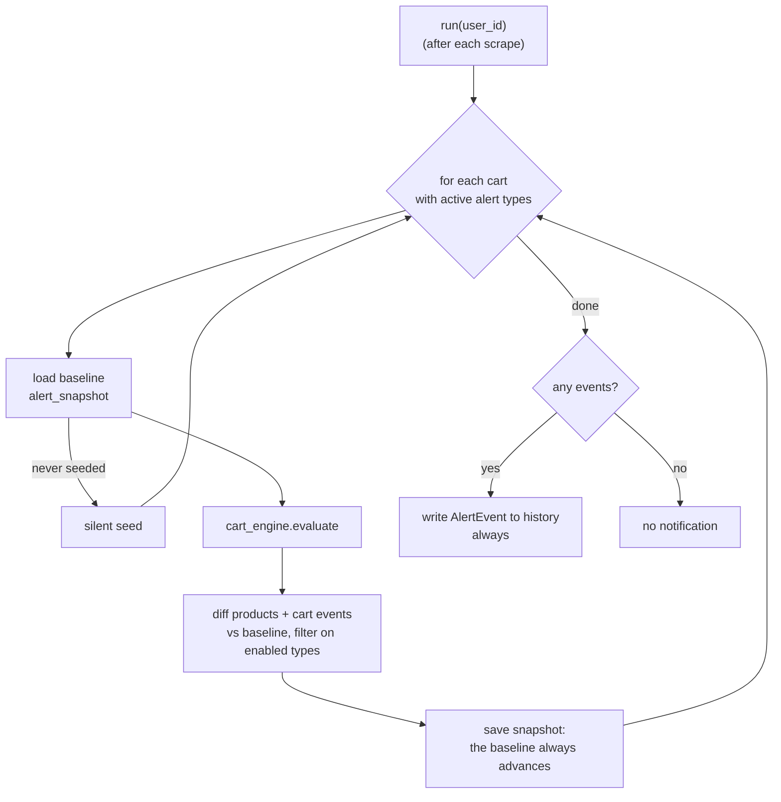

# Alert Engine

> **Layer 4 — Capability** · Audience: developer · Pseudocode allowed.
>
> Limited to what is implemented (DOC-12). Phase 6 ships the alert **engine**: the baseline, the diff, and the single aggregated `AlertEvent` written to the in-app history. Delivery to the external channels (the notifiers) is phase 7 and stays in the [Italian spec](../../../docs-ita/4-capabilities/core/alert-engine.md); the all-time-low tag (price analytics) is phase 11. Feature: [alerts-and-notifications](../../3-features/user/alerts-and-notifications.md) · Architecture: [notification-architecture](../../2-architecture/notification-architecture.md) · Contract: [alert-event](../contracts/alert-event.md).

## Purpose

At the end of each scrape (for every user whose catalog changed in that run): compute the **diff** of every cart with active alert types against its **baseline**, aggregate the events into a single digest, record it in the history, and advance the baseline. There is no time cadence: the engine is **event-driven** — a scheduled scrape in the worker, a manual scrape-now, or the test plugin's "simulate scrape" all invoke it right after the catalog delivery (ALERT-R1).



## Input / Output

| | |
|---|---|
| **Input** | `user_id` (after each scrape that updated its catalog) |
| **Output** | 0 or 1 `AlertEvent` (digest) in `alert_log`; every baseline advanced |

## The baseline

One row per **(user, cart)** in `alert_snapshot`: for each cart product `{on_sale, available, price_current}`, plus the cart-level `all_on_sale` and `threshold_reached` flags the cart-event diff compares against. Delisted members are excluded (ALERT-R12); a member that appears later is seeded silently by the run that meets it. It is managed by user events (outside `run()`), with no cadence:

```
on enable_first_alert_type(cart):   seed_snapshot(cart)        # current state, no notification
on disable_all_alert_types(cart):   delete_snapshot(cart)
```

## Run pseudocode

```
def run(user_id):
    digest_carts = []
    for cart in carts_with_enabled_alert_types(user_id):
        state = cart_engine.evaluate(cart)
        snap  = load_snapshot(cart)                  # None if never seeded (safety net: seed)
        if snap is None:
            save_snapshot(cart, state); continue     # silent seed

        enabled  = alert_types(cart)
        products, events = {}, []

        for m in cart.members where not m.removed:   # ALERT-R12: delisted ignored
            prev = snap.products.get(m.id)
            if prev is None:                          # new in the cart: silent seed
                continue
            tags = []
            now_sale = m.discount_pct > 0
            if now_sale and (not prev.on_sale or m.price_current < prev.price_current):
                tags.append(PRODUCT_ON_SALE)          # entered sale OR dropped further (ALERT-R11)
            if prev.on_sale and not now_sale:
                tags.append(PRODUCT_OFF_SALE)
            if prev.available and not m.is_available:
                tags.append(PRODUCT_UNAVAILABLE)
            if not prev.available and m.is_available:
                tags.append(PRODUCT_AVAILABLE_AGAIN)
            tags = [t for t in tags if t in enabled]
            if tags:
                products[m.id] = ProductAlert(m, tags,
                    price_previous=prev.price_current, price_current=m.price_current)

        if CART_ALL_ON_SALE in enabled:
            all_now  = state.all_on_sale              # every active member discounted
            all_prev = snap.all_on_sale
            if all_now and not all_prev: events.append(CART_ALL_ON_SALE)
        if state.threshold and state.threshold.reached and not snap.threshold_reached:
            ev = CART_THRESHOLD_REACHED_PARTIAL if state.threshold.partial else CART_THRESHOLD_REACHED
            if ev in enabled: events.append(ev)

        if products or events:
            digest_carts.append(CartAlert(cart, events, products, state.threshold))
        save_snapshot(cart, state)                    # the baseline ALWAYS advances

    if digest_carts:
        notif = AlertEvent(user_id, generated_at=now(), cart_alerts=digest_carts)
        save_alert_log(notif)                         # ALWAYS (delivery to channels is phase 7)
```

A cart with no active members has `all_on_sale = False` and `threshold = None` (CART-R12), so both cart events are naturally guarded — no threshold is evaluated without active members. `PRODUCT_ALL_TIME_LOW` is **not** produced here: it depends on the price-analytics capability (phase 11), and lives in the [Italian spec](../../../docs-ita/4-capabilities/core/alert-engine.md) until then.

## Normative cases

| Case | Behaviour |
|---|---|
| First run after seed | No notification (diff empty by construction) |
| Product added to an active cart | Seeded silently by the run that meets it |
| Price dropped and rose again between two runs | No event (diff vs baseline, not vs scrape) |
| Further drop of a product already on sale | New ON_SALE tag with before/after prices |
| Threshold already reached on the previous run | No new event until it rises and falls again |
| Cart with no active products | No threshold evaluation (CART-R12) |
| Delisted product | Ignored by the alerts (no tag); its exclusion from the totals may surface as a partial threshold (ALERT-R12) |
