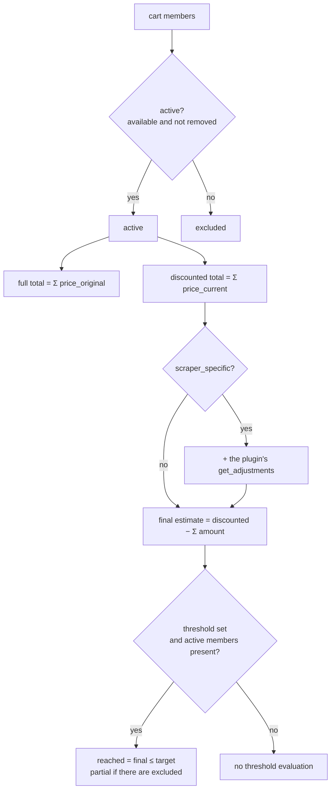

# Cart Engine

> **Layer 4 — Capability** · Audience: developer · Pseudocode allowed.
>
> Limited to what is implemented (DOC-12). Phase 5 ships the read-only evaluation (totals, adjustments, final estimate, threshold state, health flag). The alert baseline and the summary snapshot arrive in later phases. Feature: [carts](../../3-features/user/carts.md) · Contract: [adjustment](../contracts/adjustment.md).

## Purpose

Compute a cart's economic state: totals, adjustments, final estimate, threshold state. It is a **pure read** of the current state (catalog + cart definition): it persists nothing, it computes on demand for the UI (and, in later phases, the alert engine and the summary).



## Definitions

- **Active product** = a cart member with `is_available = true` and `removed = false`. Only active members enter the totals (CART-R8).
- **Full total** = Σ `price_original` of the active members · **Discounted total** = Σ `price_current` of the active members.
- **Final estimate** = discounted total − Σ `adjustment.amount` (scraper-specific carts only; for cross carts, final estimate = discounted total).
- **Threshold** = the requested absolute € amount, stored as `threshold_amount` (CART-R9: the % is only a UI input aid, converted to € once); the comparison is on the **final estimate** (CART-R11). A **fixed** amount, not recomputed as the contents change.
- **Health flag** (`has_delisted`) = true when any member is delisted; the cart is then "unhealthy". Alongside it the engine reports `any_on_sale` / `all_on_sale` (for the card's status badges) and the cart's single `currency`.

## Evaluation pseudocode

```
def evaluate_cart(mode, products, get_adjustments, threshold_amount) -> CartState:
    active   = [p for p in products if p.is_available and not p.removed]
    excluded = [p for p in products if p not in active]

    total_full       = sum(p.price_original for p in active)
    total_discounted = sum(p.price_current  for p in active)

    adjustments = []
    if mode == "scraper_specific" and active and get_adjustments is not None:
        adjustments = get_adjustments(active, total_discounted)   # logic lives in the plugin
    final_price = total_discounted - sum(a.amount for a in adjustments)

    threshold = None
    if threshold_amount is not None and active:                   # CART-R12: no threshold without active
        threshold = ThresholdState(
            amount  = threshold_amount,                           # fixed € amount (CART-R9)
            current = final_price,                                # CART-R11: compare on the final estimate
            reached = final_price <= threshold_amount,
            partial = len(active) < len(products),                # reached with excluded members → "partial"
        )
    return CartState(currency, total_full, total_discounted, adjustments,
                     final_price, active_count, excluded_count,
                     has_delisted, any_on_sale, all_on_sale, threshold)
```

Normative notes:

- The threshold is a **fixed € amount** (`threshold_amount`): it is not recomputed as the contents change; the % is only a UI input converted once (CART-R9/R10, normative example in [carts.md](../../3-features/user/carts.md)).
- The comparison is on the **final estimate** (adjustments included): it is the real price of the bulk purchase (UC-1).
- `get_adjustments` is invoked with the active members and their current discounted total; the core does not interpret the lines, it sums them. Positive lines = savings, negative = costs.
- A cart with no active members: no threshold evaluation, totals at zero, an "all excluded" state rendered by the UI.
- The engine never imports the web: the caller (the carts API) resolves the cart's scraper from `app.state` and passes the bound `get_adjustments` in — the same pattern as `update_catalog` taking its session.

## Persistence

Tables `carts` (with `mode` and `scraper_id` nullable for cross carts, `threshold_amount` nullable) and `cart_members` — schema in [database/schema.md](../database/schema.md). The threshold is a column of `carts` (a 1:1 relationship, no separate table). The per-cart alert types (rows-present = type enabled) and their baseline ship in phase 6 (`cart_alert_types` / `alert_snapshot`); see [alert-engine](alert-engine.md).

## Interactions

| Caller | For what |
|---|---|
| Carts API | cards, detail, validations |
| [Alert Engine](alert-engine.md) | current state to compare against the baseline (phase 6) |
| Summary (later phase) | periodic snapshot |
