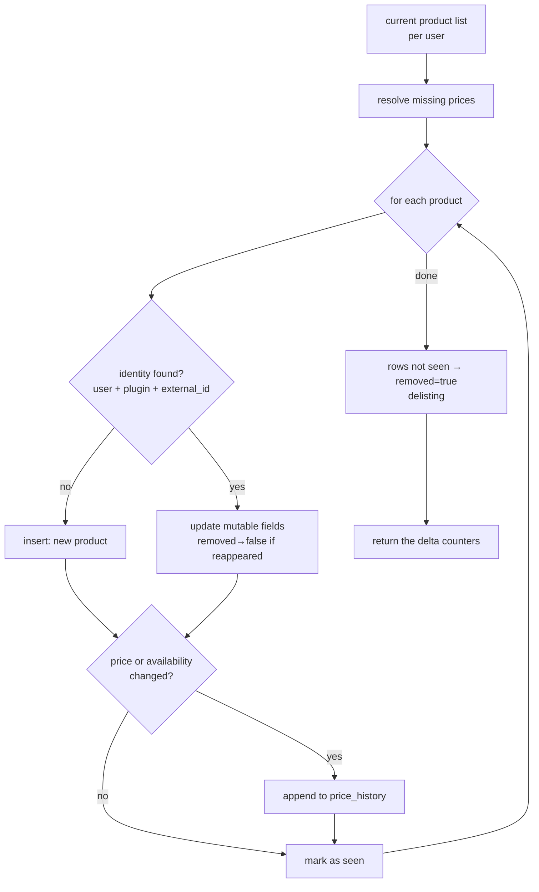

# Catalog Update Service

> **Layer 4 — Capability** · Audience: developer.
>
> Limited to what is implemented (DOC-12). The single place where scraper output becomes persistent state — delta, history, delisting — so the scraper stays stateless.

## Purpose

The single point where scraper data becomes persistent state: it receives the user's current product list (the `update_catalog` callback), computes the **deltas**, and writes only the changes. The scraper is stateless: history, availability, and delisting are decided entirely here.



## Requirements

- **CATSVC-R1** — Exposes the `update_catalog(user_id, products)` callback to plugins via the Plugin Context; it is the **only write path** for the catalog (the scraper never touches the core tables).
- **CATSVC-R2** — Matching by identity `(user_id, plugin_id, external_id)` (UNIQUE constraint on the DB): found → update; not found → new product; existing row absent from the list → delisted (`removed = true`).
- **CATSVC-R2b** — Delisting only applies to a delivery that is **complete**, and the caller is the only one who knows whether it is. Two write paths exist for that reason: `update_catalog` runs the delisting sweep, `upsert_products` never does. A partial delivery (one product resolved as its watch is added) and a failed run (the site was unreachable, gated or rate-limiting us) must both use `upsert_products` — "we could not read it" is not "it is gone". Getting this wrong is expensive rather than merely wrong: an empty delivery through `update_catalog` delists a user's entire catalog for that scraper, drags every cart holding those products to `has_delisted`, and suppresses their alerts (ALERT-R12) until the site comes back.
- **CATSVC-R3** — Resolves missing prices per the Product contract (below).
- **CATSVC-R4** — Writes to `price_history` **only** if the **current price** or the **availability** changes relative to the last entry (append-only; every entry also carries `is_available`).
- **CATSVC-R5** — Updates everything that may change on the catalog record: `name`, `url`, `image_url`, `brand`, `tags`, `category`, `extra_json`, `is_available`, `removed` (a delisted product that reappears goes back to `removed = false`). `brand`, `tags`, and `category` ([product](../contracts/product.md) PROD-R5/R6/R7) are data the scraper delivers and the core **persists without interpreting**.
- **CATSVC-R6** — Returns the **delta counters** (found/new/price_changes/removed) to the caller for the runner's run record.
- **CATSVC-R7** — An unavailable product is **never excluded**: it stays with `is_available = false`. Site-specific exclusions happen earlier, in the plugin.

## Price resolution (normative)

```
# price_original = "list price": if the scraper does not provide it, use the last
# known list price; if there is no history, the current price (no discount derivable).
if p.price_original is None:
    last = last_history_entry(product)            # None if none
    p.price_original = last.price_original if last else p.price_current

if p.discount_pct is None:
    if p.price_original > p.price_current:
        p.discount_pct = round((p.price_original - p.price_current) / p.price_original * 100, 2)
    else:
        p.discount_pct = 0     # full price (or above the known list price)
```

The "on offer" predicate used by alerts and the UI: `discount_pct > 0`.

## Delta pseudocode

```
def update_catalog(user_id, products: list[Product]) -> DeltaCounters:
    seen, counters = set(), DeltaCounters()
    for p in products:
        resolve_prices(p)
        row = find(user_id, p.plugin_id, p.external_id)        # CATSVC-R2
        if row is None:
            row = insert_product(user_id, p); counters.new += 1
        else:
            update_mutable_fields(row, p)                       # CATSVC-R5 (removed→false if reappeared)
        last = last_history_entry(row)
        if last is None or last.price_current != p.price_current \
                        or last.is_available != p.is_available:  # CATSVC-R4
            append_history(row, p); counters.price_changes += 1
        seen.add(row.id)
    # delisting: rows of the plugin not seen in this delivery
    for row in rows(user_id, plugin_id) where row.id not in seen and not row.removed:
        row.removed = True; counters.removed += 1
        # no history entry: delisting is not a price event
    counters.found = len(products)
    return counters
```

## User actions on the catalog (later phases)

Phase 3 ships a **read-only** catalog view (search, sort, paginate). The mutating actions — remove delisted, selective/empty removal — arrive with the cart / Product Picker features in later phases, together with their `ON DELETE CASCADE` over cart members (price history already cascades from `products`). The manual **Scrape now** that populates the catalog already exists, but on the scraper's own page, rate-limited by a per-scraper cooldown ([scraper-plugin](../../3-features/plugins/scraper-plugin.md) SCR-R15) — not gated on an empty catalog.
