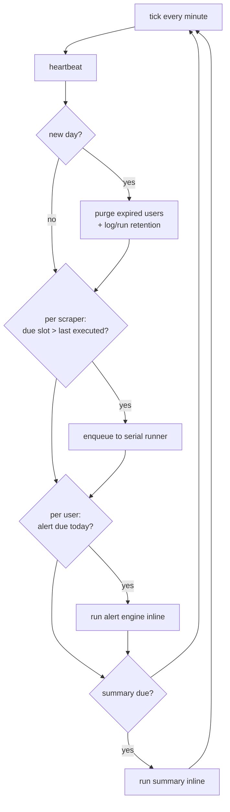

# Cron Worker (dispatcher)

> **Layer 4 — Capability** · Audience: developer · Pseudocode allowed. Feature: [scheduling-and-execution](../../2-architecture/scheduling-and-execution.md), [scraper-scheduling-and-limits](../../3-features/admin/scraper-scheduling-and-limits.md).

## Purpose

Process of the `worker` container that acts as a **temporal dispatcher**: every minute it evaluates the three schedules and submits the due jobs; once a day it runs **maintenance** (purge expired users, retention). It **never runs long work in its own loop**: scrapers go to the [serial runner](scraper-pool.md); alerts and summaries are short runs executed inline.



## Requirements

- **CRON-R1** — Tick every minute; minute-level granularity.
- **CRON-R2** — **Scraper**: for each enabled scraper, it computes the **latest due slot** (the most recent scheduled time ≤ now, even from yesterday) and compares it with the last executed slot: if more recent → enqueue the job to the runner. Catch-up crosses midnight; **only the most recent** missed slot is recovered.
- **CRON-R3** — **Alert**: due if today is a chosen day, `now ≥ time` and not already executed today. Catch-up within the due day (beyond that, skip: a declared choice).
- **CRON-R4** — **Summary**: like alert, with weekly (chosen day) / monthly (day 1) rule.
- **CRON-R5** — The dispatcher **never blocks**: enqueueing to the runner is asynchronous; queued jobs leave one at a time (serial execution, SCHED-R6).
- **CRON-R6** — The execution marker (slot/date) is updated **even on a failed run**: no retry-storm on the next minute; the next slot is the natural retry. The error is logged.
- **CRON-R7** — **Heartbeat**: on every tick the worker touches its own heartbeat (dedicated line + local file for the container healthcheck).
- **CRON-R8** — All events (executions, catch-ups beyond threshold, overlap skips, errors) go to `system_log` with the documented sources ([system-logs](../../3-features/admin/system-logs-and-maintenance.md)).
- **CRON-R9** — The worker assumes a **single replica** (declared constraint): the due/executed checks are not designed for multiple concurrent dispatchers. The per-scraper locks still protect against concurrent on-demand executions from the web.
- **CRON-R10** — **Daily maintenance**: on the first tick of each new day the worker runs, inline and in this order: (1) the **purge of expired users** — for each account with `deletion_due_at ≤ now`, plugin first and core after (USR-R9/R10); a failure leaves the user in deletion and is retried the next day; (2) the **retention** of `system_log` and of run records (MNT-R2). Outcomes in `system_log` (source `worker`); the anti-duplicate guard is a persisted last-maintenance date, as for alert and summary.

## Tick pseudocode

```
def tick(now):
    heartbeat(now)                                   # CRON-R7

    # --- MAINTENANCE: once a day (CRON-R10) ---
    if maintenance.last_run_date < now.date():
        purge_expired_users(now)                      # deletion_due_at <= now: plugin then core (USR-R10)
        apply_retention(now)                          # system_log + scrape_run/scrape_user_log (MNT-R2)
        maintenance.last_run_date = now.date()        # even on partial error: retried tomorrow

    # --- SCRAPER: multiple slots per day, cross-midnight catch-up ---
    for s in scraper_schedules where s.enabled:
        slot = latest_due_slot(s.times, now)          # max slot datetime <= now (today or yesterday)
        if slot is not None and slot > s.last_slot:
            runner.submit(scraper_job(s.scraper_id, slot))  # non-blocking; the runner is serial: lock + FIFO queue

    # --- ALERT: per-user, days of the week ---
    for a in alert_schedules where a.weekdays:
        if now.weekday() in a.weekdays and now.time() >= a.time and a.last_run_date < now.date():
            try: alert_engine.run(a.user_id)
            except Exception as e: log_error("alert", a.user_id, e)
            a.last_run_date = now.date()              # always, even on error (CRON-R6)

    # --- SUMMARY: weekly/monthly ---
    for c in summary_configs where c.enabled:
        if summary_due(c, now) and c.last_run_date < now.date():
            try: summary.run(c.user_id)
            except Exception as e: log_error("summary", c.user_id, e)
            c.last_run_date = now.date()

def latest_due_slot(times, now) -> datetime | None:
    # times = ["06:00", "14:00", "22:00"]; considers today and yesterday
    candidates = [combine(d, t) for d in (today, yesterday) for t in times]
    passed = [c for c in candidates if c <= now]
    return max(passed) if passed else None

def summary_due(c, now) -> bool:
    day_ok = (c.frequency == "weekly" and now.weekday() == c.weekday) \
          or (c.frequency == "monthly" and now.day == 1)
    return day_ok and now.time() >= c.time
```

The comparison on **slots** (datetime, not just date) for scrapers is what makes cross-midnight catch-up and the N slots per day work; `last_slot` is persisted on `scraper_schedule`.

## Delay and catch-up threshold

`delay = now − slot`. If it exceeds the configured threshold (system settings), the event is logged as a **catch-up** at `warning` level; below threshold it is a normal `info` execution. **Overlap skips** (lock already taken at the time the job runs) are `warning`: repeated, they indicate a scraper too slow for its slots.

## Interfaces

| Direction | What |
|---|---|
| Reads | `scraper_schedule`, `alert_schedule`, `summary_config`, `users` (deletion deadlines), system settings |
| Writes | `last_slot` / `last_run_date`, `system_log`, heartbeat; purge of expired users and retention (daily maintenance) |
| Invokes | [Scraper Runner](scraper-pool.md) (submit), [Alert Engine](alert-engine.md), [Summary](summary-report.md), plugins' `delete_user_data` (purge, USR-R10) |
