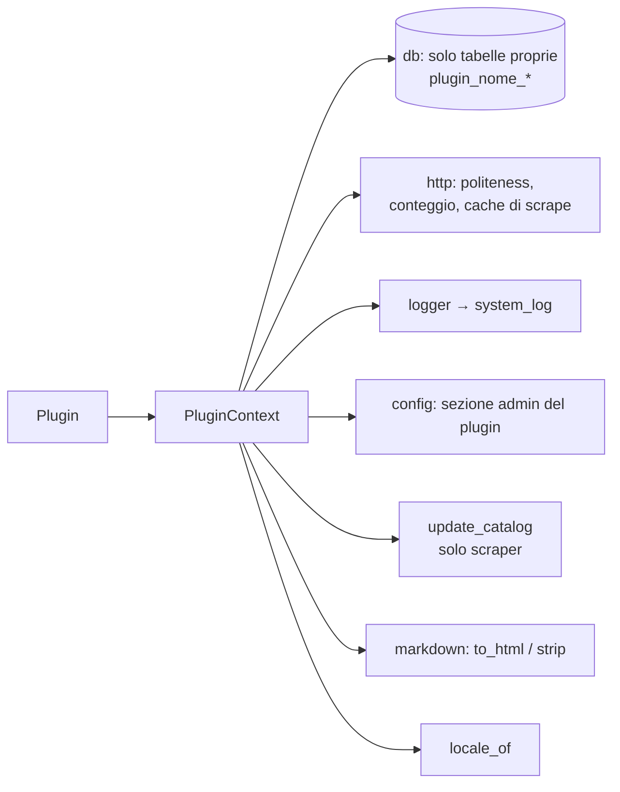

# Plugin Context

> **Layer 4 — Capability** · Audience: developer · Pseudocodice ammesso. Architettura: [plugin-architecture](../../2-architecture/plugin-architecture.md) (trust model).

## Scopo

Il contesto consegnato a ogni plugin in `initialize()`: tutto ciò che il plugin può usare, e per convenzione **nient'altro**. È disciplina architetturale (confini chiari, testabilità), non un confine di sicurezza: i plugin sono codice first-party fidato.



## Contratto

```python
class PluginContext:
    db: DatabaseSession        # per le SOLE tabelle del plugin (plugin_<nome>_*)
    logger: Logger             # finisce in system_log con source="scraper"/"notifier"
    config: PluginConfig       # solo la sezione admin del plugin (DB, via UI admin)
    http: HttpClient           # client OBBLIGATORIO per ogni I/O di rete (vedi sotto)
    update_catalog: Callable   # solo scraper: (user_id, list[Product]) -> DeltaCounters
    locale_of: Callable        # user_id -> locale (per i testi delle notifiche)
    markdown: MarkdownHelper   # render dei messaggi testuali (vedi sotto)
```

## Il client HTTP (`http`)

Non è un dettaglio: è il punto in cui il core **impone** politeness e raccoglie le metriche. Il plugin non deve mai usare librerie HTTP proprie.

- **CTX-R1** — Ritardo minimo tra richieste consecutive dello stesso plugin (configurabile dall'admin per-scraper, default 1.5 s) imposto dal client: il plugin non può andare più veloce nemmeno volendo.
- **CTX-R2** — Timeout per-richiesta di default (configurabile); user-agent identificabile di default.
- **CTX-R3** — **Contatore di richieste per run** (per `scrape_run.http_requests`): instrumentazione trasparente al plugin.
- **CTX-R4** — Retry brevi su errori di rete transitori (configurabili), con backoff; mai più di pochi tentativi.
- **CTX-R5** — Cooperazione col timeout di run del runner: il client rifiuta nuove richieste dopo la cancellazione del job.
- **CTX-R9** — **Cache di scrape, trasparente al plugin**: prima di ogni `get` il client cerca nella tabella `scrape_cache` un risultato per la **stessa query** (chiave = hash della richiesta normalizzata: metodo, URL, parametri ordinati, scope `plugin_id`). Entro l'**emivita** configurata dall'admin per il plugin → risponde dalla cache, **niente HTTP, niente attesa di politeness**, contato in `cache_hits`; scaduta o assente → richiesta reale e salvataggio del risultato. I record scaduti sono eliminati a inizio run (POOL-R3); svuotamento manuale dalla pagina admin del plugin (`DELETE /api/admin/scrapers/{id}/cache`). Emivita 0 = cache disattivata; `post` mai cachata. È così che il riuso vale sia tra utenti della stessa run sia tra run ravvicinate.

```python
class HttpClient:
    def get(self, url, **kw) -> Response: ...     # cache di scrape (CTX-R9), poi cadenzata, contata, con retry/timeout
    def post(self, url, **kw) -> Response: ...    # mai cachata
```

## La sessione DB (`db`)

- **CTX-R6** — Il plugin gestisce **solo** le proprie tabelle (`plugin_<nomeplugin>_*`), che crea idempotentemente in `initialize()`.
- **CTX-R7** — Non scrive mai nelle tabelle core: l'unica via per il catalogo è `update_catalog`; per convenzione non legge tabelle non sue (il dato che gli serve gli arriva via contratto).

## `update_catalog`

Consegna per-utente della lista corrente di [Product](../contracts/product.md); il core calcola i delta ([catalog-update-service](catalog-update-service.md)) e restituisce i contatori (usati dal runner per il record di run).

## `config`

Solo la sezione **admin** del plugin (persistita nel DB e gestita dalla UI admin via [ConfigField](../contracts/config-field.md)); i parametri di sistema riservati (politeness, timeout, emivita della cache) sono letti dal core, non dal plugin. La config **utente** degli scraper vive nelle tabelle del plugin; quella dei notifier arriva già mergeata alla `send()`.

## `markdown`

I `body` dei messaggi testuali (`TextMessageEvent`, [alert-event](../contracts/alert-event.md) AEV-R7) sono **Markdown**; il render è centralizzato nel core, mai reimplementato dai plugin.

```python
class MarkdownHelper:
    def to_html(self, md: str) -> str: ...   # markdown-it-py + sanificazione nh3
    def strip(self, md: str) -> str: ...     # testo puro per i canali senza formattazione
```

- **CTX-R8** — Il notifier rende il Markdown **solo** tramite questi helper: l'HTML in uscita è sempre sanificato (niente HTML inline passante), e il comportamento sintattico è identico su tutti i canali e coerente con l'anteprima frontend (parser della stessa famiglia markdown-it).

## `logger`

Logger namespaced per plugin; i messaggi `warning`/`error` confluiscono in `system_log` con source `scraper`/`notifier`, visibili nella pagina admin. Mai loggare contenuti operativi degli utenti.
