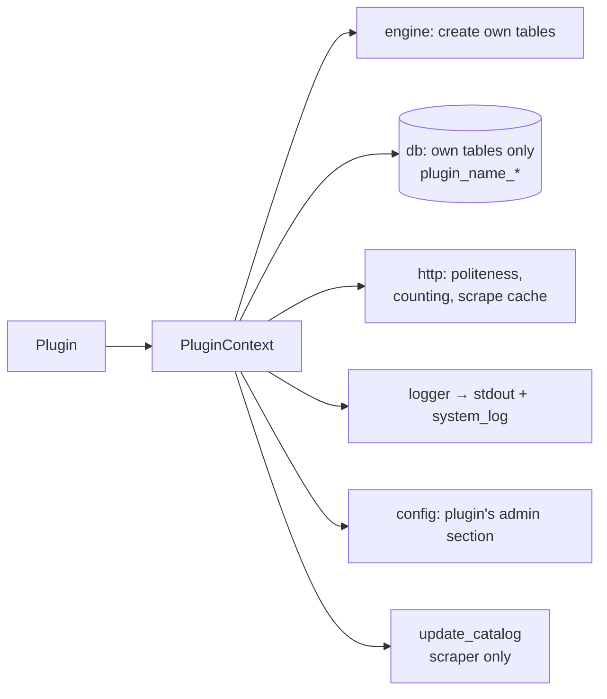

# Plugin Context

> **Layer 4 — Capability** · Audience: developer · Pseudocode allowed.
>
> English translation of the Italian reference [`docs-ita/4-capabilities/core/plugin-context.md`](../../../docs-ita/4-capabilities/core/plugin-context.md), limited to what is implemented (DOC-12). Phase 2 shipped the **minimal** context (engine, db, logger, config); phase 3 added `update_catalog` (the catalog write path) and the `http` client; phase 4 added the per-plugin **scrape cache** behind `http` (CTX-R9) and wired the process-level `system_log` sink for the logger. The `markdown` helper and `locale_of` (used by the notifiers) arrive in later phases and stay in the Italian reference.

## Purpose

The object handed to every plugin in `initialize()`: what the plugin may use and, by convention, nothing else. It is an architectural discipline (clear boundaries, testability), not a security boundary — plugins are trusted first-party code.



## Contract

```python
@dataclass
class PluginContext:
    engine: Engine             # to create the plugin's OWN tables (own MetaData) in initialize()
    db: Session                # a session scoped to the plugin's own tables (plugin_<name>_*)
    logger: Logger             # namespaced per plugin (wea.plugin.<name>)
    config: Mapping[str, Any]  # the plugin's admin-config section (its own declared fields)
    update_catalog: Callable   # scraper only: (user_id, list[Product]) -> DeltaCounters
    http: HttpClient           # MANDATORY client for every network I/O (see below)
```

The default factory (`build_context`) wires the core engine, a fresh session, a per-plugin namespaced logger, the plugin's admin config, and the `update_catalog` callback bound to that session and this plugin's `plugin_id`. It is called at load (`initialize`) and again per scrape (a fresh session each time; the caller closes `ctx.db` when the scrape ends). The registry injects it; tests can inject their own.

## The HTTP client (`http`)

Not a detail: it is where the core **enforces** politeness and gathers the metrics. The plugin must never use its own HTTP libraries.

- **CTX-R1** — Minimum delay between consecutive requests of the same plugin (admin-configurable per scraper via the reserved config `politeness_delay_ms`, default 1.5 s) enforced by the client: the plugin cannot go faster even if it wanted to.
- **CTX-R2** — Default per-request timeout (configurable, `http_timeout_s`); identifiable user-agent by default.
- **CTX-R3** — **Per-run request counter** (for `scrape_run.http_requests`): instrumentation transparent to the plugin.
- **CTX-R4** — Short retries on transient network errors, with backoff; never more than a few attempts.
- **CTX-R5** — Cooperation with the runner's run timeout: the client refuses new requests after the job is cancelled.
- **CTX-R9** — **Scrape cache, transparent to the plugin**: before every `get` the client looks in the `scrape_cache` table for a result for the **same query** (key = hash of the normalised request: method, URL, sorted params, scoped to `plugin_id`). Within the **half-life** the admin configured for the plugin (`cache_ttl_min`) → it answers from the cache, **no HTTP, no politeness wait**, counted in `cache_hits`; expired or absent → a real request and the result is saved. Expired records are dropped at run start (POOL-R3); manual clear from the plugin's admin page (`DELETE /api/admin/scrapers/{id}/cache`). Half-life 0 = cache disabled; `post` is never cached. This is how the reuse pays off both across users of the same run and across close-together runs.

```python
class HttpClient:
    def get(self, url, **kw) -> Response: ...     # scrape cache (CTX-R9), then paced, counted, with retry/timeout
    def post(self, url, **kw) -> Response: ...    # never cached
```

## The DB session and engine (`db` / `engine`)

- **CTX-R6** — The plugin manages **only** its own tables (`plugin_<name>_*`), which it creates idempotently in `initialize()` — typically with its **own** SQLAlchemy `MetaData` and `metadata.create_all(context.engine)`, fully separate from the core schema (DB-R7).
- **CTX-R7** — It never writes core tables: the only path to the catalog is `update_catalog`; by convention it does not read tables that are not its own (the data it needs arrives via the contract).

## `update_catalog`

Per-user delivery of the current list of [Product](../contracts/product.md); the core computes the deltas ([catalog-update-service](catalog-update-service.md)) and returns the counters (used by the runner for the run record). Bound to the context's session and the calling plugin's `plugin_id`.

## `config`

The plugin's **admin** section. In the shipped phases the plugin's **own declared fields** are still empty (the declarative `ConfigField` schemas land in phase 7+); the **core reserved keys** (`politeness_delay_ms`, `http_timeout_s`, `cache_ttl_min`, `scrape_now_min_interval_s`) live in the same `scraper_admin_config` row but are read by the **core** (HTTP client, cache, scrape-now cooldown) via `get_scraper_config`, not through `ctx.config`.

## `logger`

Logger namespaced per plugin (`wea.plugin.<name>`). It writes to stdout; a process-level handler also routes `warning`/`error` records to `system_log` with source `scraper`/`notifier` (4.B7), visible on the admin page. Never log users' operational content.
