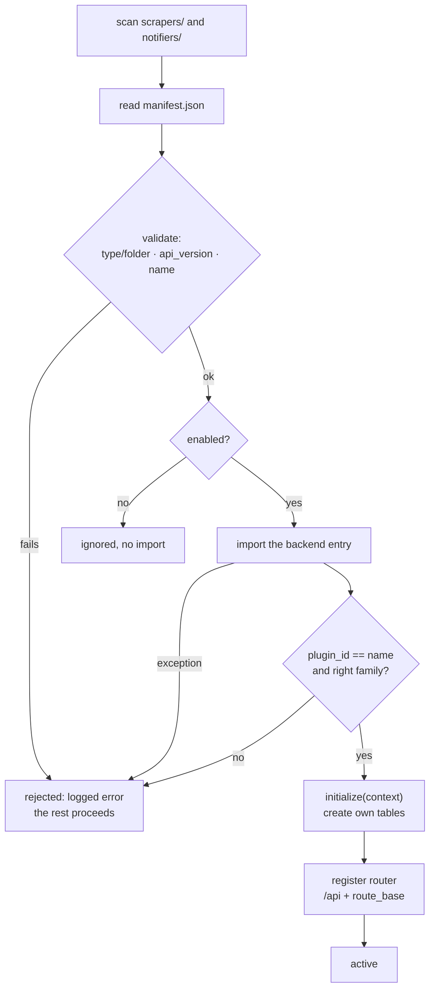

# Plugin Registry

> **Layer 4 — Capability** · Audience: developer.
>
> Limited to what is implemented (DOC-12).

## Purpose

Discover, validate and load plugins at startup, registering routes and contexts. Deterministic and static: no runtime plugin switching.



## Requirements (as implemented)

- **REG-R1** — Scan `src/plugins/scrapers/*` and `src/plugins/notifiers/*`; for each folder, read and validate `manifest.json`.
- **REG-R2** — Validations that **reject** the plugin (explicit error, the rest proceeds): `type` not matching the folder; `api_version` different from the core's (`CORE_PLUGIN_API_VERSION = 1`); duplicate `name`; the imported instance not being a `BasePlugin` of the folder's family; `plugin_id` different from the manifest `name`; entry point not importable.
- **REG-R3** — `enabled: false` → the plugin is ignored entirely (no import).
- **REG-R4** — For each accepted plugin: dynamic import of the backend entry (path **relative to the plugin folder**, loaded under a unique module name so two plugins can both ship a `backend` package), `initialize(context)` with its dedicated [Plugin Context](plugin-context.md) (where the plugin creates its own tables), and — if the plugin exposes a router and declares a `route_base` — registration of that router under `/api` + `route_base`, tagged `Plugin: <name>` in OpenAPI. A notifier without a frontend has no `route_base` and mounts no routes.
- **REG-R5** — An exception anywhere in a plugin's load (manifest, import, `initialize`, routing) isolates **that plugin** (rejected, `error` logged), never the process.
- **REG-R6** — Expose discovery to the frontend: `GET /api/plugins` → `[{name, type, route_base, icon, display_name}]` — **only enabled and loaded** plugins, no internal paths.
- **REG-R6b** — A plugin's own images are served from its `frontend/assets` folder: `GET /api/plugin-assets/{name}/assets/{filename}`. Distinct from the icon route, which resolves a file by **convention** (manifest, then `plugin-icon.{ico,svg}`) — this one takes a name, and a route that takes a name needs its own guards: a **bare filename only** (a separator or a `..` is refused before the filesystem is touched), the resolved path must sit **inside** that plugin's assets folder (which is what catches a symlink, since resolving happens first), and the **extension must be one we serve**. That last one is the real fence: a plugin folder also holds its Python, its manifest and its test fixtures, so an allow-list of image extensions is what keeps this route about images. Public, like the icon — an `` tag carries no token.
- **REG-R7** — Manifest changes take effect on **rebuild + restart** (the frontend bundle is baked at build time).

## How it loads (pseudocode)

```
CORE_PLUGIN_API_VERSION = 1

def load_plugins(app, context_builder):
    loaded, names = [], set()
    for folder_type, base in [("scraper", "src/plugins/scrapers"),
                              ("notifier", "src/plugins/notifiers")]:
        for dir in subdirs(base):
            try:
                m = parse_manifest(dir/"manifest.json", folder_type)   # type/folder, api_version
                if not m.enabled: continue
                require(m.name not in names, "duplicate name")
                module = import_entry(dir/m.backend.entry)             # unique module name
                plugin = module.plugin
                require(isinstance(plugin, expected_base[folder_type]))
                require(plugin.plugin_id == m.name)
                plugin.initialize(context_builder(m, plugin))          # creates own tables
                if plugin.router() and m.frontend:
                    app.include_router(plugin.router(),
                                       prefix=f"/api{m.frontend.route_base}",
                                       tags=[f"Plugin: {m.name}"])
                loaded.append((m, plugin)); names.add(m.name)
            except Exception as e:
                log_error(f"plugin {dir.name} rejected: {e}")          # REG-R5
    return loaded
```

## Notes

- The `web` app loads plugins in its lifespan and stores the result on `app.state` for the discovery endpoint. The `worker` runs the same load at boot (without registering HTTP routers — it only needs `initialize` + the instances for the runner).
- The `icon` declared in the manifest is served as a static asset from `/api/plugin-assets/{name}/icon` and referenced by the discovery response.
- The registry keeps the `plugin_id → instance` map used later by the runner, cart engine and notification dispatch.
