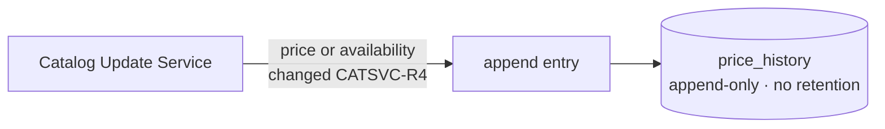

# Price History

> **Layer 4 — Capability** · Audience: developer · Pseudocode allowed.
>
> English translation of the Italian reference [`docs-ita/4-capabilities/core/price-history.md`](../../../docs-ita/4-capabilities/core/price-history.md), limited to what is implemented (DOC-12). Phase 3 ships the **append-only recording** (written by the Catalog Update Service on a price or availability change); phase 8 adds the read-side **series for the charts** (product and cart), documented below. Feature: [price-history](../../3-features/user/price-history.md).

## Purpose

Persist price **and availability** changes in a single append-only table. Deliberately simple by design: one entry only when something changes, no auxiliary table. The same table therefore encodes both the price line and the unavailability intervals — the simplification that avoids a separate "availability history".



## Entry schema

| Field | Notes |
|---|---|
| `product_id`, `user_id` | the series identity (`user_id` denormalised for per-user purges/queries) |
| `price_current` | the discounted price (the chart's line) |
| `price_original`, `discount_pct` | list price and discount at the time |
| `is_available` | availability state at the time of the entry |
| `recorded_at` | timestamp |

Written **only** by the [Catalog Update Service](catalog-update-service.md) (CATSVC-R4), when `price_current` **or** `is_available` changes relative to the last entry. `product_id` is a FK with `ON DELETE CASCADE` — deleting a product removes its history. Schema in [database/schema.md](../database/schema.md).

## Technical requirements

- **HISTC-R1** — Append-only: never update/delete an entry (except the cascade from a product deletion).
- **HISTC-R2** — Index `(product_id, recorded_at)`: serves both the delta's "last entry" query and the charts' range queries.
- **HISTC-R3** — No retention: the history is kept forever (it is the system's value).
- **HISTC-R4** — Series are served **ready to plot** by the backend (the SPA does not aggregate): [endpoints](../../api/endpoints.md#price-history--price-history).
- **HISTC-R5** — `Decimal` serialised as a string in the APIs and persisted JSON (never a float for prices).

## Read side — series for the charts (phase 8)

Two read helpers (`src/core/price_history.py`) turn the append-only table into chart-ready series;
entries are change points that the client draws as a **step line** (the value holds between two
changes), never interpolated.

```
def product_series(product_id, range):          # range: week=7d, month=30d, all
    entries = history(product_id, since(range))  # ordered by recorded_at, id
    # week/month: also carry the last change BEFORE the window, clamped to the window
    # start, so the step line starts at the right price. `is_available=false` marks a gap.
    return [{t, price: e.price_current, available: e.is_available} for e in entries]

def cart_series(cart_id, range):
    members = current_members(cart_id)           # CURRENT composition (no membership history)
    series  = [product_series(pid, range) for pid in members]
    # stepped sum on a unified timeline: at each instant, sum the current price of the
    # members that were AVAILABLE at that instant (unavailable stretches excluded).
    return stepwise_sum(series, skip_unavailable=True)  # [{t, total}]
```

Ownership is enforced at the router (a product/cart the caller does not own is a 404); the helpers
read by id. The cart series projects the **current** composition onto the past — it does not
reconstruct who was a member on a past date (a declared simplification, HIST-R4).
