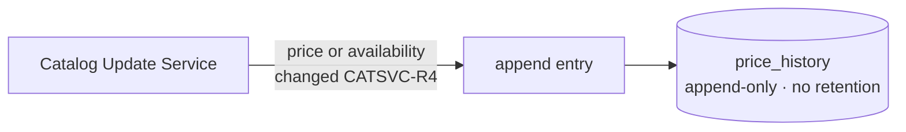

# Price History

> **Layer 4 — Capability** · Audience: developer · Pseudocode allowed.
>
> English translation of the Italian reference [`docs-ita/4-capabilities/core/price-history.md`](../../../docs-ita/4-capabilities/core/price-history.md), limited to what is implemented (DOC-12). Phase 3 ships the **append-only recording** (written by the Catalog Update Service on a price or availability change). The read-side **series for the charts** (product and cart) belong to the price-history charts feature (a later phase) and stay in the Italian reference. Feature: [price-history](../../3-features/user/price-history.md).

## Purpose

Persist price **and availability** changes in a single append-only table. Deliberately simple by design: one entry only when something changes, no auxiliary table. The same table therefore encodes both the price line and the unavailability intervals — the simplification that avoids a separate "availability history".

## Entry schema

| Field | Notes |
|---|---|
| `product_id`, `user_id` | the series identity (`user_id` denormalised for per-user purges/queries) |
| `price_current` | the discounted price (the chart's line) |
| `price_original`, `discount_pct` | list price and discount at the time |
| `is_available` | availability state at the time of the entry |
| `recorded_at` | timestamp |

Written **only** by the [Catalog Update Service](catalog-update-service.md) (CATSVC-R4), when `price_current` **or** `is_available` changes relative to the last entry. `product_id` is a FK with `ON DELETE CASCADE` — deleting a product removes its history. Schema in [database/schema.md](../database/schema.md).

## Technical requirements

- **HISTC-R1** — Append-only: never update/delete an entry (except the cascade from a product deletion).
- **HISTC-R2** — Index `(product_id, recorded_at)`: serves both the delta's "last entry" query and the charts' range queries.
- **HISTC-R3** — No retention: the history is kept forever (it is the system's value).
- **HISTC-R5** — `Decimal` serialised as a string in the APIs and persisted JSON (never a float for prices).
