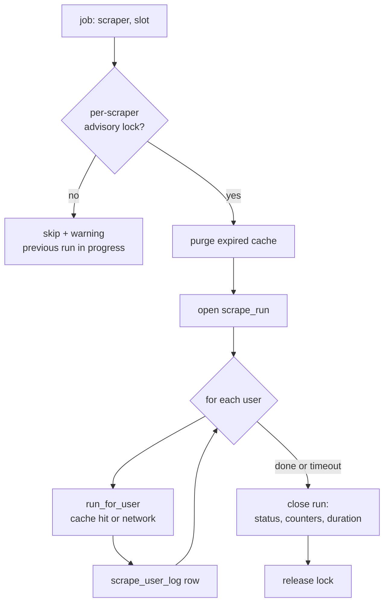

# Scraper Runner (serial execution)

> **Layer 4 — Capability** · Audience: developer · Pseudocode allowed. Feature: [scraper-scheduling-and-limits](../../3-features/admin/scraper-scheduling-and-limits.md), [scraper-monitoring](../../../docs-ita/3-features/admin/scraper-monitoring.md).

## Purpose

Execute scraper runs **one at a time** (no concurrency between scrapers, nor internal), with an anti-overlap lock, timeout, purge of the expired cache, and production of the monitoring records. Used by the worker (scheduled runs) and — for scrape-now — by the web, which shares the lock and the rules.



## Requirements

- **POOL-R1** — **Serial executor**: a single execution thread; due jobs wait in a **FIFO queue** and run one at a time (SCHED-R6). No parallelism parameter.
- **POOL-R2** — **Per-scraper lock on Postgres** (advisory lock with a key derived deterministically from the `plugin_id`): it holds across containers (worker and web — the queue's seriality covers the worker; the lock covers the web's on-demand scrapes). Lock not acquired = skip with warning, **never wait**.
- **POOL-R3** — A job performs: purge of the plugin's **expired cache** (CTX-R9) → open `scrape_run` → iteration over users (`run_for_user`) with a `scrape_user_log` row for each → close the run with counters, status, and wall-clock duration.
- **POOL-R4** — **Timeout**: past `scraper_run_timeout` the job is terminated and the run marked `timeout`. The lock is always released (even on error: try/finally; advisory locks expire with the session anyway). With serial execution the timeout is also the queue's protection: a hung job must not hold up the following ones.
- **POOL-R5** — An error on one user does not stop the others: the run continues and closes `partial`.
- **POOL-R6** — The context's HTTP client enforces the per-scraper **politeness delay**, serves repeated requests from the **scrape cache** (CTX-R9) and **counts** the run's real requests (`http_requests`) and reuses (`cache_hits`), attributing them also to the user being processed (the run is single-threaded: one user at a time).
- **POOL-R7** — Scrape-now (web) runs a job reduced to a single user, with the same lock, timeout, and records (trigger `manual`).

## Job pseudocode

```
def scraper_job(scraper_id, slot, only_user=None, trigger="scheduled"):
    if not try_advisory_lock(scraper_id):
        log_warning("worker", f"{scraper_id}: slot skipped, previous run in progress")
        return
    try:
        cache.purge_expired(scraper_id)                    # POOL-R3 / CTX-R9
        run = open_scrape_run(scraper_id, slot, trigger)
        plugin  = registry.get(scraper_id)
        context = registry.context_for(scraper_id, run)    # http instrumented for the run
        users   = [only_user] if only_user else plugin.configured_users(context)
        with deadline(settings.scraper_run_timeout):       # POOL-R4
            for user_id in users:
                ulog = open_user_log(run, user_id)
                try:
                    plugin.run_for_user(context, user_id)  # inside: update_catalog(...)
                    close_user_log(ulog, "ok")
                except Exception as e:
                    close_user_log(ulog, "error", str(e))  # POOL-R5: continue
        close_scrape_run(run, aggregate_status(run), counters(run))
        schedule.set_last_slot(scraper_id, slot)           # also on partial/error (CRON-R6)
        log_run_outcome(run)                               # info/warning in system_log
    except TimeoutExceeded:
        close_scrape_run(run, "timeout"); schedule.set_last_slot(scraper_id, slot)
        log_error("worker", f"{scraper_id}: run over timeout, terminated")
    finally:
        release_advisory_lock(scraper_id)
```

## Run counters

| Field | Source |
|---|---|
| `users_processed` | number of `scrape_user_log` rows |
| `products_found / new / removed`, `price_changes` | returned by the Catalog Update Service for each `update_catalog` and summed |
| `products_excluded` | declared by the plugin (site-specific exclusions) |
| `http_requests` | instrumented HTTP client (POOL-R6): only **real** requests to the site; also counted per-user on `scrape_user_log` |
| `cache_hits` | requests served from the scrape cache without touching the site (CTX-R9); also counted per-user |
| duration | `finished_at − started_at` (wall-clock) |

## Implementation notes

- The advisory lock key is an integer: `hash64(plugin_id)` with a deterministic hash (SHA-256 truncated to 8 bytes) — never the built-in `hash()`.
- The deadline is cooperative where possible (cancellation of the HTTP client) with a thread kill as the last line of defense; a well-written scraper dies at the first I/O after cancellation.
- Seriality also holds for the worker's manual jobs; a scrape-now started from the **web** runs in its own container and coordinates through the per-scraper lock only (declared limitation: it may overlap with the scheduled run of a *different* scraper — a rare event, a one-off job on an empty catalog).
