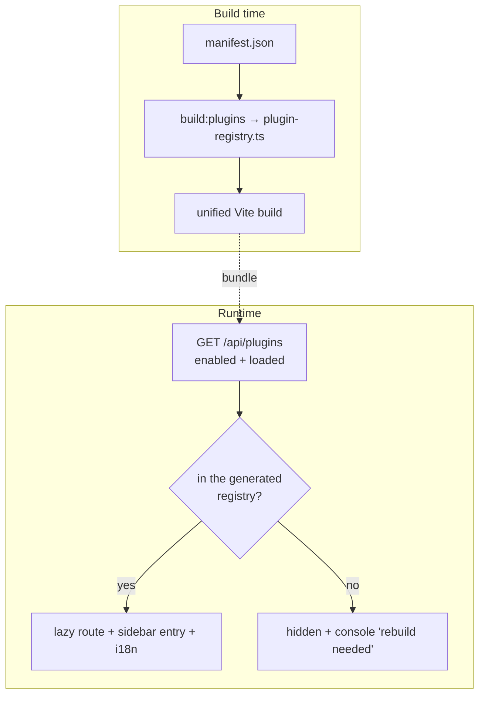

# Frontend — Plugin discovery & routing

> **Layer 4 — Capability** · Audience: developer.
>
> Limited to what is implemented (DOC-12).

## Purpose

Mount the enabled plugins' frontends dynamically, with no manual edits to build or routing.



## Requirements (as implemented)

- **FDISC-R1** — `src/generated/plugin-registry.ts` is **generated** by the `build:plugins` step (reads the manifests, keeps `enabled` plugins that ship a `frontend.entry`), never hand-written. It is gitignored and regenerated on `predev`/`prebuild`/`precheck`.
- **FDISC-R2** — At boot (and on sign-in) the SPA fetches `GET /api/plugins` and reconciles it against the generated registry into `mountedPlugins`. A single catch-all route `plugins/[...rest]` resolves `route_base` from the path and lazily imports the component (and registers the plugin's i18n namespace through `$lib`).
- **FDISC-R3** — The plugin entry exports **only** the component (`default { component }`); the route comes **solely** from the manifest (`route_base`).
- **FDISC-R4** — Bundle/runtime skew (only happens after a restart without a rebuild) is surfaced, never a broken page: a plugin enabled in the backend but missing from the bundle is hidden and logged ("rebuild the frontend"); a plugin bundled but not loaded by the backend is logged too; an unresolved plugin path renders a clean fallback.
- **FDISC-R5** — The sidebar **SCRAPERS** group comes from the same discovery: icon from the manifest, `display_name`, link to `route_base`. Notifiers never appear in the sidebar.

## Generated registry (shape)

```typescript
// AUTOGENERATED by scripts/build-plugins.mjs — do not edit by hand
export const plugins: GeneratedPlugin[] = [
  {
    name: "<plugin_id>",
    route_base: "/plugins/<slug>",
    component: () => import("$plugins/scrapers/<name>/frontend/index"),
    i18n: () => import("$plugins/scrapers/<name>/frontend/i18n"),
  },
]
```

The `$plugins` alias (in `svelte.config.js`) points at `src/plugins`, and Vite's `server.fs.allow` is widened to the repo root so the dev server can read the plugin frontends, which live outside the SvelteKit project root.

## Entry contract

```typescript
// frontend/index.ts
export default { component: PluginRoot }     // the route comes from the manifest

// frontend/i18n/index.ts — data only; the core registers it via $lib
import en from './en.json'
export default { en }
```

Plugin components import shared helpers via `$lib` (e.g. `import { _ } from '$lib/i18n'`, `import { apiFetch } from '$lib/auth/manager'`) — never a bare dependency, which would not resolve from `src/plugins`.
