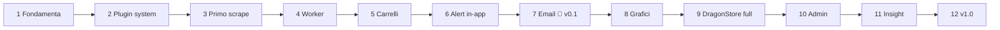

# Development Flow — Indice e stato di avanzamento

> Come si sviluppa Watch 'Em All: **per piccoli MVP apprezzabili**. Ogni MVP richiede **al massimo qualche ora** di sviluppo; ogni **fase** si chiude con qualcosa di **utilizzabile e dimostrabile** — mai "lavoro a metà" che vive solo nei branch.

## Le regole del flusso

1. **Un MVP = una PR**: piccolo, completo, mergiato su `main` verde ([regole di processo](../developer-rules/README.md)).
2. **Ordine delle fasi vincolante, ordine degli MVP interno flessibile** (salvo dipendenze indicate).
3. **Una fase è chiusa solo se la sua *Definition of Done* è vera** provandola da utente, non leggendo il codice.
4. **Le checkbox si aggiornano nella stessa PR** che completa l'MVP (questo indice + il documento di fase).
5. Se durante una fase emerge lavoro non previsto: o è un MVP nuovo nella fase giusta, o un [future improvement](../future-improvements/README.md). Mai scope-creep silenzioso.
6. Le stime sono in ore di sviluppo concentrato; sforare non è un dramma, **spezzare l'MVP sì** (significa che era troppo grosso).
7. In ogni fase gli MVP sono separati in **Backend** (`N.B*`), **Frontend** (`N.F*`) ed eventuali **Trasversali** (`N.T*`). Gli MVP frontend dipendono dagli endpoint dei corrispondenti backend, ma possono partire in parallelo sviluppando contro il contratto documentato in [api/endpoints.md](../api/endpoints.md) (l'API nasce nel catalogo prima dell'implementazione).

## Avanzamento

- [ ] **Fase 1 — Fondamenta** → [phase-01-foundations.md](phase-01-foundations.md)
  *Risultato: l'app parte con Docker, si fa login, la shell c'è.*
- [ ] **Fase 2 — Plugin system** → [phase-02-plugin-system.md](phase-02-plugin-system.md)
  *Risultato: un plugin demo appare da solo in sidebar con la sua pagina.*
- [ ] **Fase 3 — Catalogo e primo scrape** → [phase-03-catalog-first-scrape.md](phase-03-catalog-first-scrape.md)
  *Risultato: prodotti reali di Dragon Store nel Product Picker.*
- [ ] **Fase 4 — Worker e scheduling** → [phase-04-worker-scheduling.md](phase-04-worker-scheduling.md)
  *Risultato: lo scraping parte da solo agli orari decisi; l'admin lo osserva nei log.*
- [ ] **Fase 5 — Carrelli** → [phase-05-carts.md](phase-05-carts.md)
  *Risultato: carrelli con totali, adjustments, soglia e provenienza.*
- [ ] **Fase 6 — Alert in-app** → [phase-06-alerts-in-app.md](phase-06-alerts-in-app.md)
  *Risultato: cambio prezzo → notifica nello Storico alert alla cadenza scelta.*
- [ ] **Fase 7 — Notifiche Email** 🎉 → [phase-07-email-notifier.md](phase-07-email-notifier.md)
  *Risultato: **la mail col digest arriva in casella — il prodotto fa il suo mestiere (v0.1)**.*
- [ ] **Fase 8 — Grafici dello storico** → [phase-08-price-charts.md](phase-08-price-charts.md)
  *Risultato: grafici interattivi per prodotto e carrello.*
- [ ] **Fase 9 — Dragon Store completo** → [phase-09-dragonstore-complete.md](phase-09-dragonstore-complete.md)
  *Risultato: monitoraggio per categorie, dry-run dalla UI, catalogo gestibile.*
- [ ] **Fase 10 — Governo admin** → [phase-10-admin-governance.md](phase-10-admin-governance.md)
  *Risultato: plancia admin completa — statistiche, limiti, utenti, manutenzione.*
- [ ] **Fase 11 — Summary, analisi prezzi, export** → [phase-11-insights.md](phase-11-insights.md)
  *Risultato: report periodico, badge minimo storico e convenienza, export dei dati.*
- [ ] **Fase 12 — Rifinitura e v1.0** → [phase-12-polish-v1.md](phase-12-polish-v1.md)
  *Risultato: secondo canale (Discord), audit i18n English-first, CI piena: release 1.0.*

## La logica dell'ordine

- Le fasi 1-7 percorrono la **catena del valore minima** del prodotto (login → plugin → dati → automazione → carrelli → alert → consegna): alla fase 7 il sistema fa già, per intero, il suo mestiere su prodotti singoli.
- Le fasi 8-11 **arricchiscono** (grafici, categorie, governo, insight) su un prodotto che già si usa tutti i giorni — ogni fase è valore visibile, non infrastruttura.
- La fase 12 chiude il perimetro della [v1](../1-business/product-overview.md).
