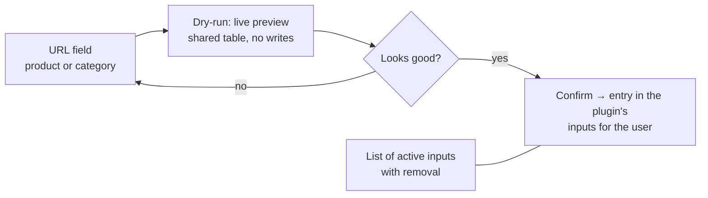

# Dragon Store — Features

> **Implemented plugin — Dragon Store (scraper)** · Audience: developer.
>
> English translation of the Italian reference [`docs-ita/implemented-plugins/dragon-store/features.md`](../../../docs-ita/implemented-plugins/dragon-store/features.md), limited to what is implemented (DOC-12). It describes the plugin's behaviour: the phase-3 single-product flow (input, dry-run preview, watch list), with the category/dented/adjustment requirements kept as forward-notes. Generic contract: [scraper-plugin](../../3-features/plugins/scraper-plugin.md).

## Plugin-specific requirements

- **DRG-R1** — Two kinds of user input: **single product URL** and **category URL**. *Phase 3 implements only the single product URL; the category branch arrives in phase 9.*
- **DRG-R2** — A category is enumerated in full (all pages) on every run; the products found enter the user's catalog. *Arrives in phase 9.*
- **DRG-R3** — In case of overlap between inputs (a single product also present in an observed category), the **category takes priority** and the product is delivered only once (dedup on `external_id`). *The category side arrives in phase 9.*
- **DRG-R4** — **"Dented"** products: every observed **category** has an **"include dented" selector**, **off** by default (dented items are excluded and counted in `products_excluded`). The user who wants them can enable it **category by category**. Out-of-stock items are always included with `is_available=false`. *Category-side filtering arrives in phase 9; the out-of-stock contract behaviour applies today.*
- **DRG-R7** — A dented product added as a **single product** is **always included**: having added it explicitly is a deliberate choice. The UI flags it with a **small red notice** ("Product in DENTED state") in the dry-run preview and in the input list. *Arrives with the dented handling in phase 9.*
- **DRG-R8** — In case of overlap between sources with different choices (e.g. a dented item excluded from category A but included from category B or added as a single product), **inclusion wins**: the product is delivered. *Arrives in phase 9.*
- **DRG-R5** — Adjustments: applies to the cart total the **highest discount threshold reached** among those configured (a positive entry); any shipping costs as a negative entry — *if applicable: to be defined, see capabilities*. *Arrives in a later phase.*
- **DRG-R6** — The notion of category stays internal: the core and the Product Picker never see it. *Relevant once categories arrive in phase 9.*

## User UI (plugin page)

Store navigation to choose what to observe:

- The user pastes a URL (the plugin recognises by itself whether it is a product or a category, thanks to the site's URL patterns — see [pre-analysis](capabilities.md#site-pre-analysis-june-2026-one-category-page)), sees the preview of the products that would be observed, and confirms.
- If the URL is a **category**, the confirmation form includes the **"Include dented products"** toggle (default: off); the preview reflects the choice. The toggle can be edited later from the input list. *Arrives in phase 9.*
- If the URL is a **single product in DENTED state**, the preview shows a small **red notice**: the product is observed anyway (explicit choice, DRG-R7). *Arrives with the dented handling in phase 9.*
- The list of active inputs (with type, product count of the last run and — for categories — the dented-toggle state) is managed from the same page.

## Admin UI (plugin admin page)

The admin page arrives with the admin-config work in a later phase. When it lands, it offers:

| Section | Content |
|---|---|
| Discount thresholds | editor of the `{minimum amount, discount %}` pairs used by the adjustments |
| Operational parameters | request timeout, politeness delay, user-agent |
| Test Scraper | on-demand dry-run on a URL, results in the shared table, no writes |

## Adjustments example

*Adjustments arrive in a later phase; the example illustrates the intended behaviour.*

Scraper-specific cart of 120 € (discounted total), configured thresholds `{50 → 10%, 100 → 15%}`:

| Entry | Amount |
|---|---|
| Threshold discount 100 € (15%) | **+18.00** (saving) |
| Final estimate | 120 − 18 = **102.00** |

The user's cart threshold is compared against the final estimate (CART-R11): it is the price they would actually pay at the Dragon Store checkout.
