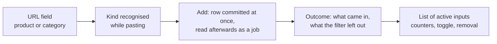

# Dragon Store — Features

> **Implemented plugin — Dragon Store (scraper)** · Audience: developer.
>
> Limited to what is implemented (DOC-12). It describes the plugin's behaviour: both inputs — a single product URL and a whole category — scraped on the spot when added and re-read on every scheduled run. Generic contract: [scraper-plugin](../../3-features/plugins/scraper-plugin.md).

## Plugin-specific requirements

- **DRG-R1** — Two kinds of user input: **single product URL** and **category URL**. The kind is decided from the URL itself (`.gp.<id>.uw` is a product, `.sp.uw` a listing) and the page asks the backend for it while the URL is being pasted, so the form can offer category-only options.
- **DRG-R2** — A category is enumerated in full (all pages) on every run; the products found enter the user's catalog. Pages come from the site's own `&pg=N`, one request at a time; the page count is printed on page one, so progress is a real fraction from the first request. A page that cannot be read makes the delivery **incomplete**, which keeps the delisting sweep away from it (CATSVC-R2b).
- **DRG-R3** — In case of overlap between inputs (a single product also present in an observed category), the **category takes priority** and the product is delivered only once (dedup on `external_id`), which also means no request of its own.
- **DRG-R4** — **"Dented"** products: every observed **category** has an **"include dented" selector**, **off** by default (dented items are excluded and counted in `products_excluded`). The user who wants them can enable it **category by category**, when adding the watch or afterwards; changing it applies **from the next scan**, and is refused while that watch is being read. Out-of-stock items are always included with `is_available=false`.
- **DRG-R7** — A dented product added as a **single product** is **always included**: having added it explicitly is a deliberate choice, and the flag is dropped rather than honoured on a product URL. Since the title arrives with the label stripped, its row in the watch list says so in words.
- **DRG-R8** — In case of overlap between sources with different choices (e.g. a dented item excluded from category A but included from category B or added as a single product), **inclusion wins**: the product is delivered.
- **DRG-R5** — Adjustments (5.B5): on the cart's **discounted total** it applies **one** discount band (the **highest reached, non-cumulative**) — phase-5 defaults: `≥100 €→5%`, `≥200 €→10%`, `≥300 €→15%` (a positive entry) — plus **shipping**: `+5.00 €` (a negative entry), **free** when the total ≥ 100 €. The values live in the plugin (`adjustments.py`); they will become admin-editable via ConfigFields (phase 7+/9). Each entry carries an i18n key (`dragon_store.adjustments.*`) the frontend localizes.
- **DRG-R6** — The notion of category stays internal: the core and the Product Picker never see it. A catalog product carries no link back to the watch that brought it in — one product can arrive from several categories at once, so the honest model is "the catalog is what a complete delivery contains" (CATSVC-R2), and what the UI wants to show lives on the watch as counters.

## User UI (plugin page)

Store navigation to choose what to observe:

- The user pastes a URL and the page asks the backend what it is (`GET /classify`, no HTTP request to the store), so the answer is visible before the add and the form can offer category-only options. The URL patterns are the site's own — see [pre-analysis](capabilities.md#site-pre-analysis-june-2026-one-category-page).
- Adding **commits the row first and reads afterwards**: the answer arrives in milliseconds and the row *is* the job, so a reload finds the operation again instead of losing it. It is **slow on purpose** — the site's `Crawl-delay` and its access check — and the page follows the job's progress in pages read.
- There is **no preview step.** A dry-run existed until 0.9.0 and was removed: it meant asking the site for the same page twice for one intention, which is not a reasonable thing to do to a site that publishes a `Crawl-delay`. What replaces it is an **outcome** shown after the fact: how many products went into the catalog, how many dented listings were left out, and a link to see them.
- If the URL is a **category**, the form includes the **"Include dented items"** toggle (default: off), and the same toggle sits on the category's row afterwards.
- If the URL is a **single product in DENTED state**, its row carries a **notice**: the product is observed anyway (explicit choice, DRG-R7), and the title alone would not say so because the label is stripped from it.
- The list of active inputs shows each one's **kind**, and for a category what its last scan yielded — products taken, dented ones left out, when it was last read — plus the dented toggle and removal. A category is named after the site's own breadcrumb, since a listing URL says nothing.
- **Scrape now** is not on this page for a plain user: it belongs to super-user and admin (the API refuses it too), because it is the quickest way to send the site requests its `Crawl-delay` never asked for.

## Admin UI (plugin admin page)

The admin page arrives with the admin-config work in a later phase. When it lands, it offers:

| Section | Content |
|---|---|
| Discount thresholds | editor of the `{minimum amount, discount %}` pairs used by the adjustments |
| Operational parameters | request timeout, politeness delay, user-agent |

## Adjustments example

Scraper-specific cart with a discounted total of **250 €** (band `≥200 → 10%`):

| Entry | i18n key | Amount |
|---|---|---|
| Threshold discount 10% | `dragon_store.adjustments.threshold_discount` | **+25.00** (saving) |
| Free shipping | `dragon_store.adjustments.free_shipping` | **0.00** |
| **Final estimate** | | 250 − 25 = **225.00** |

Below 100 € there is no discount and shipping is **−5.00 €** (a negative entry). The discount is **not cumulative**: only the highest band reached applies. The user's cart threshold is compared against the final estimate (CART-R11): it is the price they would actually pay at the Dragon Store checkout.
