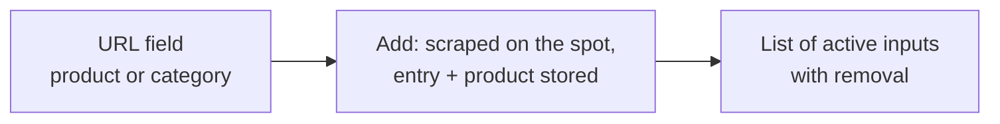

# Dragon Store — Features

> **Implemented plugin — Dragon Store (scraper)** · Audience: developer.
>
> Limited to what is implemented (DOC-12). It describes the plugin's behaviour: the single-product flow (paste a URL, it is scraped and stored on the spot, watch list), with the category/dented/adjustment requirements kept as forward-notes. Generic contract: [scraper-plugin](../../3-features/plugins/scraper-plugin.md).

## Plugin-specific requirements

- **DRG-R1** — Two kinds of user input: **single product URL** and **category URL**. *Phase 3 implements only the single product URL; the category branch arrives in phase 9.*
- **DRG-R2** — A category is enumerated in full (all pages) on every run; the products found enter the user's catalog. *Arrives in phase 9.*
- **DRG-R3** — In case of overlap between inputs (a single product also present in an observed category), the **category takes priority** and the product is delivered only once (dedup on `external_id`). *The category side arrives in phase 9.*
- **DRG-R4** — **"Dented"** products: every observed **category** has an **"include dented" selector**, **off** by default (dented items are excluded and counted in `products_excluded`). The user who wants them can enable it **category by category**. Out-of-stock items are always included with `is_available=false`. *Category-side filtering arrives in phase 9; the out-of-stock contract behaviour applies today.*
- **DRG-R7** — A dented product added as a **single product** is **always included**: having added it explicitly is a deliberate choice. The UI flags it with a **small red notice** ("Product in DENTED state") in the input list. *Arrives with the dented handling in phase 9.*
- **DRG-R8** — In case of overlap between sources with different choices (e.g. a dented item excluded from category A but included from category B or added as a single product), **inclusion wins**: the product is delivered. *Arrives in phase 9.*
- **DRG-R5** — Adjustments (5.B5): on the cart's **discounted total** it applies **one** discount band (the **highest reached, non-cumulative**) — phase-5 defaults: `≥100 €→5%`, `≥200 €→10%`, `≥300 €→15%` (a positive entry) — plus **shipping**: `+5.00 €` (a negative entry), **free** when the total ≥ 100 €. The values live in the plugin (`adjustments.py`); they will become admin-editable via ConfigFields (phase 7+/9). Each entry carries an i18n key (`dragon_store.adjustments.*`) the frontend localizes.
- **DRG-R6** — The notion of category stays internal: the core and the Product Picker never see it. *Relevant once categories arrive in phase 9.*

## User UI (plugin page)

Store navigation to choose what to observe:

- The user pastes a URL (the plugin recognises by itself whether it is a product or a category, thanks to the site's URL patterns — see [pre-analysis](capabilities.md#site-pre-analysis-june-2026-one-category-page)) and adds it. That single scrape both resolves the product and writes it to the catalog, so there is nothing to confirm afterwards. It is **slow on purpose** — the site's `Crawl-delay` and its access check — and the form says so while it waits.
- There is **no preview step.** A dry-run existed until 0.9.0 and was removed: it meant asking the site for the same page twice for one intention, which is not a reasonable thing to do to a site that publishes a `Crawl-delay`.
- If the URL is a **category**, the form includes the **"Include dented products"** toggle (default: off). The toggle can be edited later from the input list. *Arrives in phase 9.*
- If the URL is a **single product in DENTED state**, the input list shows a small **red notice**: the product is observed anyway (explicit choice, DRG-R7). *Arrives with the dented handling in phase 9.*
- The list of active inputs (with type, product count of the last run and — for categories — the dented-toggle state) is managed from the same page.

## Admin UI (plugin admin page)

The admin page arrives with the admin-config work in a later phase. When it lands, it offers:

| Section | Content |
|---|---|
| Discount thresholds | editor of the `{minimum amount, discount %}` pairs used by the adjustments |
| Operational parameters | request timeout, politeness delay, user-agent |

## Adjustments example

Scraper-specific cart with a discounted total of **250 €** (band `≥200 → 10%`):

| Entry | i18n key | Amount |
|---|---|---|
| Threshold discount 10% | `dragon_store.adjustments.threshold_discount` | **+25.00** (saving) |
| Free shipping | `dragon_store.adjustments.free_shipping` | **0.00** |
| **Final estimate** | | 250 − 25 = **225.00** |

Below 100 € there is no discount and shipping is **−5.00 €** (a negative entry). The discount is **not cumulative**: only the highest band reached applies. The user's cart threshold is compared against the final estimate (CART-R11): it is the price they would actually pay at the Dragon Store checkout.
