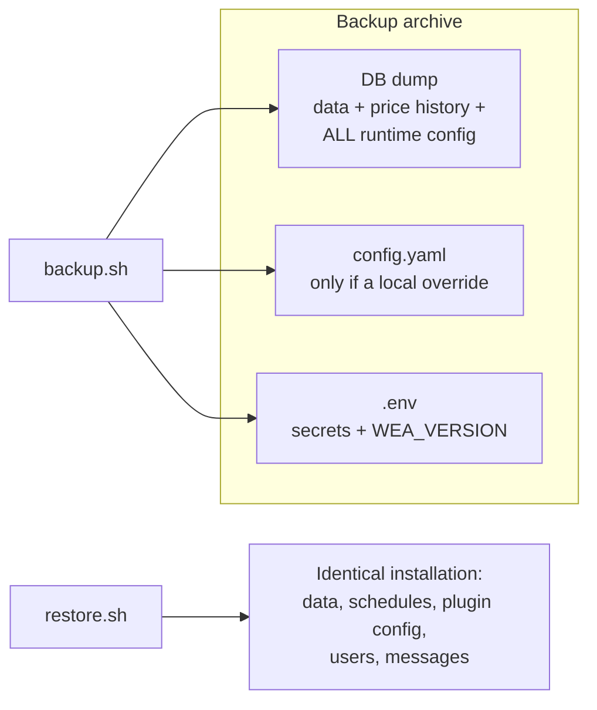

# Backup, export and restore

> **Infrastructure** · Audience: DevOps, system engineer. Config snippets allowed.

## Principle

The only non-reconstructible data is the **database** (in particular the price history), and thanks to the DB-first config principle ([configuration](configuration.md)) the DB **also** holds **all the configuration**: system settings, schedules, plugin admin/user config. Outside the DB only the two bootstrap files remain (`config.yaml`, `.env`): the backup includes them.

The tools are **scripts versioned in the repo** (`ops/` folder) and **baked into the `ops` image** published alongside web and worker ([deployment](deployment.md), INF-17): the image is `postgres:16` + the scripts (`pg_dump`/`psql` of the same version as the server by construction, zero drift). They are run **by hand** as an ephemeral container (`docker compose run --rm`) — no software to install on the host (INF-15), no mandatory automation (a host cron invoking the same command is the natural next step, at the hoster's discretion). The `db` service stays **stock**, with no foreign mounts; the scripts reach the database **over the network** (`db:5432`, credentials from `.env`).

## The scripts

| Script | What it does | Output |
|---|---|---|
| `backup.sh` | **Full backup**: `pg_dump` in custom format + a copy of `.env` and — if present — the local override of `config.yaml`, in a single timestamped archive | `backups/watchemall-backup-<date>.tar.gz` |
| `export.sh` | **Portable export**: a **readable** plain SQL dump, for inspection, diff or migration to another installation | `backups/watchemall-export-<date>.sql.gz` |
| `restore.sh <archive>` | **Restore** from a backup archive: recreates the database from the dump and puts the bootstrap files back next to the compose | DB and config at the backup's state |

Execution (from the host or the dev container, in the compose folder):

```bash
docker compose run --rm ops backup.sh
docker compose run --rm ops export.sh
docker compose run --rm ops restore.sh /backups/watchemall-backup-2026-06-12.tar.gz
```

## The `ops` service in the compose

Ephemeral (`ops` profile, never running on its own), with these mounts:

| Mount | Mode | Purpose |
|---|---|---|
| `./backups` → `/backups` | rw | destination for backups and exports (a **gitignored** folder) |
| `./.env` → `/host/.env` | ro | included in the backup (declared choice: the backup archive **contains secrets** and must be stored accordingly) |
| `./config.yaml` → `/host/config.yaml` | ro | **only if a local override exists** ([deployment](deployment.md)): the default lives in the image and does not need saving; `backup.sh` handles the absence |

In development the same scripts can be mounted from the repo (`./ops:/ops:ro` in the development compose) to iterate on them without a rebuild.

## Behaviour rules for the scripts

- **Idempotent and prudent** (INF-14): `restore.sh` asks for explicit confirmation, verifies the archive is intact **before** touching the DB, and refuses to run if `web`/`worker` are connected to the database (the application stack must be stopped: `docker compose stop web worker`).
- The restore **recreates the database from the dump**: it is the only legitimate exception to the ban on dropping the schema (INF-13/DB-R4, which concerns migrations) — the dump *is* the state being brought back to life.
- `backup.sh` and `export.sh` do not interrupt the service: `pg_dump` works on a consistent snapshot (MVCC), they can be launched with the stack hot.
- Any change that touches what the scripts save (new config files, new volumes) updates the scripts **in the same PR** (INF-16).

## What is saved, summarised



Recommended verification after any first setup: backup → `docker compose down -v` (volume destruction) → `up` → restore → log in and check that data and configuration are identical.
