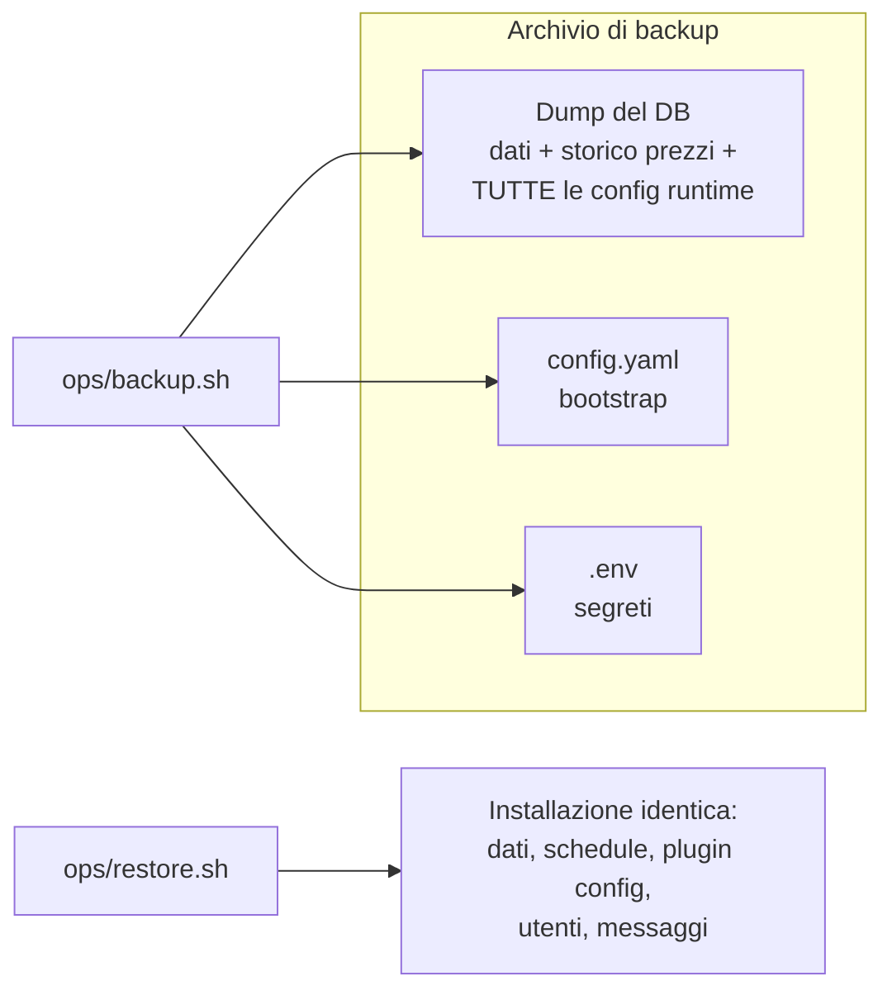

# Backup, export e ripristino

> **Infrastruttura** · Audience: DevOps, system engineer. Snippet di configurazione ammessi.

## Principio

L'unico dato non ricostruibile è il **database** (in particolare lo storico prezzi), e grazie al principio config DB-first ([configuration](configuration.md)) il DB contiene **anche tutte le configurazioni**: impostazioni di sistema, schedule, config admin/utente dei plugin. Fuori dal DB restano solo i due file di bootstrap (`config.yaml`, `.env`): il backup li include.

Gli strumenti sono **script versionati nel repo** (cartella `ops/`), montati read-only nel container `db` ed eseguiti **a mano** via `docker compose exec` — nessun software da installare sull'host (INF-15), nessuna automazione obbligatoria (un cron sull'host che invoca lo stesso comando è il passo successivo naturale, a discrezione di chi hosta).

## Gli script

| Script | Cosa fa | Output |
|---|---|---|
| `ops/backup.sh` | **Backup completo**: `pg_dump` in formato custom + copia di `config.yaml` e `.env`, in un unico archivio timestampato | `backups/watchemall-backup-<data>.tar.gz` |
| `ops/export.sh` | **Export portabile**: dump SQL **leggibile** (plain), per ispezione, diff o migrazione verso un'altra installazione | `backups/watchemall-export-<data>.sql.gz` |
| `ops/restore.sh <archivio>` | **Ripristino** da un archivio di backup: ricrea il database dal dump e riposiziona i file di bootstrap accanto al compose | DB e config allo stato del backup |

Esecuzione (dall'host o dal dev container, nella cartella del compose):

```bash
docker compose exec db /ops/backup.sh
docker compose exec db /ops/export.sh
docker compose exec db /ops/restore.sh /backups/watchemall-backup-2026-06-12.tar.gz
```

## Montaggi nel container `db`

Il container `db` (immagine PostgreSQL standard: `pg_dump`/`psql` già inclusi) riceve dal compose:

| Mount | Modo | Scopo |
|---|---|---|
| `./ops` → `/ops` | ro | gli script |
| `./backups` → `/backups` | rw | destinazione di backup ed export (cartella **gitignorata**) |
| `./config.yaml` → `/host/config.yaml` | ro | incluso nel backup |
| `./.env` → `/host/.env` | ro | incluso nel backup (scelta dichiarata: il container `db` conosce già i segreti Postgres; l'archivio di backup **contiene segreti** e va custodito di conseguenza) |

## Regole di comportamento degli script

- **Idempotenti e prudenti** (INF-14): `restore.sh` chiede conferma esplicita, verifica che l'archivio sia integro **prima** di toccare il DB e rifiuta di girare se `web`/`worker` risultano attivi (lo stack applicativo va fermato: `docker compose stop web worker`).
- Il ripristino **ricrea il database dal dump**: è l'unica eccezione legittima al divieto di drop dello schema (INF-13/DB-R4, che riguarda le migrazioni) — il dump *è* lo stato che si sta riportando in vita.
- `backup.sh` ed `export.sh` non interrompono il servizio: `pg_dump` lavora su uno snapshot consistente (MVCC), si possono lanciare a stack caldo.
- Ogni modifica che tocca ciò che gli script salvano (nuovi file di config, nuovi volumi) aggiorna gli script **nella stessa PR** (INF-16).

## Cosa viene salvato, riassunto



Verifica consigliata dopo ogni primo setup: backup → `docker compose down -v` (distruzione del volume) → `up` → restore → login e controllo che dati e configurazioni siano identici.
