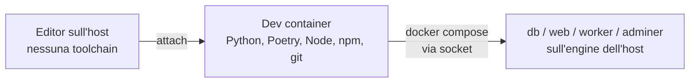

# Dev container (sviluppo zero-install)

> **Infrastruttura** · Audience: developer, DevOps. Snippet di configurazione ammessi.

## Principio: niente toolchain sull'host

Il portale è hostato su **Linux** — in locale dentro **WSL2**, oppure su un **server dedicato**. Su nessuna macchina (di sviluppo o di hosting) si installa software di sviluppo: **tutto vive nei container** (INF-15).

| Macchina | Cosa serve sull'host | Cosa NON si installa |
|---|---|---|
| Dev (WSL2 o Linux) | Docker Engine + Compose plugin, un editor con supporto Dev Containers (es. VS Code) | Python, Poetry, Node, npm, psql, … |
| Server di hosting | Docker Engine + Compose plugin | qualunque toolchain: le immagini sono multi-stage e autosufficienti (INF-5) |

## Il dev container

La cartella `.devcontainer/` alla radice del repo definisce l'ambiente di sviluppo completo: l'editor si attacca al container, e lì dentro esistono tutti gli strumenti.

```
.devcontainer/
├── devcontainer.json    # entrypoint per l'editor
└── Dockerfile           # toolchain: Python 3.12 + Poetry, Node LTS + npm, git, docker CLI
```

```jsonc
// .devcontainer/devcontainer.json (forma di riferimento)
{
  "name": "watch-em-all-dev",
  "build": { "dockerfile": "Dockerfile" },
  "mounts": [
    // docker-outside-of-docker: il dev container comanda il Docker dell'host
    "source=/var/run/docker.sock,target=/var/run/docker.sock,type=bind"
  ],
  "forwardPorts": [8080, 8081],
  "postCreateCommand": "poetry install && npm install"
}
```

Scelte dichiarate:

- **docker-outside-of-docker**: il dev container monta il socket Docker dell'host e lancia `docker compose` da dentro — i container applicativi (`db`, `web`, `worker`, `adminer`) girano sull'engine dell'host, non annidati. Più semplice e leggero del Docker-in-Docker.
- La toolchain del dev container (Python+Poetry, Node+npm) **rispecchia gli stage di build** dei Dockerfile dei package: stessa versione maggiore, così "funziona nel dev container" implica "builda nell'immagine".
- Il flusso quotidiano non cambia: `docker compose --profile dev up` (dal terminale **dentro** il dev container), hot-reload tramite i bind-mount del profilo dev.

## Flusso di lavoro



1. Clona il repo in WSL2 (o sul server di sviluppo Linux).
2. Apri la cartella nell'editor → "Reopen in Container".
3. Dentro il container: `cp .env.example .env`, `docker compose --profile dev up`.
4. Test, lint, build: sempre dal terminale del dev container — mai dall'host.

## Hosting

Il deployment su server o su WSL2 usa lo **stesso compose di produzione** ([deployment](deployment.md)) e non richiede il dev container: le immagini `web` e `worker` contengono già tutto (build multi-stage, frontend cucinato nell'immagine). L'unico prerequisito dell'host resta Docker.
