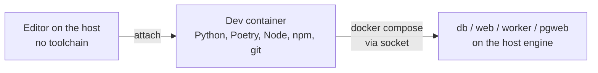

# Dev container (zero-install development)

> **Infrastructure** · Audience: developer, DevOps. Config snippets allowed.
>
> English translation of the Italian reference [`docs-ita/infrastructure/dev-container.md`](../../docs-ita/infrastructure/dev-container.md), limited to what is implemented (DOC-12). The dev container is delivered in phase 0.

## Principle: no toolchain on the host

The portal is hosted on **Linux** — locally inside **WSL2**, or on a **dedicated server**. On no machine (development or hosting) is development software installed: **everything lives in containers** (INF-15).

| Machine | Needed on the host | NOT installed |
|---|---|---|
| Dev (WSL2 or Linux) | Docker Engine + Compose plugin, an editor with Dev Containers support (e.g. VS Code) | Python, Poetry, Node, npm, psql, … |
| Hosting server | Docker Engine + Compose plugin | any toolchain: the images are multi-stage and self-contained (INF-5) |

## The dev container

The `.devcontainer/` folder at the repo root defines the full development environment: the editor attaches to the container, and every tool lives inside it.

```
.devcontainer/
├── devcontainer.json    # entrypoint for the editor
├── Dockerfile           # toolchain: Python 3.12 + Poetry, Node 22 LTS + npm, git, docker CLI
└── post-create.sh       # tolerant install: activates by itself once the toolchain files exist
```

```jsonc
// .devcontainer/devcontainer.json
{
  "name": "watch-em-all-dev",
  "build": { "dockerfile": "Dockerfile" },
  "mounts": [
    // docker-outside-of-docker: the dev container drives the host's Docker
    "source=/var/run/docker.sock,target=/var/run/docker.sock,type=bind"
  ],
  "forwardPorts": [8080, 8081],
  "postCreateCommand": "bash .devcontainer/post-create.sh",
  "remoteUser": "root"
}
```

Declared choices:

- **docker-outside-of-docker**: the dev container mounts the host's Docker socket and runs `docker compose` from inside — the application containers (`db`, `web`, `worker`, `pgweb`) run on the host's engine, not nested. Simpler and lighter than Docker-in-Docker.
- The dev container toolchain (Python+Poetry, Node+npm) **mirrors the build stages** of the package Dockerfiles: same major version, so "works in the dev container" implies "builds in the image".
- **Git and GitHub are used from the host, never from the container**: the dev container is for building and running; commit, push and PR (`git`, `gh`) happen **outside**, on the host — the single declared exception to zero-install (the `gh` CLI is installed on the host). The `git` binary still ships in the image because Poetry/npm need it for repository dependencies.
- **`root` user in the container** (declared simplification): non-root access to the Docker socket would require aligning the host `docker` group GID; inside a local dev container, root is accepted practice and removes that complexity.
- **Tolerant post-create**: `post-create.sh` installs dependencies only if the toolchain files exist (`pyproject.toml` arrives with 1.B1, `src/frontend/package.json` with 1.F1) — the dev container is born in phase 0, before any code, without failing.

## Workflow



1. Clone the repo in WSL2 (or on the Linux dev server).
2. Open the folder in the editor → "Reopen in Container".
3. Inside the container: `cp .env.example .env`, `docker compose -f compose-dev.yml up`.
4. Test, lint, build: always from the dev container terminal — never from the host.
5. Commit, push and PR: **from the host** (`git` and `gh` live outside the container).

## Hosting

Deployment on a server or on WSL2 **needs neither the dev container nor the sources**: it is pull-based — the deploy kit (release compose + `.env`) and the images published on GHCR ([deployment](deployment.md)). The dev container instead uses the repo's **development compose** (`compose-dev.yml`, with `build:`): same shape, local sources. The host's only prerequisite, in both cases, stays Docker.
